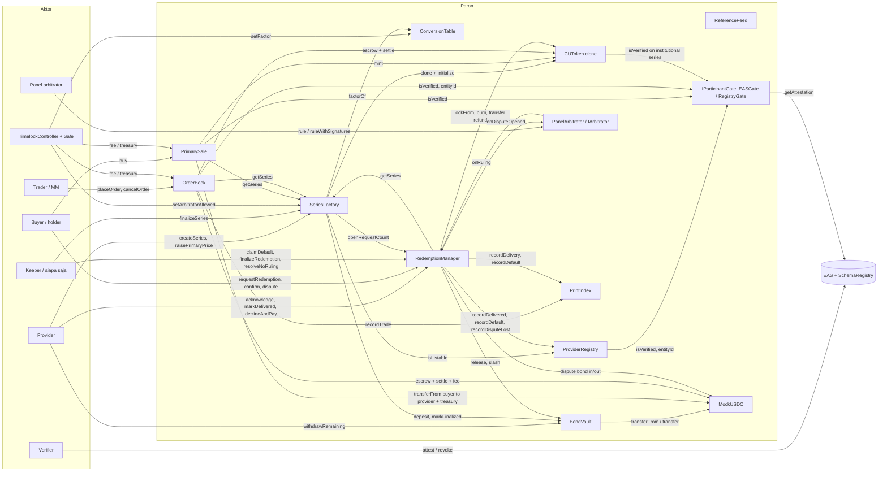

# Paron: spesifikasi interface kontrak (dev doc 01)

Status: **APPROVED-SYNCED, spec saja (bukan kode).** Semua usulan P-xx dan sebagian T-xx disetujui Fatih (Jum 9 Okt 2026 ~09:40 WIB, lewat 07); dokumen ini disinkronkan Jum 9 Okt ~09:45–10:30 WIB (log di §0.1). **Jum 9 Okt 2026 ~11:05 WIB:** perubahan dari audit Principal Engineer (07 §11, D-45..D-59) ditambahkan (log di §0.2); D-54 (attester/proposer EOA, executor terbuka) **APPROVED** ~11:05 WIB untuk deployment hackathon. **Jum 9 Okt 2026 ~11:14 WIB:** Fatih meng-APPROVE semua D-45..D-58 (~11:12 WIB, 07 §10.5); semua penanda usulan dikonversi menjadi spec dan teks yang digantikan dihapus (log §0.3). Disusun awal Kamis 8 Okt 2026, ~21:05 WIB, untuk build ETHJKT 2026 (Jumat 9 Okt 09:00 → Sabtu 10 Okt 12:00 WIB).
Kode produk baru boleh ditulis mulai **Jumat 9 Okt 09:00 WIB**. Signature di tabel ini bergaya Solidity hanya untuk kejelasan; tidak ada body fungsi atau kontrak utuh.

**Sumber (kanonik saja, lihat CONTEXT-INDEX.md §A):**
- `paron-design.md` → dikutip sebagai **(design §x)**. Sumber utama untuk §3 (12 kontrak + gate), §4.1 (state machine), §4.2 (parameter), §5 (fee), §10 (gap), §11 (chain).
- `paron-stack.md` → **(stack §x)**. Versi toolchain, event Ponder, schema EAS, invariant.
- `paron-product-knowledge.md` → **(PK §x)**. Ringkasan per aktor.
- `paron-gaps.md` → **(gaps Gx)**. Isinya sama dengan design §10; kalau beda, design §10 yang dipakai (lihat §12 Kontradiksi).
- `open-questions-research.md` → **(OQR §x)**. `notes.md` → **(notes §x)**.

**Legenda:**
- **[APPROVED P-xx]** = usulan dari dokumen ini (sumber tidak merinci), **disetujui Fatih Jum 9 Okt 2026 ~09:40 WIB** lewat `07-decisions-log.md` (D-xx). Sebelumnya bertanda `[PENDING P-xx]`.
- **[TBD T-xx]** = belum ada angka/keputusan. Setelah approval hanya **T-02** dan **T-04 (prod)** yang masih TBD; T-01, T-03, T-05 dan T-04 demo sudah APPROVED.
- Tanpa tag + ada sitasi = fakta dari dokumen kanonik.
- Semua nama fungsi/event/error yang **tidak** dikutip dari sumber adalah usulan, walaupun tidak diberi tag satu per satu di setiap baris tabel. Yang disebut sumber ditandai **(src)**.

Daftar lengkap semua item (kini APPROVED/TBD) ada di **Lampiran A**. Kontradiksi antar dokumen kanonik ada di **§12** (semuanya RESOLVED).

---

## 0.1 Log sinkronisasi setelah approval (Jum 9 Okt 2026 ~09:45–10:30 WIB)

Sumber perubahan: 07 (D-01..D-44 APPROVED, §8 V-1..V-8) dan register divergensi dev doc lain. Cadangan versi sebelumnya: `.bak-2026-10-09-pre-approval/01-contract-interfaces.md`.

| # | Asal | Perubahan di 01 | Bagian |
|---|---|---|---|
| S-01 | 07 V-1 (D-19, D-02) | Flag deployment `allowOpenWindow` (demo `true`) dan `enforceCalendarMonth` (prod `true`) di `SeriesFactory`; validasi `InvalidWindow` mengikuti flag | §2.1, §6.3 |
| S-02 | 07 V-2 (D-19, D-25) | Series panggung = `CU-JKT-H100-2610` | §2.3, §5.1, §6.4 |
| S-03 | 07 V-3 (D-09) | A100 `4_500`; RTX 4090 tidak dimasukkan | §1, §2.2, §6.2 |
| S-04 | 07 V-4 (D-29) | Request ulang setelah refund pasca-window; mekanisme `refundedAfterWindow` digantikan reopen otomatis T12b (D-46, ~11:12 WIB) | §6.8.1, §6.8.2 |
| S-05 | 07 V-5 (D-15) | Parameter demo `PrintIndex` 24 jam / 1 CU / 2 entity / 72 jam | §2.2, §6.10 |
| S-06 | 07 V-6 (D-40) | Batas fee `primaryFeeBps ≤ 500`, `takerFeeBps ≤ 100`; faucet 5.000 mUSDC / 1 jam | §2.2, §6.6, §6.7, §6.12 |
| S-07 | 07 V-8 / 04 X4-1 (P4-13) | Wiring: prediksi alamat CREATE dari nonce deployer menggantikan CREATE2 | §9 |
| S-08 | 03 X-1 | `ReputationUpdated` membawa `strikes` | §6.1 |
| S-09 | 03 X-2 | Kolom Emit tabel fungsi RM memakai bentuk lengkap `RedemptionFinalized` | §6.8.1 |
| S-10 | 03 X-4 | `PrintRecorded` = opsional (indexer memakai `Trade`) | §6.10 |
| S-11 | 03 X-8 | Event OZ `TimelockController` 5.6.1 di-index; Timelock = kontrak statis indexer | §7, §11 |
| S-12 | 03 X-9 (P-64) | Event OZ `AccessControl` (grant/revoke role) di-index; `setGate` + event `GateUpdated` | §7, §11 |
| S-13 | 03 X-10 (D-41) | Schema EAS `KybApplication` (bukan kontrak Paron) | §6.13, §11 |
| S-14 | 05 X-6 (P5-05) | Escrow ask `OrderBook` tetap lewat `approve` + `transferFrom` (tidak ada hak escrow khusus) | §6.7 |
| S-15 | 05 X-7 | Spender `permit` di `createSeriesWithPermit` = `BondVault` | §6.3 |
| S-16 | 02 X2-1 (D-18) | Invariant I1 ditulis dalam bentuk kerja `bond ≥ bondPerCU × totalSupply` | §10 |
| S-17 | 06 X6-11 (P6-09/10/19), 04 P4-12, sitemap S-7 | View baru: `bounds()`, `allowOpenWindow()`, `enforceCalendarMonth()`, `leadTime()`, `isArbitratorAllowed()`, `allowedArbitrators()`, `seriesCount()` di `SeriesFactory`; `rulingWindow()` di RM; `params()` di `PrintIndex` | §6.3, §6.8, §6.10 |
| S-18 | 07 D-32 | Provider **tidak** bisa pause sale sendiri di MVP | §4.1, §6.3 |
| S-19 | 07 D-06 | `ReferenceFeed` MVP = `push` saja; `pushSigned` ditunda | §6.11 |
| S-20 | 07 D-08 / sitemap §9 | Tim = Fatih solo: "EOA tim" = EOA terpisah yang semuanya dipegang Fatih | §4.1, §7 |
| S-21 | §12, Lampiran A | K-01..K-25 RESOLVED; register P/T berstatus APPROVED/TBD | §12, Lampiran A |

## 0.2 Log perubahan audit Principal Engineer (Jum 9 Okt 2026; semuanya APPROVED: D-54 ~11:05 WIB, lainnya ~11:12 WIB)

Sumber: `paron-build/AUDIT.md` §3 (SC-1..SC-18), §4 EN-2, §5. Keputusan di 07 §11. Cadangan sebelum perubahan: `.bak-2026-10-09-pre-audit/01-contract-interfaces.md`. **Tidak ada teks APPROVED yang dihapus**; usulan ditulis di sampingnya dengan penanda `[USULAN D-xx, PENDING]`. Kalau Fatih menolak sebuah D, penandanya dihapus dan teks APPROVED tetap. **Update ~11:05 WIB:** D-54 APPROVED (07 §10.4). **Update ~11:14 WIB:** semua D lain di tabel ini APPROVED (~11:12 WIB, 07 §10.5); penanda `[USULAN …]` diganti tag `[D-xx]` dan teks lama yang bertentangan dihapus (§0.3).

| # | Temuan | D | Perubahan yang diusulkan di 01 | Bagian |
|---|---|---|---|---|
| A-01 | SC-1 | D-45 | `registerProvider`/`isListable` wajib `role == 1`; error `NotProviderRole()` | §6.1 |
| A-02 | SC-2 | D-46 | `resolveNoRuling` setelah `windowEnd` membuka request baru di RM; `refundedAfterWindow` dihapus; event `RedemptionReopened` | §6.8 |
| A-03 | SC-3 | D-47 | `declineAndPay` hanya sebelum `Defaultable` | §6.8.1, T13, Lampiran A P-48 |
| A-04 | SC-5 | D-49 | `SeriesFactory.setGate` + `GateUpdated` | §6.3, §7, §7.1, §11 |
| A-05 | SC-6 | D-50 | `_update` aturan 2: kecualikan `from ∈ {RM, OrderBook}` | §6.4 |
| A-06 | SC-7, SC-18 | D-51 | Sisa yang masih menyilang dikembalikan; `OrderPlaced` hanya untuk sisa yang di-rest | §6.7 |
| A-07 | SC-8, SC-16 | D-52 | Lot CU 1 CU utuh (`InvalidLot()`) | §1, §6.6, §6.7, §6.8.1 |
| A-08 | SC-9, SC-10 | D-53 | Tumbling window + set entity per window; `PrintIndex` tidak revert; try/catch + `IndexUpdateFailed` | §6.7, §6.8.3, §6.10, §8.2 |
| A-09 | SC-11, EN-2 | D-54 (**APPROVED** ~11:05 WIB) | Hackathon: attester `W-VERIFIER`, proposer + `W-ADMIN`, executor terbuka. Diterapkan sebagai spec; override D-04/P4-15 untuk deployment hackathon saja | §4.1, §7 |
| A-10 | SC-12..SC-15 | D-55 | Fee floor di teks P-01; `linkAttestation` tidak mundur; auth `rule()` satu sumber; permit try/catch | §1, §4.1, §6.3, §6.9, §6.13 |
| A-11 | §5 #3 | D-56 | `Defaulted.caller` = `msg.sender` di `onRuling` (arbitrator) | §6.8.3 |

## 0.3 Changelog sinkron approval ~11:12 WIB (Jum 9 Okt 2026 ~11:14 WIB)

Cadangan: `.bak-2026-10-09-pre-1112/01-contract-interfaces.md`.
- A-01..A-11 menjadi spec (tag `[D-xx]`). Teks yang digantikan dan dihapus: `refundedAfterWindow` (state + view) dan cabang pengecualian D-29 di `requestRedemption` → `reopenedFrom` + T12b (D-46); klausa P-48 "dan juga setelahnya" (D-47); `ARBITER_ROLE` di `PanelArbitrator` (D-55c); catatan P-49 lama dan catatan "Masalah" D-46 digabung jadi satu catatan.
- S-04 (D-29) tetap tercatat sebagai riwayat; mekanismenya kini D-46.

---

## 0. Ringkasan

Paron terdiri dari 12 kontrak + `IParticipantGate` (dengan dua implementasi `EASGate` / `RegistryGate`) (design §3). Inti nilainya:
1. **Tidak ada mint tanpa bond.** Series hanya bisa dibuat kalau `bondPerCU × maxSupply` USDC ditarik ke `BondVault` di transaksi yang sama (design §1, §3 #3).
2. **Tidak ada redemption tunai berbasis oracle dan tidak ada pool bersama.** Payout hanya saat default terbukti, sebesar `bondPerCU × amount` yang tetap, dan hanya dari bond series itu sendiri (design §1, §3 #5).
3. **Redemption = state machine dengan deadline** (design §4.1). Diam-nya provider = bukti default; siapa saja bisa memicu `claimDefault`.
4. **`PrintIndex` dan `ReferenceFeed` tidak pernah ada di jalur payout** (design §1, §3 #11, §4.4).

Toolchain (design §3, stack §4.1): Solidity **0.8.37** (`pragma solidity 0.8.37` di file kita), Foundry **v1.8.5**, `evm_version = cancun`, `optimizer = true`, **tanpa** pin `solc` global (`auto_detect_solc`, karena EAS 1.9.0 butuh persis 0.8.29), OpenZeppelin **5.6.1** (AccessControl, ERC20 / ERC20Upgradeable + Initializable, Clones, SafeERC20, ReentrancyGuard, Pausable, EIP712, SignatureChecker/EIP-1271, TimelockController).

---

## 1. Konvensi

| Hal | Konvensi | Sumber / status |
|---|---|---|
| Token settlement | `settlementToken` = parameter constructor (USDC-only di MVP; `MockUSDC` di kedua testnet). Semua nilai uang (harga, bond, fee, dispute bond, payout) dalam unit token ini | design §3 #12, stack §4.1 |
| Desimal USDC | **6 desimal**. `$1.00 = 1_000_000`, `$3.00 = 3_000_000`, `$4.50 = 4_500_000`, `$2,250 = 2_250_000_000` | design §3 #12, §11 |
| Desimal CU | `CUToken` **18 desimal**; UI menampilkan 2 desimal. `1 CU = 1e18` unit token | design §3 #4, stack §4.1 |
| Definisi CU | 1 CU = 1 jam GPU setara H100-SXM-80GB | design §1 |
| Faktor konversi | Presisi **1e4** (`H100 = 10_000`, `H200 = 14_000`, `B200 = 25_000`, `GB200 = 35_000`, `A100 = 4_500`; RTX 4090 tidak dimasukkan). Di-snapshot per series saat listing | design §1.1, §3 #2; nilai A100/RTX 4090: 07 D-09 (APPROVED) |
| Jumlah CU dari jam GPU | `CU = gpuHours × factor / 1e4` (contoh: 1.000 jam H200 → 1.400 CU; 14 CU H200 → 10 jam H200) | design §1 |
| Harga | Selalu **per CU** (bukan per jam GPU native), dalam unit USDC per **1 CU utuh** (1e18 unit token). Contoh `primaryPrice = 3_000_000` ($3.00/CU) | design §1, §2 Flow B |
| Harga native | `nativePricePerGpuHour = cuPrice × factor / 1e4` (contoh $4.06/CU × 1,40 ≈ $5.69/jam H200). Dipakai untuk prints (G1) | design §1, §7.4, §10.2 G1 |
| Rumus biaya | `cost = qty × price / 1e18` (qty dalam unit CU 18 desimal, hasil dalam unit USDC). **Pembulatan [APPROVED P-01, diperjelas D-55a]:** `cost` dan escrow (pembayaran ke protokol/provider) dibulatkan **ke atas**, payout dari protokol dibulatkan **ke bawah**, dan **fee** = `floor(cost × bps / 10_000)` (02 P2-03, §6.6). Angka demo tidak berubah | P-01; SC-12 |
| Lot CU **[D-52]** | `CU_LOT = 1e18` (1 CU utuh). `PrimarySale.buy.qty`, `OrderBook.placeOrder.qty`, dan `RedemptionManager.requestRedemption.amount` wajib kelipatan `CU_LOT`, kalau tidak revert `InvalidLot()`; ukuran order minimum = 1 lot (menutup DoS debu di 10 level, dan debu < 1 CU yang tidak bisa di-redeem). Transfer P2P tidak dibatasi | 07 D-52 (SC-8, SC-16) |
| Tick order book | 0,01 USDC = `10_000` unit USDC per CU | design §3 #7 |
| Persen / fee | Disimpan dalam **basis point (bps)** [APPROVED P-02]: fee primer 1% = `100`, taker 0,15% = `15`, maker 0% = `0`, dispute bond 5% = `500`, bond floor 1,5× = `15_000` (bps dari primaryPrice) | nilai: design §5, §4.2; representasi: P-02 |
| Waktu | Unix timestamp **detik** (`uint64`) dari `block.timestamp`; durasi (window) dalam detik (`uint64`) [APPROVED P-03 untuk tipe]. Batas deadline **inklusif** untuk aksi provider (`ack ≤ ackDeadline`, `markDelivered ≤ deliveryDeadline`) dan default berlaku saat `now > deadline` | design §4.1 (≤ deadline) |
| ID | `seriesId: uint256`, `reqId: uint256` (sama dengan schema EAS `CapacityAttested(uint256 seriesId, …)` dan `DeliveryReceipt(uint256 reqId, …)`). Mulai dari 1; 0 = tidak ada [APPROVED P-04] | stack §4.1 |
| `entityId` | `bytes32` (dari `ParticipantVerified(bytes32 entityId, uint8 role, bytes2 country, uint64 expiry)`) | stack §4.1 |
| ID model GPU | `bytes32 gpuModel = keccak256("H100-SXM-80GB")` dst. (string kanonik per baris tabel faktor) [APPROVED P-05] | P-05 |
| Region | `bytes2 country` (ISO-3166 alpha-2, sama dengan field `country` di schema EAS) + `uint8 continent` di series [APPROVED P-06]. Gap G4 meminta "continent plus ISO-3166 country" | design §10.2 G4, stack §4.1 |
| Hash | `specHash`, `termsHash`, `deliveryRef`, `receiptHash` = `bytes32` (hash dari JSON/dokumen offchain, JSON di IPFS) | design §2 Flow A/C, §10.2 G4/G14 |
| EIP-712 | Domain per deployment `{name:"Paron", version:"1", chainId, verifyingContract}` | stack §4.1 |
| Access control | OZ 5 `AccessControl`. Revert akses ditangani error bawaan OZ `AccessControlUnauthorizedAccount(account, role)`; kontrak-ke-kontrak memakai error kustom `Only<Contract>()` | OZ 5.6.1 (stack §4.1); nama error: usulan |
| Error | Custom error Solidity (bukan string revert) | usulan |
| Keamanan | `ReentrancyGuard` pada semua fungsi yang memindahkan nilai; urutan checks-effects-interactions; `SafeERC20` untuk semua transfer token | design §3 #8, stack §4.1 |
| Chain | Kode chain-agnostic. Primer Robinhood Chain Testnet (46630), fallback Arbitrum Sepolia (421614). Alamat EAS dari config chain | design §3, §11.1 |

---

## 2. Parameter

### 2.1 Parameter redemption (design §4.2, "set per series and bounded by the protocol")

| Parameter | Produksi (default) | Demo | Batas | Disimpan di | Sumber |
|---|---|---|---|---|---|
| `ackWindow` | 24 jam | 60 dtk | 1 jam – 72 jam | `Series` | design §4.2 |
| `deliveryWindow` (setelah ack) | 48 jam | 60 dtk | 1 jam – 7 hari | `Series` | design §4.2 |
| `disputeWindow` (setelah `markDelivered`) | 72 jam | 90 dtk | 24 jam – 7 hari | `Series` | design §4.2 |
| `disputeBond` | 5% dari klaim (`bondPerCU × amount`), minimal $5 | sama | "prevents griefing" | konstanta protokol: `disputeBondBps = 500`, `minDisputeBond = 5_000_000` [APPROVED P-02] | design §4.2 |
| `minRedemption` | diset provider (mis. 8 CU = 1 node 8-GPU selama 1 jam) | 1 CU | ≥ 1 CU | `Series` | design §4.2 |
| `bondPerCU` | ≥ 1,5 × primaryPrice | 1,5× ($4.50 untuk CU $3.00) | provider boleh posting lebih (badge "200% backed") | `Series` | design §4.2, §2 Flow A |
| Arbitrator ruling deadline | 7 hari | 120 dtk | — | [APPROVED P-07]: `rulingWindow` sebagai parameter deployment di `RedemptionManager` (bukan per series) | design §4.2 |

> **Catatan penting:** nilai demo (60 dtk / 60 dtk / 90 dtk / 120 dtk) berada **di luar** batas protokol (minimal 1 jam / 1 jam / 24 jam). Jadi batas harus berupa **parameter deployment** (immutable di constructor `SeriesFactory`): set "prod" vs set "demo". [APPROVED P-08, 07 D-20] Lihat §12 K-13. Set demo juga memakai `allowOpenWindow = true` (window yang sudah terbuka boleh di-listing) dan set prod `enforceCalendarMonth = true` (07 D-19, D-02; nilai per set di 04 §5).

### 2.2 Parameter lain

| Parameter | Nilai | Di kontrak | Sumber |
|---|---|---|---|
| Bond floor | `bondPerCU ≥ 1,5 × primaryPrice` (dikunci Fatih) | `SeriesFactory` (`bondFloorBps = 15_000`) | design locked decisions, §3 #3 |
| Bond penuh saat listing | `bondPerCU × maxSupply`, ditarik di tx yang sama | `SeriesFactory` → `BondVault` | design §1, §3 #3 |
| Fee primary sale | 1,0% dari hasil penjualan, dipotong dari provider, ke treasury | `PrimarySale` (`primaryFeeBps = 100`) | design §2 Flow B, §5 |
| Fee taker sekunder | 0,15%, ke treasury | `OrderBook` (`takerFeeBps = 15`) | design §5, §3 #7 |
| Fee maker | 0% | `OrderBook` (`makerFeeBps = 0`) | design §5 |
| Listing fee | $0 di MVP | — (tidak diimplementasi) | design §5 |
| Fee arbitrator | "dari dispute bond pihak yang kalah" | **[APPROVED P-09]**: tidak diimplementasi di MVP (07 D-21; §12 K-08) | design §5 |
| Batas fee (maks) | `primaryFeeBps ≤ 500` (5%), `takerFeeBps ≤ 100` (1%) | `PrimarySale.maxPrimaryFeeBps`, `OrderBook.maxTakerFeeBps` (konstanta); setter di atas batas → `FeeTooHigh` | **APPROVED T-01** (07 D-40; angka baru, bukan dari sumber) |
| Tick | 0,01 USDC | `OrderBook` | design §3 #7 |
| Maks level harga aktif per sisi | ≤ 20 (design §3 #7) **vs** ≤ 10 (design §10.4, stack §4.1) | `OrderBook` (`MAX_LEVELS`) | **[APPROVED P-10]**: pakai **10** (angka terbaru, build plan; 07 D-17) — §12 K-01 |
| Maks fill per tx (loop matching dibatasi) | — | `OrderBook` (`maxFills`) | "matching loop bounded" (design §3 #7); angka **[TBD T-02]** |
| Timelock delay | 48 jam prod, 5 menit demo | `TimelockController` | design §3 #2, §11.4; stack §4.1 |
| Presisi faktor | 1e4 | `ConversionTable` | design §3 #2 |
| Faktor GPU awal | H100 1,00 · H200 1,40 · B200 2,50 · GB200 3,50 · **A100 0,45** · RTX 4090 **tidak dimasukkan** | `ConversionTable` | design §1.1 (awal A100 0,60, RTX4090 0,35); revisi Q9 (design §9) = **07 D-09 APPROVED** |
| `leadTime` (primary sale tutup di `windowEnd − leadTime`) | — | `SeriesFactory`/`Series` | disebut di design §3 #6; nilai **APPROVED T-03**: prod 24 jam, demo 0 (parameter deployment, 07 D-39) |
| Grace period finalisasi | — | `SeriesFactory` | disebut di design §2 Flow E; nilai **[APPROVED P-11]**: `grace = ackWindow + deliveryWindow + disputeWindow + rulingWindow` per series |
| Panel arbitrator | 2-of-3 | `PanelArbitrator` | design §3 #9 |
| Parameter PrintIndex (panjang window, volume minimum, partisipan minimum, batas carry-forward, α winsorization) | — | `PrintIndex` | disebut di design §10.2 G3/G13; **demo APPROVED** (07 D-15): `windowLength` 24 jam, `minVolume` 1 CU, `minParticipants` 2 entity, `maxCarryForward` 72 jam. **Prod + α winsorization: [TBD T-04]** |
| Faucet MockUSDC (jumlah, cooldown) | — | `MockUSDC` | faucet disebut di design §3 #12; nilai **APPROVED T-05**: 5.000 mUSDC (`5_000_000_000`) per drip, cooldown 1 jam (07 D-40) |

### 2.3 Angka demo (untuk cek konsistensi)

Dari design §7.4 / PK §7, dengan nama series sesuai 07 D-19 (APPROVED): series panggung `CU-JKT-H100-2610` (design menulis `2611`; window Okt 2026 dipakai karena redemption demo terjadi 10 Okt, §12 K-12). 500 CU @ **$3.00**, `bondPerCU = $4.50`, bond terkunci **$2,250** (`2_250_000_000`). Buyer membeli 20 CU ($60; provider menerima $59.40, treasury $0.60). Ask @ $3.20. Default 10 CU → holder menerima **$45** (`45_000_000`) dari bond series itu.

---

## 3. Inventaris kontrak

| # | Kontrak | Prioritas 27 jam | Tipe deploy | Ringkas | Sumber |
|---|---|---|---|---|---|
| 1 | `ProviderRegistry` | Must | singleton | Siapa yang boleh listing + status + reputasi | design §3 #1 |
| 2 | `ConversionTable` | Must (simple) | singleton, admin = Timelock | Faktor GPU 1e4, perubahan timelocked | design §3 #2 |
| 3 | `SeriesFactory` | Must | singleton | Validasi term, tarik bond, clone `CUToken`, allowlist arbitrator | design §3 #3, PK §6.7 |
| 4 | `CUToken` | Must | implementasi + clone EIP-1167 per series | ERC-20 per series, transfer diblokir setelah `windowEnd` | design §3 #4 |
| 5 | `BondVault` | Must | singleton | Akuntansi bond USDC terisolasi per series | design §3 #5 |
| 6 | `PrimarySale` | Must | singleton | Jual harga tetap, mint ke buyer, fee 1% | design §3 #6 |
| 7 | `OrderBook` | Must (minimal) | singleton (buku per series) | CLOB-lite, self-match block, emit `Trade` | design §3 #7, §10.4 |
| 8 | `RedemptionManager` | **Must, inti** | singleton | State machine §4.1 | design §3 #8, §4 |
| 9 | `IArbitrator` + `PanelArbitrator` | Must (panel) | singleton per panel | `rule(reqId, outcome)` 2-of-3 | design §3 #9 |
| 10 | `PrintIndex` | Must (VWAP); TWAP nice | singleton | Indeks prints per kelas GPU (CU terms), status | design §3 #10, §10.4 |
| 11 | `ReferenceFeed` | Nice (lihat §12 K-09) | singleton | Referensi eksternal sintetis, display saja | design §3 #11, §10.3 |
| 12 | `MockUSDC` | Must | singleton per chain | Token settlement testnet 6 desimal + faucet | design §3 #12 |
| 13 | `IParticipantGate` + `EASGate` / `RegistryGate` | Must | satu implementasi aktif per chain | `isVerified(addr)`, `entityId(addr)` | design §3 #13 |
| — | `TimelockController` (OZ) + Safe 2-of-3 | Must (config) | — | Change control (bukan kontrak Paron, tapi pemegang role) | design §10.3, §11.4; stack §4.1 |

---

## 4. Role dan access control (global)

### 4.1 Pemegang role manusia/governance

| Role | Dipegang oleh | Dipakai untuk | Sumber |
|---|---|---|---|
| `DEFAULT_ADMIN_ROLE` | `TimelockController` (satu-satunya pemegang). Proposer: Safe (RH Testnet) / dua EOA tim (fallback opsi B). **[APPROVED D-54, Jum 9 Okt ~11:05 WIB, hackathon saja]** deployment hackathon: proposer + canceller = Safe **dan** EOA `W-ADMIN`; executor = `address(0)` (terbuka) | Grant/revoke role lain; semua perubahan parameter yang timelocked | design §11.4 opsi B, stack §3.4 & §4.1 ("proposer = Safe"); 07 D-54 |
| `ADMIN_ROLE` | Safe 2-of-3 (RH) / EOA tim (fallback opsi B) | Aksi admin non-parameter (mis. status provider, pause) [APPROVED P-12 untuk daftar persisnya] | design §11.4 (nama ADMIN), stack §3.4 |
| `VERIFIER_ROLE` | Safe 2-of-3 = "demo verifier" (persona demo = open question Q4). **[APPROVED D-54, Jum 9 Okt ~11:05 WIB, hackathon saja]** deployment hackathon: EOA `W-VERIFIER` berlabel "Paron demo verifier (team-operated)" sebagai attester tepercaya (`EASGate.setAttester`, tetap via Timelock) / `VERIFIER_ROLE` di `RegistryGate`; Safe boleh tetap di allowlist. D-04 tetap desain target | Menerbitkan/mencabut attestation (EAS) atau mengisi allowlist `RegistryGate`/registry fallback | design §2, §10.3, §11.4 |
| (`ARBITER_ROLE` dihapus) | — | **[D-55c]** `PanelArbitrator` tidak memakai role; otorisasi putusan = keanggotaan `members` (§6.9) | design §11.4 (nama ARBITER) |
| `PAUSER_ROLE` | Safe (ADMIN) | `pause` series (design §3 #3 tidak menyebut pemegang). Provider **tidak** bisa pause sale sendiri di MVP (07 D-32) | **[APPROVED P-13]** |
| `FEED_SIGNER_ROLE` | EOA script keeper sintetis | Push nilai ke `ReferenceFeed` | **[APPROVED P-14]**: `push` biasa oleh EOA keeper (07 D-06); `pushSigned` ditunda (design §3 #11 menyebut "signed push") |
| `MINTER_ROLE` (MockUSDC) | deployer / script seed | Mint USDC testnet untuk seed | **[APPROVED P-15]**; dicabut **setelah Demo Day**, bukan langsung setelah seed (04 X4-4) |
| Treasury | Penerima fee 1% dan 0,15% | Alamat penerima, bukan role. **[APPROVED P-16]**: treasury = alamat Safe (RH) / alamat Timelock-owned (fallback). Fee di-push langsung saat trade, jadi **tidak perlu fungsi withdraw di `PrimarySale`/`OrderBook`**; Safe memindahkan USDC dengan tx Safe biasa | design §3 #6/#7 ("to treasury"); PK §6.7 menyatakan treasury & withdraw belum terverifikasi |

**Tim solo (07 D-08, sitemap §9):** setiap "EOA tim" / "anggota panel" / pemilik Safe di dokumen ini adalah EOA terpisah yang semuanya dipegang Fatih (perangkat/profil wallet berbeda). Interface tidak berubah.

**Fallback admin** (design §11.4, stack §3.4): di Arbitrum Sepolia tidak ada Safe UI → opsi A (Safe via protocol-kit) atau opsi B (role ADMIN/VERIFIER/ARBITER ke 3 EOA tim, `TimelockController` 5 menit memegang DEFAULT_ADMIN, 2 proposer). Interface kontrak **sama** di kedua mode; hanya alamat pemegang role yang beda.

### 4.2 Izin kontrak-ke-kontrak

| Kontrak target | Fungsi terlindungi | Hanya boleh dipanggil oleh | Sumber |
|---|---|---|---|
| `CUToken` | `mint` | `PrimarySale` | design §3 #4 |
| `CUToken` | `burn`, `lockFrom` (tarik CU ke escrow redemption) | `RedemptionManager` | design §3 #4 (burn); `lockFrom` = [APPROVED P-17] |
| `CUToken` | `initialize` | `SeriesFactory` (sekali) | usulan |
| `BondVault` | `release`, `slash` | `RedemptionManager` | design §3 #5 |
| `BondVault` | `deposit`, `markFinalized` | `SeriesFactory` | usulan (konsekuensi design §3 #3 "pulls the full bond") |
| `BondVault` | `withdrawRemaining` | provider series itu, setelah finalisasi | design §3 #5 |
| `ProviderRegistry` | `recordDelivered`, `recordDefault`, `recordDisputeLost` | `RedemptionManager` | design §3 #1 ("written only by RedemptionManager") |
| `RedemptionManager` | `onRuling` (callback) | arbitrator yang tercatat di series request itu | design §3 #8 ("arbitrator callback") |
| `IArbitrator` | `onDisputeOpened` | `RedemptionManager` | [APPROVED P-18] |
| `PrintIndex` | `recordTrade` | `OrderBook` | [APPROVED P-19] (`OrderBook` "updates PrintIndex", design §2 Flow B) |
| `PrintIndex` | `recordDelivery`, `recordDefault` | `RedemptionManager` | [APPROVED P-19] (design §3 #10: "delivered-CU and default-rate counters") |
| `ConversionTable` | `setFactor` | `TimelockController` | design §3 #2 |

---

## 5. Tipe bersama

Didefinisikan sekali (mis. `ParonTypes`-style library; nama file = urusan doc 04) dan dipakai lintas kontrak.

```
enum ProviderStatus { None, Active, Suspended, Banned }        // Active/Suspended/Banned: design §3 #1; None = belum terdaftar [APPROVED P-20]

enum RedemptionState {                                           // nama state: design §4.1
  None,          // reqId tidak ada
  Requested,     // REQUESTED
  Acknowledged,  // ACKNOWLEDGED
  Delivered,     // DELIVERED
  Defaultable,   // DEFAULTABLE  (TURUNAN waktu; tidak pernah disimpan, hanya dikembalikan oleh stateOf()) [APPROVED P-21]
  Disputed,      // DISPUTED
  Defaulted,     // DEFAULTED   (terminal)
  Finalized,     // FINALIZED   (terminal)
  Refunded       // REFUNDED    (terminal)
}

enum Ruling { None, Delivered, NotDelivered }                    // design §4.1
enum IndexStatus { OK, THIN, DISRUPTED }                         // design §10.2 G13; lihat §12 K-03
enum Side { Bid, Ask }
enum PrintKind { Primary, Trade }                                // "print PRIMARY": PK §5.3; [APPROVED P-22]
```

### 5.1 `SeriesParams` (input `createSeries`) dan `Series` (disimpan)

| Field | Tipe | Input / turunan | Keterangan | Sumber |
|---|---|---|---|---|
| `provider` | `address` | turunan (`msg.sender`) | | design §2 Flow A |
| `token` | `address` | turunan (clone) | `CUToken` series | design §3 #3 |
| `gpuModel` | `bytes32` | input | lihat P-05 | design §2 Flow A |
| `factor` | `uint32` | turunan (snapshot `ConversionTable`) | immutable | design §1, §3 #2 |
| `gpuHours` | `uint64` | input | jam GPU native yang ditawarkan | design §2 Flow A step 2 |
| `maxSupply` | `uint256` | turunan `gpuHours × factor × 1e18 / 1e4` | [APPROVED P-23]: input = `gpuHours`, bukan CU | design §1 |
| `primaryPrice` | `uint256` | input | USDC per CU; **hanya boleh naik** selama sale buka | design §3 #3 |
| `bondPerCU` | `uint256` | input | ≥ 1,5 × primaryPrice | design §3 #3 |
| `windowStart`, `windowEnd` | `uint64` | input | window redemption. Model bulan kalender UTC (Q2 = 07 D-02 APPROVED; divalidasi kalau `enforceCalendarMonth`) | design §1, §10.2 G5 |
| `ackWindow`, `deliveryWindow`, `disputeWindow` | `uint64` | input | dalam batas §2.1 | design §4.2 |
| `minRedemption` | `uint256` | input | ≥ 1 CU (`1e18`) | design §4.2 |
| `arbitrator` | `address` | input | wajib ada di allowlist | design §3 #3 |
| `specHash` | `bytes32` | input | hash JSON `paron-spec/v1` (G4), immutable | design §1, §10.2 G4 |
| `termsHash` | `bytes32` | input (opsional, 0 boleh) | hash `SERIES_TERMS.md` (G14, NICE) | design §10.2 G14, §10.4 NICE |
| `country` / `continent` | `bytes2` / `uint8` | input | region, P-06 | design §10.2 G4 |
| `institutional` | `bool` | input | kalau `true`, transfer CU hanya ke alamat terverifikasi gate | design §10.2 G8, stack §4.1 |
| `symbol` | `string` | input | mis. `CU-JKT-H100-2610` (series panggung, 07 D-19) atau `CU-JKT-H100-2611` (seed) | design §1 |
| `paused` | `bool` | state | satu-satunya field mutable selain `primaryPrice` | design §3 #3 |
| `finalized` | `bool` | state | di-set oleh `finalizeSeries` | design §2 Flow E |
| `soldSupply` | `uint256` | state (di `PrimarySale` atau token `totalSupply`) | | design §3 #6 |

---

## 6. Spesifikasi per kontrak

Format tiap kontrak: tujuan → state kunci → fungsi (tabel: signature, pemanggil/role, efek, emit, revert) → event → error → access control.

### 6.1 `ProviderRegistry`

**Tujuan.** Menentukan siapa yang boleh listing: provider harus memegang attestation EAS `ProviderVerified` yang belum dicabut dari verifier yang di-allowlist (fallback MVP: mapping verifier-role). Menyimpan status (Active/Suspended/Banned) dan counter reputasi yang hanya ditulis `RedemptionManager` (design §3 #1, §2).

**State kunci**

| Nama | Tipe | Keterangan |
|---|---|---|
| `providers` | `mapping(address => Provider)` | `Provider { ProviderStatus status; bytes32 entityId; bytes32 attestationUid; uint256 deliveredCU; uint256 defaultedCU; uint256 voluntaryDefaultedCU; uint32 disputesLost; uint32 strikes; }` |
| `gate` | `IParticipantGate` | **[APPROVED P-24]**: registry memakai gate yang sama dengan buyer/trader (attestation `ParticipantVerified` dengan `role = Provider`), bukan schema `ProviderVerified` terpisah, karena schema `ProviderVerified` tidak didefinisikan di stack §4.1 (lihat §12 K-14). Mode `RegistryGate` = "verifier-role mapping" fallback |
| `redemptionManager` | `address` | satu-satunya penulis reputasi |

Counter `deliveredCU`, `defaultedCU`, `disputesLost` = fakta (design §3 #1). `voluntaryDefaultedCU` dan `strikes` = **[APPROVED P-25]** untuk membedakan `declineAndPay` ("smaller reputation hit", design §4.1) dari default paksa ("provider strike", design §4.1).

**Fungsi**

| Signature | Pemanggil / role | Efek | Emit | Revert |
|---|---|---|---|---|
| `registerProvider() external` | provider | Membaca `gate.isVerified(msg.sender)` + `entityId`; set `status = Active` kalau `None`. **[D-45]** juga wajib `gate.participantOf(msg.sender).role == 1` (Provider, P-24/P-62); role 2/3/4 revert `NotProviderRole()` | `ProviderRegistered` | `NotVerified`, `AlreadyRegistered`, + `NotProviderRole` [D-45] |
| `isListable(address provider) external view returns (bool)` | siapa saja (dipakai `SeriesFactory`) | `true` jika `status == Active` **dan** `gate.isVerified(provider)` saat ini (cek ulang revocation/expiry live). **[D-45]** **dan** `gate.participantOf(provider).role == 1` (MarketMaker role 4 tidak boleh listing) | — | — |
| `setStatus(address provider, ProviderStatus status) external` | `ADMIN_ROLE` [APPROVED P-26: langsung, tidak lewat timelock, karena suspend sering mendesak] | Ubah status. Suspended/Banned → tidak bisa listing series baru; **kewajiban series yang sudah ada tetap jalan** (redemption, default, withdraw) [APPROVED P-26] | `ProviderStatusChanged` | `UnknownProvider`, `AccessControlUnauthorizedAccount` |
| `recordDelivered(address provider, uint256 cu) external` | `RedemptionManager` | `deliveredCU += cu` | `ReputationUpdated` | `OnlyRedemptionManager` |
| `recordDefault(address provider, uint256 cu, bool voluntary) external` | `RedemptionManager` | `voluntary ? voluntaryDefaultedCU += cu : (defaultedCU += cu, strikes++)` | `ReputationUpdated` | `OnlyRedemptionManager` |
| `recordDisputeLost(address provider) external` | `RedemptionManager` | `disputesLost++` | `ReputationUpdated` | `OnlyRedemptionManager` |
| `getProvider(address provider) external view returns (Provider memory)` | siapa saja | — | — | — |
| `setGate(address newGate) external` | Timelock (`DEFAULT_ADMIN_ROLE`) | Ganti gate pasca-deploy [APPROVED P-64] | `GateUpdated` | `ZeroAddress`, `AccessControlUnauthorizedAccount` |

**Event**

| Event | Kapan |
|---|---|
| `ProviderRegistered(address indexed provider, bytes32 indexed entityId)` | registrasi |
| `ProviderStatusChanged(address indexed provider, ProviderStatus oldStatus, ProviderStatus newStatus)` | `setStatus` |
| `GateUpdated(address indexed oldGate, address indexed newGate)` | `setGate` (P-64; event sama di `PrimarySale` dan `OrderBook`, 03 X-9) |
| `ReputationUpdated(address indexed provider, uint256 deliveredCU, uint256 defaultedCU, uint256 voluntaryDefaultedCU, uint32 disputesLost, uint32 strikes)` | setiap `record*` (field `strikes` ditambah saat sinkronisasi, 03 X-1) |

**Error:** `NotVerified()`, `AlreadyRegistered()`, `UnknownProvider()`, `OnlyRedemptionManager()`, `ZeroAddress()`. **[D-45]** + `NotProviderRole()`.

**Access control:** `DEFAULT_ADMIN_ROLE` = Timelock (ganti gate/verifier allowlist, timelocked: PK §6.7 "Timelock yang sama menjaga … allowlist (verifier, arbitrator)"). `ADMIN_ROLE` = status. Reputasi = hanya `RedemptionManager`.

---

### 6.2 `ConversionTable`

**Tujuan.** Peta model GPU → faktor (presisi 1e4). Perubahan **timelocked** (`TimelockController`, 48 jam; demo 5 menit) dan hanya berlaku untuk series **baru**, karena faktor di-snapshot saat listing (design §1.1, §3 #2).

**State kunci:** `mapping(bytes32 gpuModel => uint32 factor) factors` (0 = tidak terdaftar); `bytes32[] gpuModels` (untuk UI/enumerasi). Nilai awal di §2.2.

**Fungsi**

| Signature | Pemanggil / role | Efek | Emit | Revert |
|---|---|---|---|---|
| `factorOf(bytes32 gpuModel) external view returns (uint32)` | siapa saja (`SeriesFactory` saat `createSeries`) | — | — | `UnknownGpuModel` |
| `setFactor(bytes32 gpuModel, uint32 factor) external` | `DEFAULT_ADMIN_ROLE` = `TimelockController` saja | Set/ubah faktor. Tidak menyentuh series yang sudah ada | `FactorSet` | `InvalidFactor` (0), `AccessControlUnauthorizedAccount` |
| `removeGpuModel(bytes32 gpuModel) external` | Timelock | Hapus model [APPROVED P-27]. RTX 4090 tidak pernah dimasukkan (07 D-09), jadi fungsi ini tidak dipakai di demo | `FactorSet(gpuModel, old, 0)` | `UnknownGpuModel` |
| `listGpuModels() external view returns (bytes32[] memory)` | siapa saja | — | — | — |

**Event:** `FactorSet(bytes32 indexed gpuModel, uint32 oldFactor, uint32 newFactor)`.
**Error:** `UnknownGpuModel(bytes32 gpuModel)`, `InvalidFactor()`.
**Access control:** hanya Timelock yang bisa menulis (design §3 #2). Test wajib "factor timelock" (design §7.1).

---

### 6.3 `SeriesFactory`

**Tujuan.** `createSeries` memvalidasi term (window di masa depan, `bondPerCU ≥ 1,5 × primaryPrice`, supply positif, arbitrator di allowlist, ack/delivery/dispute window dalam batas), **menarik bond penuh di tx yang sama**, dan men-deploy clone `CUToken` (EIP-1167). Struct series immutable kecuali `primaryPrice` (hanya naik selama sale buka) dan `pause` (design §3 #3). Juga memegang allowlist arbitrator (PK §6.7) dan, menurut usulan dokumen ini, `finalizeSeries` (P-28).

**State kunci**

| Nama | Tipe | Keterangan |
|---|---|---|
| `series` | `mapping(uint256 => Series)` | §5.1 |
| `seriesIdOf` | `mapping(address token => uint256)` | lookup dari token |
| `nextSeriesId` | `uint256` | mulai 1 |
| `cuTokenImpl` | `address immutable` | implementasi untuk clone |
| `registry`, `conversionTable`, `bondVault`, `primarySale`, `orderBook`, `redemptionManager`, `gate`, `settlementToken` | `address` | wiring (lihat §9 urutan wiring) |
| `arbitratorAllowed` | `mapping(address => bool)` | allowlist (design §3 #3) |
| `bounds` | `struct WindowBounds { uint64 minAck; uint64 maxAck; uint64 minDelivery; uint64 maxDelivery; uint64 minDispute; uint64 maxDispute; }` | immutable per deployment (prod vs demo) [APPROVED P-08] |
| `allowOpenWindow` | `bool immutable` | demo `true`, prod `false` (07 D-19, V-1) |
| `enforceCalendarMonth` | `bool immutable` | prod `true`; demo `true` juga (2610/2611/2612 semuanya bulan kalender UTC; 04 §5) (07 D-02, V-1) |
| `bondFloorBps` | `uint16 constant = 15_000` | 1,5× (dikunci Fatih) |
| `leadTime` | `uint64 immutable` | APPROVED T-03: prod 24 jam, demo 0 (07 D-39) |
| `allowedArbitratorList` | `address[]` | pendamping `arbitratorAllowed` untuk enumerasi UI (06 X6-11) |

**Fungsi**

| Signature | Pemanggil / role | Efek | Emit | Revert |
|---|---|---|---|---|
| `createSeries(SeriesParams calldata p) external returns (uint256 seriesId, address token)` **(src: nama fungsi)** | provider (`registry.isListable`) | (1) validasi semua term; (2) `factor = conversionTable.factorOf(p.gpuModel)` (snapshot); (3) `maxSupply = gpuHours × factor × 1e18 / 1e4`; (4) `bondVault.deposit(seriesId, provider, bondPerCU × maxSupply / 1e18)` (USDC ditarik dari provider); (5) clone `CUToken` (`Clones.cloneDeterministic`, salt [APPROVED P-29]: `keccak256(seriesId)`) + `initialize`; (6) simpan `Series`; sale terbuka | `SeriesCreated` | `ProviderNotListable`, `UnknownGpuModel`, `ZeroSupply`, `InvalidWindow` (`windowStart ≥ windowEnd`; atau `!allowOpenWindow && windowStart ≤ now`; atau `allowOpenWindow && windowEnd ≤ now + leadTime`; atau `enforceCalendarMonth` dan window bukan tepat satu bulan kalender UTC), `BondBelowFloor`, `ArbitratorNotAllowed`, `AckWindowOutOfBounds`, `DeliveryWindowOutOfBounds`, `DisputeWindowOutOfBounds`, `MinRedemptionTooSmall`, `MinRedemptionAboveSupply`, `ZeroPrice`, error SafeERC20 jika allowance/saldo USDC kurang |
| `createSeriesWithPermit(SeriesParams calldata p, uint256 deadline, uint8 v, bytes32 r, bytes32 s) external returns (uint256, address)` | provider | **[APPROVED P-37]** Sama, didahului `permit` EIP-2612 di `MockUSDC` dengan **spender = `BondVault`** (karena `BondVault.deposit` yang menarik USDC; 05 X-7), supaya listing benar-benar **satu tx** (design §2 Flow A step 4 menyebut "a single transaction approves USDC and calls createSeries"). **[D-55d]** `permit` dibungkus try/catch; kalau gagal (sudah terpakai karena front-run atau retry) tetapi allowance `BondVault` sudah cukup, lanjut; kalau tidak cukup, revert seperti biasa | `SeriesCreated` | + error permit | 
| `raisePrimaryPrice(uint256 seriesId, uint256 newPrice) external` | provider series | `primaryPrice = newPrice` | `PrimaryPriceRaised` | `NotSeriesProvider`, `PriceCanOnlyIncrease`, `SaleClosed`, **`BondBelowFloor` jika `bondPerCU < 1,5 × newPrice`** [APPROVED P-30, §12 K-15] |
| `pauseSeries(uint256 seriesId) external` / `unpauseSeries(uint256 seriesId) external` | `PAUSER_ROLE` [APPROVED P-13] (provider tidak bisa pause sendiri di MVP, 07 D-32) | `paused = true/false`. **Cakupan [APPROVED P-31]:** pause memblokir `PrimarySale.buy` dan order baru di `OrderBook`; **tidak** memblokir `cancelOrder`, redemption, `claimDefault`, dispute, ruling, `finalizeSeries`, atau withdraw (perlindungan holder tidak boleh bisa dimatikan admin) | `SeriesPaused` / `SeriesUnpaused` | `UnknownSeries`, `AccessControlUnauthorizedAccount` |
| `finalizeSeries(uint256 seriesId) external` **(src: nama fungsi)** | **siapa saja** (keeper) | Syarat: `now ≥ windowEnd + grace` (P-11) **dan** `redemptionManager.openRequestCount(seriesId) == 0` [APPROVED P-32]. Set `finalized = true`; panggil `bondVault.markFinalized(seriesId)`. CU sisa = void (transfer sudah diblokir oleh `CUToken` sejak `windowEnd`) | `SeriesFinalized` | `UnknownSeries`, `SeriesNotExpired`, `OpenRequestsRemaining`, `AlreadyFinalized` |
| `setArbitratorAllowed(address arbitrator, bool allowed) external` | Timelock (`DEFAULT_ADMIN_ROLE`) | Ubah allowlist. Series lama tetap memakai arbitrator-nya | `ArbitratorAllowlistUpdated` | `AccessControlUnauthorizedAccount` |
| `getSeries(uint256 seriesId) external view returns (Series memory)` | siapa saja | — | — | `UnknownSeries` |
| `isSaleOpen(uint256 seriesId) external view returns (bool)` | siapa saja | `!paused && !finalized && now < windowEnd − leadTime && soldSupply < maxSupply` | — | — |
| `isRedeemWindowOpen(uint256 seriesId) external view returns (bool)` | siapa saja | `windowStart ≤ now < windowEnd` | — | — |
| `predictTokenAddress(uint256 seriesId) external view returns (address)` | siapa saja | alamat clone deterministik | — | — |
| `bounds() external view returns (WindowBounds memory)` | siapa saja (wizard S2, 04 P4-12, 06 P6-09) | batas window deployment ini | — | — |
| `allowOpenWindow() external view returns (bool)` / `enforceCalendarMonth() external view returns (bool)` / `leadTime() external view returns (uint64)` | siapa saja (04 P4-12) | getter `immutable public` | — | — |
| `isArbitratorAllowed(address arbitrator) external view returns (bool)` | siapa saja (06 P6-10) | baca allowlist | — | — |
| `allowedArbitrators() external view returns (address[] memory)` | siapa saja (UI, `/admin`, sitemap S-7) | daftar arbitrator yang saat ini diizinkan | — | — |
| `seriesCount() external view returns (uint256)` | siapa saja (06 P6-19, fallback tanpa indexer) | `nextSeriesId − 1` (id 1..N) | — | — |
| `setGate(address newGate) external` **[D-49]** | Timelock (`DEFAULT_ADMIN_ROLE`) | Ganti `gate` yang diteruskan ke `initialize` clone `CUToken` **baru**; series lama tetap memakai gate lama (P-64) | `GateUpdated` | `ZeroAddress`, `AccessControlUnauthorizedAccount` |

**Kepemilikan `finalizeSeries` [APPROVED P-28].** Sumber tidak menyebut kontraknya (PK §6.4 catatan). Usulan: di `SeriesFactory`, karena factory pemilik struct series dan flag `finalized`; ia memanggil `BondVault.markFinalized`. Alternatif: di `RedemptionManager` (tahu jumlah request terbuka) atau di `BondVault`. Lihat juga P-32.

**Event**

| Event | Field |
|---|---|
| `SeriesCreated` **(src: nama event, design §10.3, stack §4.2)** | `(uint256 indexed seriesId, address indexed provider, address indexed token, string symbol, bytes32 gpuModel, uint32 factor, uint64 gpuHours, uint256 maxSupply, uint256 primaryPrice, uint256 bondPerCU, uint64 windowStart, uint64 windowEnd, uint64 ackWindow, uint64 deliveryWindow, uint64 disputeWindow, uint256 minRedemption, address arbitrator, bytes32 specHash, bytes32 termsHash, bytes2 country, uint8 continent, bool institutional)` |
| `PrimaryPriceRaised` | `(uint256 indexed seriesId, uint256 oldPrice, uint256 newPrice)` |
| `SeriesPaused` / `SeriesUnpaused` | `(uint256 indexed seriesId, address by)` |
| `SeriesFinalized` | `(uint256 indexed seriesId, uint256 voidedSupply, uint256 bondRemaining)` |
| `ArbitratorAllowlistUpdated` | `(address indexed arbitrator, bool allowed)` |
| `GateUpdated` **[D-49]** | `(address indexed oldGate, address indexed newGate)` (event sama dengan tiga kontrak lain) |

**Error:** `ProviderNotListable()`, `UnknownGpuModel(bytes32)`, `ZeroSupply()`, `ZeroPrice()`, `InvalidWindow()`, `BondBelowFloor(uint256 bondPerCU, uint256 minBondPerCU)`, `ArbitratorNotAllowed(address)`, `AckWindowOutOfBounds()`, `DeliveryWindowOutOfBounds()`, `DisputeWindowOutOfBounds()`, `MinRedemptionTooSmall()`, `MinRedemptionAboveSupply()`, `UnknownSeries(uint256)`, `NotSeriesProvider()`, `PriceCanOnlyIncrease()`, `SaleClosed()`, `SeriesNotExpired()`, `OpenRequestsRemaining(uint256 count)`, `AlreadyFinalized()`. **[D-49]** + `ZeroAddress()`.

**Model window (Q2), APPROVED (07 D-02 + D-19).** Kalau `enforceCalendarMonth == true`: `windowStart` = tanggal 1 jam 00:00 **UTC** dan `windowEnd` = tanggal 1 bulan berikutnya 00:00 UTC **[APPROVED P-33]**. Kalau `allowOpenWindow == true` (hanya set demo): window yang sudah terbuka boleh di-listing selama `windowEnd > now + leadTime`, sehingga series panggung `CU-JKT-H100-2610` (Okt 2026) bisa di-forge live 10 Okt (§12 K-12). Set prod: `allowOpenWindow = false` → `windowStart > now` wajib.

**Access control:** listing = provider `isListable`; harga = provider series; pause = PAUSER; allowlist arbitrator = Timelock; finalisasi = siapa saja.

---

### 6.4 `CUToken` (ERC-20 clone per series)

**Tujuan.** Satu token ERC-20 per series (clone EIP-1167). Mint hanya oleh `PrimarySale`, burn hanya oleh `RedemptionManager`, **transfer diblokir setelah `windowEnd`**, saldo yang dikunci untuk redemption dipegang `RedemptionManager`. 18 desimal (design §3 #4). Hook `_update`: (a) blokir setelah `windowEnd`, (b) `IParticipantGate.isVerified(to)` untuk series institusional (stack §4.1).

**State kunci:** `seriesId`, `factory`, `primarySale`, `redemptionManager`, `orderBook`, `gate`, `windowEnd`, `institutional` (semua di-set sekali di `initialize`); state ERC-20 standar (`ERC20Upgradeable`).

**Fungsi**

| Signature | Pemanggil / role | Efek | Emit | Revert |
|---|---|---|---|---|
| `initialize(uint256 seriesId, string name, string symbol, address factory, address primarySale, address redemptionManager, address orderBook, address gate, uint64 windowEnd, bool institutional) external` | `SeriesFactory`, sekali | Set state | `Initialized` (OZ) | `InvalidInitialization` (OZ) |
| `mint(address to, uint256 amount) external` | `PrimarySale` | Mint ke buyer | `Transfer(0, to, amount)` | `OnlyPrimarySale`, `TransfersClosed`, `RecipientNotVerified` |
| `lockFrom(address holder, uint256 amount) external` | `RedemptionManager` | Pindahkan CU holder → `RedemptionManager` tanpa allowance (supaya request redemption cukup satu tx) **[APPROVED P-17]**; alternatif: holder `approve` + `transferFrom` biasa | `Transfer(holder, RM, amount)` | `OnlyRedemptionManager`, `TransfersClosed`, ERC20 saldo kurang |
| `burn(uint256 amount) external` | `RedemptionManager` | Burn dari saldo `RedemptionManager` sendiri (CU yang terkunci) | `Transfer(RM, 0, amount)` | `OnlyRedemptionManager` |
| `transfer` / `transferFrom` / `approve` (ERC-20) | holder | Standar, lewat `_update` | `Transfer` / `Approval` | `TransfersClosed(uint64 windowEnd)`, `RecipientNotVerified(address)` |
| `decimals() returns (uint8)` | siapa saja | `18` | — | — |

**Aturan `_update` [APPROVED P-34 untuk pengecualian]:**
1. Jika `now ≥ windowEnd`: tolak semua transfer **kecuali** (i) burn oleh `RedemptionManager`, (ii) transfer keluar dari `RedemptionManager` (refund `REFUNDED`), (iii) transfer keluar dari `OrderBook` (pengembalian escrow saat `cancelOrder`). Tanpa pengecualian ini, refund dan cancel setelah `windowEnd` akan revert (§12 K-16).
2. Jika `institutional == true` dan `to` bukan `address(0)` / `RedemptionManager` / `OrderBook`: wajib `gate.isVerified(to)`. **[D-50]** cek ini **dilewati** kalau `from ∈ {RedemptionManager, OrderBook}` (refund `resolveNoRuling` dan pengembalian escrow `cancelOrder` = aset milik pengguna sendiri). Tanpa pengecualian ini, refund/cancel ke pengguna yang KYB-nya dicabut revert, request tidak pernah terminal, dan `finalizeSeries` terblokir selamanya (P-32).
3. Mint setelah `windowEnd` mustahil karena `PrimarySale` tutup di `windowEnd − leadTime`.

**Event:** ERC-20 standar (`Transfer`, `Approval`) + `Initialized`.
**Error:** `OnlyPrimarySale()`, `OnlyRedemptionManager()`, `TransfersClosed(uint64 windowEnd)`, `RecipientNotVerified(address to)`.
**Nama/simbol:** simbol = `p.symbol` (mis. `CU-JKT-H100-2610`); nama = `"Paron CU " + symbol` [APPROVED P-35].
**Access control:** tidak ada admin. Tidak bisa di-upgrade (clone minimal, tanpa proxy upgradeable).

**Catatan invariant.** Karena CU yang dikunci berada di saldo `RedemptionManager`, `totalSupply` **sudah termasuk** CU terkunci. Jadi invariant design §3 #5 `bond[s] ≥ bondPerCU × (totalSupply + locked)` jangan dihitung ganda; bentuk operasionalnya: `bond[s] ≥ bondPerCU × totalSupply` selama series belum final (§12 K-05, P-36).

---

### 6.5 `BondVault`

**Tujuan.** Akuntansi USDC terisolasi per series. `release` dan `slash` hanya oleh `RedemptionManager`; `withdrawRemaining` hanya oleh provider setelah `finalizeSeries`. **Tidak ada jalur lintas series** dan tidak ada pool asuransi bersama (design §3 #5).

**State kunci**

| Nama | Tipe | Keterangan |
|---|---|---|
| `settlementToken` | `IERC20 immutable` | parameter constructor (design §3 #12) |
| `bonds` | `mapping(uint256 seriesId => SeriesBond)` | `SeriesBond { address provider; uint256 deposited; uint256 balance; uint256 released; uint256 slashed; bool finalized; bool withdrawn; }` |
| `factory`, `redemptionManager` | `address` | pemanggil yang diizinkan |

Setiap fungsi tulis menerima **tepat satu** `seriesId` dan hanya mengubah `bonds[seriesId]`. Tidak ada fungsi yang memindahkan saldo antar series (invariant #2, stack §4.6).

**Fungsi**

| Signature | Pemanggil / role | Efek | Emit | Revert |
|---|---|---|---|---|
| `deposit(uint256 seriesId, address provider, uint256 amount) external` | `SeriesFactory` | `safeTransferFrom(provider, vault, amount)`; `deposited = balance = amount` | `BondDeposited` | `OnlyFactory`, `BondAlreadyExists`, SafeERC20 |
| `release(uint256 seriesId, uint256 amount) external` **(src)** | `RedemptionManager` | `balance -= amount; released += amount`; USDC → provider (bond untuk CU yang sudah delivered dikembalikan, design §2 Flow C step 4) | `BondReleased` | `OnlyRedemptionManager`, `InsufficientBond`, `AlreadyFinalized` [APPROVED P-38: tolak `release`/`slash` setelah final; aman karena finalisasi mensyaratkan 0 request terbuka] |
| `slash(uint256 seriesId, address recipient, uint256 amount) external` **(src)** | `RedemptionManager` | `balance -= amount; slashed += amount`; USDC → holder (payout default) | `BondSlashed` | `OnlyRedemptionManager`, `InsufficientBond` |
| `markFinalized(uint256 seriesId) external` | `SeriesFactory` (pemilik `finalizeSeries`, P-28) | `finalized = true` | `BondFinalized` | `OnlyFactory`, `AlreadyFinalized` |
| `withdrawRemaining(uint256 seriesId) external` **(src)** | provider series | Syarat `finalized && !withdrawn`; kirim seluruh `balance` ke provider | `BondWithdrawn` | `NotSeriesProvider`, `NotFinalized`, `AlreadyWithdrawn` |
| `bondOf(uint256 seriesId) external view returns (SeriesBond memory)` | siapa saja | Untuk bar kesehatan bond (S3) dan coverage | — | — |

**Event:** `BondDeposited(uint256 indexed seriesId, address indexed provider, uint256 amount)`, `BondReleased(uint256 indexed seriesId, address indexed provider, uint256 amount, uint256 indexed reqId)`, `BondSlashed(uint256 indexed seriesId, address indexed recipient, uint256 amount, uint256 indexed reqId)`, `BondFinalized(uint256 indexed seriesId, uint256 balance)`, `BondWithdrawn(uint256 indexed seriesId, address indexed provider, uint256 amount)`.
(Usulan: `release`/`slash` menerima `reqId` tambahan hanya untuk event → signature akhir `release(uint256 seriesId, uint256 amount, uint256 reqId)` dan `slash(uint256 seriesId, address recipient, uint256 amount, uint256 reqId)` [APPROVED P-39].)

**Error:** `OnlyFactory()`, `OnlyRedemptionManager()`, `BondAlreadyExists()`, `InsufficientBond(uint256 balance, uint256 amount)`, `NotSeriesProvider()`, `NotFinalized()`, `AlreadyFinalized()`, `AlreadyWithdrawn()`.

**Access control:** tanpa admin dan tanpa fungsi "rescue/sweep" [APPROVED P-40: sengaja tidak ada, supaya admin tidak bisa menyentuh bond]. `ReentrancyGuard` di semua fungsi transfer.

**Dispute bond tidak disimpan di sini** [APPROVED P-41]: dispute bond holder dipegang `RedemptionManager` (escrow terpisah), supaya `bonds[s]` hanya berisi kolateral provider dan invariant tetap sederhana.

---

### 6.6 `PrimarySale`

**Tujuan.** Penjualan harga tetap dari series; mint CU langsung ke buyer sampai `maxSupply` (tidak ada stok pra-mint). `maxCost` **wajib** (0 tidak pernah mematikan proteksi slippage). Fee ke treasury, sisanya langsung ke provider. Tutup di `windowEnd − leadTime` (design §3 #6, §2 Flow B).

**State kunci:** `factory`, `settlementToken` (immutable), `gate`, `treasury`, `primaryFeeBps = 100`, `maxPrimaryFeeBps = 500` (konstanta, T-01), `sold: mapping(uint256 seriesId => uint256)`.

**Fungsi**

| Signature | Pemanggil / role | Efek | Emit | Revert |
|---|---|---|---|---|
| `buy(uint256 seriesId, uint256 qty, uint256 maxCost) external returns (uint256 cost)` **(src: `maxCost` wajib; nama `buy` dari PK §5.3)** | buyer (`gate.isVerified(msg.sender)` [APPROVED P-42: wajib untuk semua series, karena design §10.4 MUST #4 meminta attestation untuk buyer]) | **[D-52]** `qty % CU_LOT == 0` (kalau tidak, `InvalidLot()`). `cost = ceil(qty × primaryPrice / 1e18)`; `fee = cost × 100 / 10_000` (floor, D-55a); USDC buyer → treasury (`fee`) dan → provider (`cost − fee`); `CUToken.mint(buyer, qty)`; `sold += qty` | `PrimaryBuy` | `MaxCostRequired` (`maxCost == 0`), `SlippageExceeded(cost, maxCost)`, `ZeroQty`, `SaleClosed`, `SeriesPaused`, `SupplyExceeded(remaining)`, `BuyerNotVerified`, `UnknownSeries` |
| `setTreasury(address treasury) external` | Timelock | ganti penerima fee | `TreasuryUpdated` | `ZeroAddress` |
| `setGate(address newGate) external` | Timelock | ganti gate [APPROVED P-64] | `GateUpdated` | `ZeroAddress` |
| `setPrimaryFeeBps(uint16 bps) external` | Timelock (PK §5.11: fee diatur timelock) | ubah fee (hanya transaksi berikutnya) | `PrimaryFeeUpdated` | `FeeTooHigh` (`bps > 500`, APPROVED T-01) |
| `remaining(uint256 seriesId) external view returns (uint256)` | siapa saja | `maxSupply − sold` | — | — |
| `quote(uint256 seriesId, uint256 qty) external view returns (uint256 cost, uint256 fee)` | siapa saja (UI) | — | — | — |

**Event:** `PrimaryBuy(uint256 indexed seriesId, address indexed buyer, uint256 qty, uint256 price, uint256 cost, uint256 fee)` **(src: nama event, stack §4.2)**, `TreasuryUpdated(address)`, `PrimaryFeeUpdated(uint16)`, `GateUpdated(address indexed oldGate, address indexed newGate)`.
**Error:** `MaxCostRequired()`, `SlippageExceeded(uint256 cost, uint256 maxCost)`, `ZeroQty()`, `SaleClosed()`, `SeriesPaused()`, `SupplyExceeded(uint256 remaining)`, `BuyerNotVerified(address)`, `UnknownSeries(uint256)`, `ZeroAddress()`, `FeeTooHigh()`. **[D-52]** + `InvalidLot()`.
**Access control:** `buy` publik (gated KYB); setter = Timelock.
**Proceeds:** langsung ke provider, tanpa escrow (design §2 Flow B, §4.4). Open question Q1 (design §9) diputuskan: **langsung ke provider** (07 D-01 APPROVED), jadi tidak ada state escrow.
**Primary print:** `PrimaryBuy` di-index Ponder sebagai print `PRIMARY` (PK §5.3). Usulan: **tidak** dihitung ke `PrintIndex` (harga tetap dari provider, bukan harga temuan pasar) [APPROVED P-22].

---

### 6.7 `OrderBook` (CLOB-lite)

**Tujuan.** Limit order per series dalam USDC pada tick tetap 0,01; prioritas harga-waktu dalam satu tick, partial fill, cancel. Order yang menggantung meng-escrow asetnya. Fee taker ke treasury. Menolak order setelah `windowEnd`. Emit `Trade` (design §3 #7). Self-match prevention dengan `entityId` KYB, flag `eligible` per print (design §10.4 MUST #2). Revert `SelfMatch()` (design §10.5 #5).

**State kunci**

| Nama | Tipe | Keterangan |
|---|---|---|
| `orders` | `mapping(uint256 orderId => Order)` | `Order { uint256 seriesId; address maker; bytes32 makerEntity; Side side; uint256 price; uint256 qtyRemaining; uint64 createdAt; uint256 prev; uint256 next; }` |
| `levels` | per `seriesId`, per `Side`: sorted list harga aktif + antrian FIFO per harga | maksimal `MAX_LEVELS` per sisi (P-10) |
| `nextOrderId` | `uint256` | |
| `takerFeeBps = 15`, `makerFeeBps = 0`, `maxTakerFeeBps = 100` (konstanta, T-01), `treasury` | | design §5; batas: APPROVED T-01 |
| `maxFillsPerTx` | `uint16` | [TBD T-02] |
| `factory`, `gate`, `printIndex`, `settlementToken` | | |

**Escrow:** bid meng-escrow USDC `qty × price / 1e18` (dibulatkan ke atas); ask meng-escrow CU `qty`. Keduanya pakai `transferFrom` dengan allowance standar: trader harus `approve` USDC/CU ke `OrderBook` lebih dulu (05 P5-05 APPROVED; **tidak** ada hak escrow khusus di `CUToken`, 05 X-6).

**Fungsi**

| Signature | Pemanggil / role | Efek | Emit | Revert |
|---|---|---|---|---|
| `placeOrder(uint256 seriesId, Side side, uint256 price, uint256 qty, bool immediateOrCancel) external returns (uint256 orderId, uint256 filledQty)` | trader (`gate.isVerified`) | (1) cek tick, window, pause, KYB; (2) cocokkan dengan sisi lawan (harga terbaik dulu, FIFO di tiap harga), maksimal `maxFillsPerTx`; tiap fill: cek self-match, pindahkan CU dan USDC, potong fee taker, `printIndex.recordTrade(...)`; (3) sisa: kalau `immediateOrCancel` dikembalikan, kalau tidak di-rest + escrow. **[D-51]** kalau loop berhenti karena `maxFillsPerTx` habis padahal harga sisa **masih menyilang** best order lawan, sisa **dikembalikan** (diperlakukan IOC); sisa hanya di-rest kalau tidak menyilang, jadi book tidak pernah menyilang setelah tx. Taker non-IOC boleh, tetapi tidak pernah di-rest di harga yang menyilang. `orderId` hanya dialokasikan untuk sisa yang di-rest (return `orderId = 0` kalau tidak ada). **[D-52]** `qty % CU_LOT == 0`, kalau tidak `InvalidLot()` (minimum 1 CU). **[D-53]** `printIndex.recordTrade` dibungkus try/catch; kalau gagal emit `IndexUpdateFailed` dan fill tetap jalan | `OrderPlaced`, `Trade` (per fill); **[D-51]** `OrderPlaced` hanya kalau ada sisa yang di-rest | `InvalidTick`, `ZeroQty`, `OrderBookClosed` (`now ≥ windowEnd`), `SeriesPaused`, `TraderNotVerified`, `SelfMatch()`, `TooManyPriceLevels`, `UnknownSeries`, + `InvalidLot` [D-52] |
| `cancelOrder(uint256 orderId) external` | maker order | Hapus dari level; kembalikan escrow (USDC atau CU). **Tetap boleh setelah `windowEnd`** (P-34) | `OrderCancelled` | `NotOrderOwner`, `OrderNotFound` |
| `setTakerFeeBps(uint16)` / `setTreasury(address)` / `setGate(address)` | Timelock | `setGate` = [APPROVED P-64] | `TakerFeeUpdated` / `TreasuryUpdated` / `GateUpdated` | `FeeTooHigh` (`bps > 100`), `ZeroAddress` |
| `bestBid(uint256 seriesId)` / `bestAsk(uint256 seriesId) external view returns (uint256 price, uint256 qty)` | siapa saja | | — | — |
| `getLevels(uint256 seriesId, Side side, uint256 depth) external view returns (uint256[] memory prices, uint256[] memory qtys)` | siapa saja (UI S3, read API G11) | | — | — |
| `getOrder(uint256 orderId) external view returns (Order memory)` | siapa saja | | — | — |

**Fallback desain** (design §8 build risk): kalau tertinggal per Jum 20:00 → board sederhana "list at price, take": `placeOrder` hanya sisi ask + `take(orderId, qty, maxCost)` tanpa matching otomatis. Interface event `Trade` tetap sama, jadi Ponder/API tidak berubah.

**Fee taker [APPROVED P-43]:** taker beli → bayar `notional + fee` USDC; taker jual → terima `notional − fee`. Maker selalu menerima notional penuh (maker 0%).

**Self-match [APPROVED P-44 untuk detail]:** sebelum tiap fill, kalau `makerEntity == takerEntity` (dan bukan 0) → revert seluruh tx `SelfMatch()` (sesuai design §10.5 #5 "rejects it with `SelfMatch()`"). Alternatif yang tidak dipilih: skip/cancel order resting (gaya CME). `entityId` diambil dari `gate.entityId(addr)` saat order dibuat.

**Eligibility print [APPROVED P-45]:** `eligible = (makerEntity != 0 && takerEntity != 0 && makerEntity != takerEntity)`. Karena self-match sudah ditolak dan semua trader wajib KYB (P-42), praktis semua fill eligible; flag tetap diemit supaya API/`PrintIndex` konsisten (invariant #3 dan #4, stack §4.6).

**Event**

| Event | Field |
|---|---|
| `OrderPlaced` | `(uint256 indexed orderId, uint256 indexed seriesId, address indexed maker, Side side, uint256 price, uint256 qty)`. **[D-51]** diemit **hanya** untuk bagian yang di-rest, dengan `qty` = qty yang di-rest (bukan qty asli). Taker IOC atau taker yang terisi penuh tidak mengemit `OrderPlaced` (05 T5-06; cocok dengan 03 H16) |
| `IndexUpdateFailed` **[D-53]** | `(bytes32 indexed gpuModel, uint256 indexed seriesId, uint256 refId)` (`refId` = `makerOrderId` fill); emit kalau `recordTrade` revert di dalam try/catch |
| `OrderCancelled` | `(uint256 indexed orderId, uint256 indexed seriesId, uint256 qtyReturned)` |
| `Trade` **(src: design §2 Flow B `Trade(series, price, qty, cuPrice)`)** | Usulan diperluas [APPROVED P-46] untuk tuple print G1: `(uint256 indexed seriesId, uint256 indexed makerOrderId, address indexed taker, address maker, bytes32 makerEntity, bytes32 takerEntity, Side takerSide, uint256 cuPrice, uint256 qty, uint256 nativePrice, uint256 takerFee, bool eligible)`. `cuPrice` = harga order (per CU); `nativePrice = cuPrice × factor / 1e4` (G1: "emit native GPU type and native-hour price alongside CU price"). Lihat §12 K-11 soal arti `price` vs `cuPrice` di sumber |
| `TakerFeeUpdated(uint16)`, `TreasuryUpdated(address)`, `GateUpdated(address indexed oldGate, address indexed newGate)` | |

**Error:** `InvalidTick()`, `ZeroQty()`, `OrderBookClosed()`, `SeriesPaused()`, `TraderNotVerified(address)`, `SelfMatch()` **(src)**, `TooManyPriceLevels()`, `NotOrderOwner()`, `OrderNotFound()`, `UnknownSeries(uint256)`, `FeeTooHigh()`, `ZeroAddress()`. **[D-52]** + `InvalidLot()`.
**Access control:** publik (KYB-gated) untuk order; setter = Timelock. `ReentrancyGuard` di `placeOrder`/`cancelOrder`.

---

### 6.8 `RedemptionManager` (inti)

**Tujuan.** Menjalankan state machine design §4.1: deadline, redemption minimum, dispute bond, `claimDefault` permissionless, callback arbitrator, update reputasi. `ReentrancyGuard` di semua transfer nilai; checks-effects-interactions (design §3 #8). Prinsip: Paron tidak pernah memverifikasi delivery; yang dibuat bisa dibuktikan adalah *non-performance* (design §4).

**State kunci**

| Nama | Tipe | Keterangan |
|---|---|---|
| `requests` | `mapping(uint256 reqId => Request)` | `Request { uint256 seriesId; address holder; uint256 amount; bytes32 deliveryRef; bytes32 receiptHash; RedemptionState state; uint64 requestedAt; uint64 ackDeadline; uint64 deliveryDeadline; uint64 disputeDeadline; uint64 rulingDeadline; uint256 disputeBond; }` |
| `nextReqId` | `uint256` | mulai 1 |
| `openRequestCount` | `mapping(uint256 seriesId => uint256)` | request non-terminal per series (dipakai `finalizeSeries`, P-32) |
| `rulingWindow` | `uint64 immutable` (getter publik `rulingWindow()`, 04 P4-12) | 7 hari prod / 120 dtk demo (P-07) |
| `reopenedFrom` **[D-46]** | `mapping(uint256 reqId => uint256 oldReqId)` | 0 = request asli; ≠ 0 = record hasil reopen T12b. Membatasi reopen satu kali (menggantikan `refundedAfterWindow` D-29) |
| `disputeBondBps = 500`, `minDisputeBond = 5_000_000` | konstanta | design §4.2 |
| `factory`, `bondVault`, `registry`, `printIndex`, `settlementToken` | `address` | wiring |

`claim` (nilai klaim) = `bondPerCU × amount / 1e18` (USDC). `disputeBond = max(claim × 500 / 10_000, 5_000_000)` (design §4.2).

#### 6.8.1 Fungsi

| Signature | Pemanggil / role | Efek | Emit | Revert |
|---|---|---|---|---|
| `requestRedemption(uint256 seriesId, uint256 amount, bytes32 deliveryRef) external returns (uint256 reqId)` **(src)** | holder | Syarat `windowStart ≤ now < windowEnd` (request setelah `windowEnd` hanya lewat reopen T12b, D-46); `amount ≥ minRedemption`; `amount % CU_LOT == 0` [D-52]. `CUToken.lockFrom(holder, amount)` (CU **dikunci, tidak di-burn**). `state = Requested`, `ackDeadline = now + ackWindow`, `openRequestCount++` | `RedemptionRequested` | `UnknownSeries`, `OutsideRedemptionWindow`, `BelowMinRedemption`, `ZeroAmount`, `InvalidLot` [D-52], saldo CU kurang |
| `acknowledge(uint256 reqId) external` **(src)** | provider series | Syarat `state == Requested && now ≤ ackDeadline`. `state = Acknowledged`, `deliveryDeadline = now + deliveryWindow` | `Acknowledged` | `NotProvider`, `InvalidState`, `AckDeadlinePassed` |
| `markDelivered(uint256 reqId, bytes32 receiptHash) external` **(src)** | provider series | Syarat `state == Acknowledged && now ≤ deliveryDeadline`. Simpan `receiptHash`; `state = Delivered`, `disputeDeadline = now + disputeWindow` | `Delivered` | `NotProvider`, `InvalidState`, `DeliveryDeadlinePassed`, `ZeroReceipt` |
| `confirm(uint256 reqId) external` **(src)** | holder request | Syarat `state == Delivered`. → **FINALIZED**: burn CU; `bondVault.release(seriesId, claim)` ke provider; `registry.recordDelivered(provider, amount)`; `printIndex.recordDelivery(gpuModel, amount)`; `openRequestCount--` | `RedemptionFinalized(reqId, seriesId, amount, bondReleased, auto_ = false)` | `NotHolder`, `InvalidState` |
| `finalizeRedemption(uint256 reqId) external` [APPROVED P-47: nama] | siapa saja (keeper) | Auto-finalize: syarat `state == Delivered && now > disputeDeadline`. Efek sama dengan `confirm` | `RedemptionFinalized(reqId, seriesId, amount, bondReleased, auto_ = true)` | `InvalidState`, `DisputeWindowOpen` |
| `dispute(uint256 reqId) external` | holder request | Syarat `state == Delivered && now ≤ disputeDeadline`. Tarik `disputeBond` USDC dari holder (escrow di kontrak ini, P-41). `state = Disputed`, `rulingDeadline = now + rulingWindow`. `IArbitrator(series.arbitrator).onDisputeOpened(reqId, rulingDeadline)` | `Disputed` | `NotHolder`, `InvalidState`, `DisputeWindowClosed`, SafeERC20 |
| `claimDefault(uint256 reqId) external` **(src)** | **siapa saja** | Syarat `stateOf(reqId) == Defaultable` (yaitu `Requested && now > ackDeadline` **atau** `Acknowledged && now > deliveryDeadline`). → **DEFAULTED**: burn CU terkunci; `bondVault.slash(seriesId, holder, claim)` (payout **ke holder**, bukan ke pemanggil); `registry.recordDefault(provider, amount, false)`; `printIndex.recordDefault(gpuModel, amount)`; `openRequestCount--` | `Defaulted` | `NotDefaultable`, `InvalidState` |
| `declineAndPay(uint256 reqId) external` **(src)** | provider series | Default sukarela. Syarat `stateOf(reqId) ∈ {Requested, Acknowledged}`, yaitu sebelum deadline aktif lewat (`now ≤ ackDeadline` / `now ≤ deliveryDeadline`) [D-33; P-48 diubah D-47]. Setelah `Defaultable` revert `InvalidState` dan hanya `claimDefault` (dengan strike) yang berlaku. Efek sama dengan `claimDefault`, tetapi `recordDefault(provider, amount, true)` (reputasi turun lebih sedikit) | `Defaulted` (`voluntary = true`) | `NotProvider`, `InvalidState` |
| `onRuling(uint256 reqId, Ruling ruling) external` | arbitrator series (callback dari `IArbitrator.rule`) | Syarat `state == Disputed && now ≤ rulingDeadline`. **Delivered** → FINALIZED: efek `confirm` + dispute bond holder → provider. **NotDelivered** → DEFAULTED: efek `claimDefault` + dispute bond **dikembalikan** ke holder + `registry.recordDisputeLost(provider)` | `Ruled` + `RedemptionFinalized(…, auto_ = false)` atau `Defaulted(…, viaDispute = true)` | `NotArbitrator`, `InvalidState`, `RulingDeadlinePassed`, `InvalidRuling` |
| `resolveNoRuling(uint256 reqId) external` [APPROVED P-47: nama] | siapa saja | Syarat `state == Disputed && now > rulingDeadline`. **Kasus reopen [D-46] (T12b):** kalau `windowEnd ≤ now < windowEnd + grace` **dan** `reopenedFrom[reqId] == 0`: CU **tetap** di RM; dispute bond dikembalikan; record lama → `Refunded`; di tx yang sama dibuat record baru `Requested` (reqId baru; holder, amount, `deliveryRef` sama; `ackDeadline = now + ackWindow`; `reopenedFrom[new] = reqId`); `openRequestCount` tetap (−1 +1). **Kasus lain (T12):** → **REFUNDED**: CU dikembalikan (transfer dari kontrak ini ke holder, diizinkan `_update` aturan 1), dispute bond dikembalikan, **tanpa slash**, bond tetap di vault; `openRequestCount--` | `Refunded`; saat reopen + `RedemptionRequested` + `RedemptionReopened` | `InvalidState`, `RulingDeadlineNotReached` |
| `stateOf(uint256 reqId) external view returns (RedemptionState)` | siapa saja (UI countdown, keeper) | Mengembalikan `Defaultable` jika syarat waktu terpenuhi; selain itu state tersimpan | — | — |
| `getRequest(uint256 reqId) external view returns (Request memory)` | siapa saja | — | — | — |
| `disputeBondFor(uint256 seriesId, uint256 amount) external view returns (uint256)` | siapa saja (UI) | — | — | — |
| `openRequestCount(uint256 seriesId) external view returns (uint256)` | siapa saja (`SeriesFactory`) | — | — | — |
| `rulingWindow() external view returns (uint64)` | siapa saja (04 P4-12) | — | — | — |
| `reopenedFrom(uint256 reqId) external view returns (uint256)` [D-46] | siapa saja (UI, indexer) | — | — | — |

#### 6.8.2 Pemetaan state machine (design §4.1) ke fungsi

Diagram asli (design §4.1):

```
requestRedemption ──► REQUESTED ──(provider ack ≤ ackDeadline)──► ACKNOWLEDGED
        │                   │                                         │
        │          ackDeadline passes                     markDelivered ≤ deliveryDeadline
        │                   ▼                                         ▼
        │            DEFAULTABLE ◄──── deliveryDeadline passes ── DELIVERED
        │                   │                                    │         │
        │        claimDefault (anyone)               holder confirm /   holder dispute (+bond)
        │                   ▼                        disputeWindow ends       ▼
        │              DEFAULTED                         ▼                DISPUTED ──► arbitrator.rule()
        │     holder paid bondPerCU×amt            FINALIZED                     ├─ Delivered → FINALIZED (holder's dispute bond → provider)
        │     CU burned, provider strike           CU burned, bond released      ├─ NotDelivered → DEFAULTED (+ dispute bond refunded)
        │                                                                        └─ no ruling by deadline → REFUNDED (CU unlocked, no slash)
        └── provider can also call declineAndPay(reqId) → DEFAULTED voluntarily (graceful, smaller reputation hit)
```

> **Catatan pembacaan:** di diagram, panah "deliveryDeadline passes" digambar dari kotak DELIVERED. Secara makna (design §2 Flow D: "A missed acknowledgment **or delivery deadline** lets anyone call claimDefault"; §4.2: deliveryWindow = "after ack"), transisi itu berlaku untuk request yang sudah **ACKNOWLEDGED tetapi belum `markDelivered`** sampai `deliveryDeadline`. Request yang sudah DELIVERED tidak bisa jadi DEFAULTABLE; jalannya hanya confirm/auto-finalize atau dispute. Spec ini memakai pembacaan tersebut (§12 K-07).

| # | Dari | Ke | Pemicu (fungsi) | Pemanggil | Guard | Efek CU | Efek bond provider | Efek dispute bond | Reputasi |
|---|---|---|---|---|---|---|---|---|---|
| T1 | — | REQUESTED | `requestRedemption` | holder | window buka, `amount ≥ minRedemption` | dikunci di RM | — | — | — |
| T2 | REQUESTED | ACKNOWLEDGED | `acknowledge` | provider | `now ≤ ackDeadline` | — | — | — | — |
| T3 | REQUESTED | DEFAULTABLE | (waktu) | — | `now > ackDeadline` | — | — | — | — |
| T4 | ACKNOWLEDGED | DELIVERED | `markDelivered` | provider | `now ≤ deliveryDeadline` | — | — | — | — |
| T5 | ACKNOWLEDGED | DEFAULTABLE | (waktu) | — | `now > deliveryDeadline` | — | — | — | — |
| T6 | DEFAULTABLE | DEFAULTED | `claimDefault` | siapa saja | — | burn | `slash(claim)` → holder | — | `defaultedCU += amount`, strike |
| T7 | DELIVERED | FINALIZED | `confirm` | holder | `now` kapan saja selama `Delivered` | burn | `release(claim)` → provider | — | `deliveredCU += amount` |
| T8 | DELIVERED | FINALIZED | `finalizeRedemption` | siapa saja | `now > disputeDeadline` | burn | `release(claim)` → provider | — | `deliveredCU += amount` |
| T9 | DELIVERED | DISPUTED | `dispute` | holder | `now ≤ disputeDeadline`; bayar dispute bond | tetap terkunci | — | masuk escrow RM | — |
| T10 | DISPUTED | FINALIZED | `IArbitrator.rule` → `onRuling(Delivered)` | arbitrator | `now ≤ rulingDeadline` | burn | `release(claim)` → provider | → provider | `deliveredCU += amount` |
| T11 | DISPUTED | DEFAULTED | `IArbitrator.rule` → `onRuling(NotDelivered)` | arbitrator | `now ≤ rulingDeadline` | burn | `slash(claim)` → holder | dikembalikan ke holder | `defaultedCU += amount`, `disputesLost++`, strike |
| T12 | DISPUTED | REFUNDED | `resolveNoRuling` | siapa saja | `now > rulingDeadline` dan bukan kasus T12b | dikembalikan ke holder | — (tidak ada slash) | dikembalikan ke holder | — |
| T12b **[D-46]** | DISPUTED (lama) → REFUNDED + record baru → REQUESTED | (satu tx) | `resolveNoRuling` | siapa saja | `now > rulingDeadline`, `windowEnd ≤ now < windowEnd + grace`, record lama bukan hasil reopen | tetap terkunci di RM | — | dikembalikan ke holder | — |
| T13 | REQUESTED / ACKNOWLEDGED [P-48, D-47] | DEFAULTED | `declineAndPay` | provider | `now ≤ ackDeadline` untuk REQUESTED / `now ≤ deliveryDeadline` untuk ACKNOWLEDGED [D-47] | burn | `slash(claim)` → holder | — | `voluntaryDefaultedCU += amount` (tanpa strike) |

Terminal: DEFAULTED, FINALIZED, REFUNDED. Setiap transisi terminal → `openRequestCount[seriesId]--`. Setiap `claimDefault` membayar **tepat** `bondPerCU × amount` **sekali** (invariant #6, stack §4.6).

**Catatan REFUNDED setelah `windowEnd` [D-46, menggantikan mekanisme P-49 / D-29 opsi A]:** `requestRedemption` setelah `windowEnd` tidak mungkin, karena `lockFrom` (holder → RM) diblokir `_update` aturan 1 (§6.4). Karena itu request ulang dibuka **otomatis** oleh `resolveNoRuling` (T12b) tanpa memindahkan CU. Maksud D-29 tetap: holder tetap bisa menagih delivery, provider tetap bisa ack/deliver, dan kalau tidak `claimDefault` berlaku seperti biasa. Reopen hanya **sekali** dan hanya sebelum `windowEnd + grace` (grace = P-11), supaya siklus dispute → tanpa putusan → reopen tidak memblokir `finalizeSeries` selamanya. `finalizeSeries` tetap menunggu `openRequestCount == 0`. Aturan `_update` dan SYS-9 (02) tidak berubah.

#### 6.8.3 Event

| Event | Field |
|---|---|
| `RedemptionRequested` **(src: stack §4.2; design §10.3 menyebutnya `Redeemed`)** | `(uint256 indexed reqId, uint256 indexed seriesId, address indexed holder, uint256 amount, bytes32 deliveryRef, uint64 ackDeadline)` |
| `Acknowledged` | `(uint256 indexed reqId, uint64 deliveryDeadline)` |
| `Delivered` **(src)** | `(uint256 indexed reqId, uint256 indexed seriesId, bytes32 receiptHash, uint64 disputeDeadline)` |
| `Disputed` **(src)** | `(uint256 indexed reqId, uint256 indexed seriesId, uint256 disputeBond, uint64 rulingDeadline)` |
| `Ruled` | `(uint256 indexed reqId, Ruling ruling, address arbitrator)` |
| `RedemptionFinalized` | `(uint256 indexed reqId, uint256 indexed seriesId, uint256 amount, uint256 bondReleased, bool auto_)` |
| `Defaulted` **(src)** | `(uint256 indexed reqId, uint256 indexed seriesId, address indexed holder, uint256 amount, uint256 payout, bool voluntary, bool viaDispute, address caller)`. `caller` = `msg.sender` (`claimDefault`: pemanggil; `declineAndPay`: provider). **[D-56]** untuk default lewat putusan (`viaDispute = true`), `caller` = `msg.sender` di `onRuling` = alamat arbitrator (`PanelArbitrator`), tanpa `tx.origin` (menjawab 05 T5-08) |
| `Refunded` | `(uint256 indexed reqId, uint256 indexed seriesId, uint256 amount, uint256 disputeBondReturned)` |
| `RedemptionReopened` **[D-46]** | `(uint256 indexed oldReqId, uint256 indexed newReqId, uint256 indexed seriesId, uint64 ackDeadline)`; diemit bersama `RedemptionRequested` untuk `newReqId` |
| `IndexUpdateFailed` **[D-53]** | `(bytes32 indexed gpuModel, uint256 indexed seriesId, uint256 refId)` (`refId` = `reqId`); emit kalau `recordDelivery`/`recordDefault` revert di dalam try/catch, supaya `confirm`/`claimDefault` tidak pernah terblokir oleh `PrintIndex` |

**Error:** `UnknownSeries(uint256)`, `UnknownRequest(uint256)`, `OutsideRedemptionWindow()`, `BelowMinRedemption(uint256 min)`, `ZeroAmount()`, `ZeroReceipt()`, `NotHolder()`, `NotProvider()`, `NotArbitrator()`, `InvalidState(RedemptionState current)`, `AckDeadlinePassed()`, `DeliveryDeadlinePassed()`, `DisputeWindowClosed()`, `DisputeWindowOpen()`, `NotDefaultable()`, `RulingDeadlinePassed()`, `RulingDeadlineNotReached()`, `InvalidRuling()`.

**Access control:** tanpa admin. Peran ditentukan per request: holder (tersimpan saat request), provider (dari series), arbitrator (dari series), siapa saja (`claimDefault`, `finalizeRedemption`, `resolveNoRuling`). **Pause series tidak memblokir fungsi apa pun di sini** (P-31).

---

### 6.9 `IArbitrator` + `PanelArbitrator`

**Tujuan.** `rule(reqId, outcome)` dari panel yang di-allowlist (tanda tangan 2-of-3, atau Safe). Kalau panel melewati ruling deadline, fallback **mengembalikan CU dan dispute bond holder, tanpa slash** (netral) (design §3 #9, §4.3). Adapter Kleros/UMA = nice-to-have/roadmap lewat interface yang sama.

**`IArbitrator` (interface)**

| Signature | Pemanggil | Efek |
|---|---|---|
| `onDisputeOpened(uint256 reqId, uint64 rulingDeadline) external` [APPROVED P-18] | `RedemptionManager` | Arbitrator mencatat dispute terbuka (untuk UI S7 dan validasi `rule`) |
| `rule(uint256 reqId, Ruling outcome) external` **(src)** | panel / implementasi | Memanggil `RedemptionManager.onRuling(reqId, outcome)` |

**`PanelArbitrator` state kunci:** `members: address[3]`, `threshold = 2`, `redemptionManager`, `disputes: mapping(uint256 reqId => Dispute { uint64 rulingDeadline; bool open; bool ruled; })`, domain EIP-712 (P-50), `nonces` tidak diperlukan karena satu putusan per `reqId`.

**Mode putusan [APPROVED P-50]:** dua jalur dengan hasil sama:
- (a) **Tanda tangan offchain:** dua anggota menandatangani EIP-712 `Ruling(uint256 reqId, uint8 outcome, uint64 rulingDeadline)`; siapa saja mengirim `ruleWithSignatures`. Verifikasi pakai `SignatureChecker` (EIP-1271, jadi anggota boleh Safe/MPC; stack §4.1).
- (b) **Safe sebagai anggota tunggal threshold:** Safe 2-of-3 memanggil `rule(reqId, outcome)` langsung (`threshold` efektif 1 dengan `members = [Safe]`). Dipakai di RH Testnet (Safe UI tersedia); jalur (a) dipakai di fallback (design §11.4: "PanelArbitrator already takes 2-of-3 signatures").

| Signature | Pemanggil / role | Efek | Emit | Revert |
|---|---|---|---|---|
| `onDisputeOpened(uint256 reqId, uint64 rulingDeadline) external` | `RedemptionManager` | `disputes[reqId] = {deadline, open}` | `DisputeReceived` | `OnlyRedemptionManager`, `DisputeAlreadyOpen` |
| `ruleWithSignatures(uint256 reqId, Ruling outcome, bytes[] calldata signatures) external` | siapa saja (relayer) | Verifikasi ≥ `threshold` tanda tangan unik dari `members`; `ruled = true`; panggil `RedemptionManager.onRuling` | `RulingSubmitted` | `UnknownDispute`, `AlreadyRuled`, `RulingDeadlinePassed`, `InsufficientSignatures`, `InvalidSignature`, `DuplicateSigner`, `InvalidRuling` |
| `rule(uint256 reqId, Ruling outcome) external` **(src)** | `msg.sender ∈ members` **dan** `threshold == 1` (mode Safe) [D-55c: satu sumber otorisasi, tanpa `ARBITER_ROLE`] | Sama | `RulingSubmitted` | `NotPanelMember`, + di atas |
| `setPanel(address[] calldata members, uint8 threshold) external` | Timelock | Ganti komposisi panel (PK §6.7: komposisi panel di bawah admin). Tidak mengubah dispute yang sudah terbuka [APPROVED P-51] | `PanelUpdated` | `InvalidThreshold` |
| `getDispute(uint256 reqId) external view returns (Dispute memory)` | siapa saja (S7) | — | — | — |

**Event:** `DisputeReceived(uint256 indexed reqId, uint64 rulingDeadline)`, `RulingSubmitted(uint256 indexed reqId, Ruling outcome, address[] signers)`, `PanelUpdated(address[] members, uint8 threshold)`.
**Error:** `OnlyRedemptionManager()`, `DisputeAlreadyOpen()`, `UnknownDispute()`, `AlreadyRuled()`, `RulingDeadlinePassed()`, `InsufficientSignatures(uint256 got, uint256 need)`, `InvalidSignature()`, `DuplicateSigner(address)`, `NotPanelMember()`, `InvalidRuling()`, `InvalidThreshold()`.
**Access control:** panel = anggota `members` saja [D-55c]; komposisi = Timelock; arbitrator harus ada di allowlist `SeriesFactory` saat listing. Arbitrator untuk demo (panel tim vs stub Kleros/UMA) = open question Q3 (design §9).
**Fee arbitrator:** tidak ada di MVP (P-09).

---

### 6.10 `PrintIndex`

**Tujuan.** VWAP (dan TWAP, nice) fill per kelas GPU **dalam satuan CU**, plus counter delivered-CU dan default-rate. Mengekspos `latestRoundData()` gaya `AggregatorV3Interface` supaya protokol/index provider mana pun bisa membaca (design §3 #10). Lapisan integritas: hanya print `eligible`, ambang volume minimum, status `THIN` (design §10.4 MUST #2), plus `DISRUPTED` dengan batas carry-forward (design §10.2 G13). **Tidak pernah dipakai untuk payout** (design §1).

**Pembagian kerja onchain vs offchain [APPROVED P-52].** Design §10.4 meminta "volume-weighted winsorized mean over eligible prints". Winsorization onchain (sorting/percentile) mahal dan α belum ditentukan. Usulan:
- **Onchain (`PrintIndex`)**: VWAP rolling atas print eligible per kelas GPU + status OK/THIN/DISRUPTED + carry-forward. Inilah yang dibaca `latestRoundData`.
- **Offchain (Ponder `/v1/index/{gpu}`)**: VWAP winsorized dengan α Paron yang dipublikasikan di `METHODOLOGY.md`. Detail di doc 03.
- Alternatif: winsorization onchain atas ring buffer N print terakhir (N kecil, mis. 32) — lebih kredibel, lebih banyak gas.

**State kunci**

| Nama | Tipe | Keterangan |
|---|---|---|
| `classes` | `mapping(bytes32 gpuModel => IndexState)` | `IndexState { uint256 sumNotional; uint256 sumQty; uint64 windowStart; uint80 roundId; int256 answer; uint64 updatedAt; uint64 lastOkAt; IndexStatus status; uint32 printCount; uint32 participantCount; uint256 deliveredCU; uint256 defaultedCU; }` |
| `seenEntity` **[D-53]** | `mapping(bytes32 gpuModel => mapping(uint64 windowStart => mapping(bytes32 entity => bool)))` | set entity unik per window; `participantCount` naik hanya saat entity pertama kali terlihat di window itu (maker dan taker dihitung terpisah) |
| `params` | `IndexParams { uint64 windowLength; uint256 minVolume; uint32 minParticipants; uint64 maxCarryForward; }` | demo APPROVED (07 D-15): `24 jam / 1e18 (1 CU) / 2 / 72 jam`; prod **[TBD T-04]** |
| `orderBook`, `redemptionManager`, `factory` | `address` | pencatat yang diizinkan |

Normalisasi: harga order book **sudah per CU** (design §1), jadi `PrintIndex` memakai `cuPrice` apa adanya; per-kelas dipisah per `gpuModel` (H100, H200, …) karena header S1 menampilkan "H100-equivalent VWAP" (design §7.2) dan G1 meminta GPU type native. Lihat §12 K-11 soal frasa "price ÷ factor".

**Fungsi**

| Signature | Pemanggil / role | Efek | Emit | Revert |
|---|---|---|---|---|
| `recordTrade(uint256 seriesId, uint256 cuPrice, uint256 qty, bool eligible, bytes32 makerEntity, bytes32 takerEntity) external` | `OrderBook` [P-19] | Emit `PrintRecorded` **opsional** (indexer memakai `Trade`, 03 X-4; boleh dihapus untuk hemat gas). Jika `eligible`: tambah ke akumulator window kelas GPU series itu; hitung ulang `answer` dan `status`. **[D-53]** (1) gulir dulu kalau `now ≥ windowStart + windowLength` (lihat catatan tumbling di bawah); (2) tambah ke akumulator + tandai `seenEntity`; (3) hitung status. **Tidak boleh revert** untuk input valid (aritmetika dibatasi; `gpuModel` tak dikenal = abaikan, bukan revert) | `PrintRecorded`, `IndexUpdated` (jika berubah) | `OnlyOrderBook` |
| `recordDelivery(bytes32 gpuModel, uint256 cu) external` | `RedemptionManager` | `deliveredCU += cu` | `DeliveryRecorded` | `OnlyRedemptionManager` |
| `recordDefault(bytes32 gpuModel, uint256 cu) external` | `RedemptionManager` | `defaultedCU += cu` | `DefaultRecorded` | `OnlyRedemptionManager` |
| `poke(bytes32 gpuModel) external` | siapa saja (keeper) | Gulirkan window berdasarkan waktu; update status (mis. OK → THIN → DISRUPTED saat data basi). **[D-53]** memakai aturan gulir tumbling yang sama dengan `recordTrade` | `IndexUpdated` | `UnknownGpuModel` |
| `latestRoundData(bytes32 gpuModel) external view returns (uint80 roundId, int256 answer, uint256 startedAt, uint256 updatedAt, uint80 answeredInRound)` | siapa saja | Nilai terakhir (carry-forward saat THIN) | — | `NoData` |
| `statusOf(bytes32 gpuModel) external view returns (IndexStatus status, uint64 lastOkAt)` | siapa saja | | — | — |
| `decimals() external pure returns (uint8)` | siapa saja | `6` (unit USDC per CU) [APPROVED P-53] | — | — |
| `setParams(IndexParams calldata p) external` | Timelock (G13: "parameter changes through the timelock") | | `IndexParamsUpdated` | |
| `params() external view returns (IndexParams memory)` | siapa saja (sitemap S-7) | — | — | — |
| `setDisrupted(bytes32 gpuModel, bool disrupted) external` | `ADMIN_ROLE` [APPROVED P-54] | Deklarasi market disruption manual | `IndexStatusChanged` | |

**`AggregatorV3Interface` per kelas [APPROVED P-55]:** interface Chainlink asli `latestRoundData()` tanpa argumen. Usulan: `PrintIndex` memakai versi ber-argumen di atas, plus kontrak adapter tipis `PrintIndexFeed(gpuModel)` per kelas yang mengekspos `latestRoundData()` / `decimals()` / `description()` standar (mis. `"Paron H100 CU VWAP"`). Adapter = opsional (nice).

**Definisi status [APPROVED P-56]** (design hanya menyebut nama; G3/G13):
- `OK`: dalam `windowLength` terakhir, volume eligible ≥ `minVolume` **dan** partisipan unik (entity) ≥ `minParticipants`.
- `THIN`: syarat OK tidak terpenuhi; `answer` = carry-forward nilai OK terakhir.
- `DISRUPTED`: carry-forward sudah lebih lama dari `maxCarryForward`, **atau** admin men-set disrupted. `answer` tetap nilai terakhir tetapi konsumen harus menganggapnya tidak valid.
**[D-53]** **Window tumbling:** "window terakhir" di atas diimplementasikan sebagai window tumbling, bukan rolling sejati. Kalau `now ≥ windowStart + windowLength`: (a) status dihitung dari window yang selesai (carry-forward → THIN; carry-forward > `maxCarryForward` → DISRUPTED), (b) `sumNotional = sumQty = 0`, `participantCount = 0`, `windowStart = now`. `answer` OK terakhir tetap dibawa (carry-forward). `METHODOLOGY.md` menyatakan bahwa "rolling 24 jam" didekati dengan window tumbling 24 jam. Alternatif rolling sejati (ring buffer N print) ditunda.
(Status di API: stack §4.2 hanya `OK|THIN`; design G13 + PK §6.6 punya `DISRUPTED`. §12 K-03.) `IndexStatusChanged` tidak membawa field alasan tambahan (07 §10.1, keputusan untuk 03 T3-07); alasan manual vs otomatis diturunkan indexer dari tx (`setDisrupted` vs `poke`/`recordTrade`).

**Event:** `PrintRecorded(uint256 indexed seriesId, bytes32 indexed gpuModel, uint256 cuPrice, uint256 qty, bool eligible)` (opsional, 03 X-4), `IndexUpdated(bytes32 indexed gpuModel, uint80 roundId, int256 answer, IndexStatus status)`, `IndexStatusChanged(bytes32 indexed gpuModel, IndexStatus oldStatus, IndexStatus newStatus)`, `DeliveryRecorded(bytes32 indexed gpuModel, uint256 cu)`, `DefaultRecorded(bytes32 indexed gpuModel, uint256 cu)`, `IndexParamsUpdated(IndexParams)`.
**Error:** `OnlyOrderBook()`, `OnlyRedemptionManager()`, `UnknownGpuModel(bytes32)`, `NoData()`.
**Access control:** pencatat = `OrderBook` / `RedemptionManager`; parameter = Timelock; disrupted manual = ADMIN.

---

### 6.11 `ReferenceFeed`

**Tujuan.** Push bertanda tangan dari harga referensi *eksternal* (mis. benchmark H100 publik), **hanya untuk display dan coverage ratio, tidak pernah untuk payout**. Di MVP berlabel "reference, manually updated" (design §3 #11). Karena syarat lisensi OCPI, isinya **data demo sintetis berlabel** ("Spot reference (synthetic demo data)"), OCPI hanya dikutip di slide (design §10.2 G9, §10.5 #2). Nama di §10.3: adapter `IReferenceFeed` dengan implementasi MVP `SyntheticReferenceFeed`; spec ini memakai `ReferenceFeed` yang mengimplementasikan `IReferenceFeed` [APPROVED P-57].

**State kunci:** `mapping(bytes32 gpuModel => Ref { int256 value; uint64 updatedAt; uint80 roundId; })`, `string label` (mis. `"synthetic demo data"`), `bool isSynthetic = true`, opsional alamat Chainlink L2 Sequencer Uptime Feed (stack §4.1, alamat testnet ❓).

**Fungsi**

| Signature | Pemanggil / role | Efek | Emit | Revert |
|---|---|---|---|---|
| `push(bytes32 gpuModel, int256 value, uint64 observedAt) external` | `FEED_SIGNER_ROLE` (P-14) | Simpan nilai (unit USDC 6 desimal per jam GPU H100-equivalent [APPROVED P-58]) | `ReferenceUpdated` | `StaleObservation` (`observedAt ≤ updatedAt` atau di masa depan), `AccessControlUnauthorizedAccount` |
| `pushSigned(bytes32 gpuModel, int256 value, uint64 observedAt, bytes calldata sig) external` | siapa saja (relayer), tanda tangan EIP-712 dari signer | **Tidak di MVP** (07 D-06: MVP = `push` biasa); disimpan sebagai opsi "signed push" (design §3 #11) [APPROVED P-14] | `ReferenceUpdated` | `InvalidSignature`, `StaleObservation` |
| `latestRoundData(bytes32 gpuModel) external view returns (uint80, int256, uint256, uint256, uint80)` | siapa saja (UI, Ponder) | — | — | `NoData` |
| `label() external view returns (string memory)` / `isSynthetic() external view returns (bool)` | siapa saja | UI wajib menampilkan label ini | — | — |
| `setLabel(string calldata)` | Timelock | | `LabelUpdated` | |

**Event:** `ReferenceUpdated(bytes32 indexed gpuModel, int256 value, uint64 observedAt, uint80 roundId)`, `LabelUpdated(string)`.
**Error:** `StaleObservation()`, `InvalidSignature()`, `NoData()`.
**Access control:** signer = keeper sintetis; label = Timelock. **Invariant desain:** tidak ada kontrak Paron lain yang memanggil `ReferenceFeed` (hanya UI/Ponder).
**Coverage ratio** dihitung di UI/API, bukan onchain. Rumus design §4.4 `bondPerCU ÷ (reference × factor)` diselesaikan menjadi `coverage = bondPerCU ÷ reference` (reference per jam H100-equivalent = per CU; 07 D-34) (§12 K-10) [APPROVED P-59].

---

### 6.12 `MockUSDC`

**Tujuan.** Token settlement testnet (6 desimal, seperti USDC) dengan faucet, di-deploy di kedua chain untuk paritas. USDC-only di MVP; token settlement adalah parameter constructor di kontrak lain (design §3 #12). Dipilih alih-alih test USDC Circle supaya wallet demo bisa di-mint bebas (design §11.1).

**State kunci:** ERC-20 standar; `decimals = 6`; `faucetAmount = 5_000_000_000` (5.000 mUSDC), `faucetCooldown = 1 jam` (APPROVED T-05, 07 D-40); `lastFaucet: mapping(address => uint64)`.

**Fungsi**

| Signature | Pemanggil / role | Efek | Emit | Revert |
|---|---|---|---|---|
| `faucet() external` | siapa saja | Mint `faucetAmount` ke caller, sekali per `faucetCooldown` | `Transfer`, `FaucetDrip` | `FaucetCooldown(uint64 nextAt)` |
| `mint(address to, uint256 amount) external` | `MINTER_ROLE` (P-15) | Untuk script seed (provider butuh ≥ $2,250 untuk bond demo) | `Transfer` | `AccessControlUnauthorizedAccount` |
| `permit(...)` (EIP-2612, OZ `ERC20Permit`) | siapa saja | Untuk listing satu tx (P-37) | `Approval` | error permit OZ |
| ERC-20 standar, `decimals() → 6` | | | | |

**Nama/simbol [APPROVED P-60]:** `"Mock USDC"` / `"mUSDC"` di kedua chain (OQR §6 menyebut opsi flourish `mUSDC` vs `mUSDG`; usulan: tetap `mUSDC` karena settlement MVP = USDC).
**Event:** ERC-20 + `FaucetDrip(address indexed to, uint256 amount)`. **Error:** `FaucetCooldown(uint64 nextAt)`.
**Access control:** `MINTER_ROLE` tetap di deployer/`W-DEP` untuk top-up seed sampai setelah Demo Day, lalu dicabut [APPROVED P-15, 04 X4-4]. Kontrak ini **hanya testnet**.

---

### 6.13 `IParticipantGate` + `EASGate` / `RegistryGate`

**Tujuan.** Satu interface untuk cek KYB: `isVerified(addr)`, `entityId(addr)`. `EASGate` membaca attestation `ParticipantVerified` dari alamat EAS menurut config chain (self-deploy di Robinhood Testnet, existing `0x2521021fc8BF070473E1e1801D3c7B4aB701E1dE` di Arbitrum Sepolia). `RegistryGate` = allowlist berbasis role, dipakai kalau EAS gagal Jumat (design §3 #13; soft-fail go/no-go cek 3, design §11.3). Ganti gate = satu argumen constructor (stack §3.3).

Schema (stack §4.1): `ParticipantVerified(bytes32 entityId, uint8 role, bytes2 country, uint64 expiry)`. Schema lain: `CapacityAttested(uint256 seriesId, bytes32 specHash, uint64 gpuHours)` (NICE, 07 D-27), `DeliveryReceipt(uint256 reqId, bytes32 receiptHash)` (dibaca UI/Ponder, tidak oleh gate), dan **`KybApplication(bytes32 entityId, uint8 role, bytes2 country, bytes32 dataHash)`** (07 D-41 opsi B APPROVED; self-attestation pemohon, recipient = pemohon; approval = `ParticipantVerified` dengan `refUID` = UID pengajuan). `KybApplication` **tidak** dibaca gate dan bukan kontrak Paron; didaftarkan di 04 DP-2 (03 X-10). Build solo mengerjakan fallback D (penerbitan manual) dulu (sitemap §9.1).

**`IParticipantGate` (interface)**

| Signature | Keterangan | Sumber |
|---|---|---|
| `isVerified(address account) external view returns (bool)` | attestation valid: belum dicabut, belum `expiry`, attester di allowlist | design §3 #13 |
| `entityId(address account) external view returns (bytes32)` | `0` jika tidak terverifikasi | design §3 #13 |
| `participantOf(address account) external view returns (bytes32 entityId, uint8 role, bytes2 country, uint64 expiry)` | detail untuk UI/registry | [APPROVED P-61] |

**Kode `role` [APPROVED P-62]:** `1 = Provider`, `2 = Buyer`, `3 = Trader`, `4 = MarketMaker` (buyer/trader/MM boleh trading; provider boleh listing **dan** trading untuk market-making seri sendiri, PK §6.1). Schema tidak mendefinisikan nilainya.

**`EASGate`**

| Signature | Pemanggil / role | Efek | Emit | Revert |
|---|---|---|---|---|
| `constructor(IEAS eas, bytes32 schemaUid, address[] trustedAttesters)` | deployer | Alamat EAS dari `chains.json` (design §11.1) | — | — |
| `linkAttestation(bytes32 uid) external` | siapa saja (biasanya peserta sendiri, atau verifier) | EAS tidak punya indeks "attestation by recipient", jadi gate menyimpan `uidOf[recipient] = uid` setelah cek schema, attester, recipient, revocation, expiry [APPROVED P-63; alternatif: EASGate sebagai schema resolver yang mencatat otomatis saat attest]. **[D-55b]** uid baru hanya diterima kalau `time` attestation-nya ≥ `time` attestation yang sedang di-link, **atau** yang sedang di-link sudah tidak valid (dicabut, kedaluwarsa, attester tidak tepercaya lagi); kalau tidak, revert `StaleAttestation()` (mencegah uid lama menimpa link baru) | `AttestationLinked` | `WrongSchema`, `UntrustedAttester`, `AttestationRevoked`, `AttestationExpired`, `UnknownAttestation`, + `StaleAttestation` [D-55b] |
| `isVerified(address)` / `entityId(address)` | siapa saja | Baca `eas.getAttestation(uidOf[a])` **live** setiap panggilan (supaya revocation langsung berlaku) | — | — |
| `setAttester(address attester, bool trusted) external` | Timelock | Allowlist verifier | `AttesterUpdated` | — |

**`RegistryGate`**

| Signature | Pemanggil / role | Efek | Emit | Revert |
|---|---|---|---|---|
| `setParticipant(address account, bytes32 entityId, uint8 role, bytes2 country, uint64 expiry) external` | `VERIFIER_ROLE` | Isi allowlist (field = schema `ParticipantVerified`) | `ParticipantSet` | `ZeroEntity` |
| `revokeParticipant(address account) external` | `VERIFIER_ROLE` | Hapus | `ParticipantRevoked` | `NotVerified` |
| `isVerified` / `entityId` | siapa saja | Baca mapping + cek `expiry` | — | — |

**Event:** `AttestationLinked(address indexed account, bytes32 indexed uid, bytes32 entityId)`, `AttesterUpdated(address indexed attester, bool trusted)`, `ParticipantSet(address indexed account, bytes32 indexed entityId, uint8 role, bytes2 country, uint64 expiry)`, `ParticipantRevoked(address indexed account)`.
**Error:** `WrongSchema()`, `UntrustedAttester(address)`, `AttestationRevoked()`, `AttestationExpired()`, `UnknownAttestation()`, `RecipientMismatch()`, `ZeroEntity()`, `NotVerified()`. **[D-55b]** + `StaleAttestation()`.
**Dipakai oleh:** `ProviderRegistry` (P-24), `PrimarySale` (P-42), `OrderBook` (KYB + `entityId` untuk self-match), `CUToken` (series institusional).
**Nama:** design §10.2 G8 dan §10.3 menyebut `ParticipantRegistry.isVerified(to)`; design §3 #13 dan stack §4.1 menyebut `IParticipantGate`. Spec ini memakai `IParticipantGate` (§12 K-04).

---

## 7. Permukaan governance (yang dikontrol Timelock / admin)

`TimelockController` OZ 5.6.1: delay 48 jam prod / 5 menit demo; proposer = Safe (RH Testnet) atau dua EOA tim (fallback opsi B; semuanya dipegang Fatih, D-08); dia satu-satunya `DEFAULT_ADMIN_ROLE` (design §11.4, stack §3.4/§4.1). **[APPROVED D-54, Jum 9 Okt ~11:05 WIB, hackathon saja]** (deployment hackathon saja, audit SC-11/EN-2): proposer + canceller = Safe **dan** EOA `W-ADMIN`; **executor = `address(0)`** (siapa saja boleh `execute` operasi yang sudah lewat delay; aman karena hanya operasi terjadwal yang bisa dieksekusi). Jadi `/admin` cukup memakai write wagmi biasa untuk schedule (W-ADMIN) dan execute (wallet apa pun). "Timelock yang sama menjaga parameter fee dan allowlist (verifier, arbitrator)" (PK §6.7).

| Aksi | Kontrak.fungsi | Lewat Timelock? | Sumber |
|---|---|---|---|
| Ubah/tambah/hapus faktor GPU | `ConversionTable.setFactor` / `removeGpuModel` | Ya | design §3 #2 |
| Allowlist arbitrator | `SeriesFactory.setArbitratorAllowed` | Ya | PK §6.7 |
| Allowlist verifier/attester | `EASGate.setAttester`; grant `VERIFIER_ROLE` di `RegistryGate` | Ya | PK §6.7 |
| Fee + treasury | `PrimarySale.setPrimaryFeeBps` / `setTreasury`; `OrderBook.setTakerFeeBps` / `setTreasury` | Ya | PK §5.11, stack §4.1 |
| Parameter PrintIndex | `PrintIndex.setParams` | Ya | design §10.2 G13 |
| Komposisi panel | `PanelArbitrator.setPanel` | Ya | PK §6.7 |
| Label referensi | `ReferenceFeed.setLabel` | Ya | usulan |
| Status provider | `ProviderRegistry.setStatus` | **Tidak** (ADMIN langsung) [P-26] | usulan |
| Pause series | `SeriesFactory.pauseSeries` | **Tidak** (PAUSER langsung) [P-13] | usulan |
| Market disruption manual | `PrintIndex.setDisrupted` | **Tidak** (ADMIN langsung) [P-54] | usulan |
| Push referensi | `ReferenceFeed.push` | Tidak (signer) | usulan |
| **Tidak ada** | fungsi admin untuk memindahkan bond, mengubah term series, mem-burn CU holder, atau mengubah state request | — | design §1, §3 #5, §4.3 ("a captured arbitrator can't slash by inaction"; tidak ada admin di jalur default) |

**Gate switch:** ganti `EASGate` → `RegistryGate` = argumen constructor saat deploy (stack §3.3). Kalau perlu ganti setelah deploy: `setGate(address)` via Timelock di `ProviderRegistry`, `PrimarySale`, `OrderBook` (**[D-49]** **+ `SeriesFactory`**, supaya clone baru ikut gate baru), masing-masing emit `GateUpdated(oldGate, newGate)` [APPROVED P-64, 03 X-9]; `CUToken` clone menyimpan gate saat `initialize`, jadi series lama tetap memakai gate lama [APPROVED P-64].

### 7.1 Event governance yang di-index (03 X-8, X-9; APPROVED lewat sinkronisasi)

`TimelockController` dan event OZ standar **bukan** kontrak Paron baru; yang ditambahkan hanya daftar event yang dibaca indexer. Alamat `TimelockController` masuk daftar **kontrak statis** indexer (03 §2.1, sumber alamat = manifest 04 §7).

| Event (OZ 5.6.1) | Kontrak | Dipakai untuk |
|---|---|---|
| `CallScheduled(bytes32 indexed id, uint256 indexed index, address target, uint256 value, bytes data, bytes32 predecessor, uint256 delay)` | `TimelockController` | antrian proposal `/admin` (03 E23) |
| `CallSalt(bytes32 indexed id, bytes32 salt)` | `TimelockController` | salt operasi (dibutuhkan untuk `execute`) |
| `CallExecuted(bytes32 indexed id, uint256 indexed index, address target, uint256 value, bytes data)` | `TimelockController` | status DONE |
| `Cancelled(bytes32 indexed id)` | `TimelockController` | status CANCELLED |
| `MinDelayChange(uint256 oldDuration, uint256 newDuration)` | `TimelockController` | delay aktif |
| `RoleGranted(bytes32 indexed role, address indexed account, address indexed sender)` / `RoleRevoked(…)` / `RoleAdminChanged(bytes32 indexed role, bytes32 indexed previousAdminRole, bytes32 indexed newAdminRole)` | semua kontrak `AccessControl` Paron + `TimelockController` | daftar pemegang role (`/admin/roles` FULL, `/verifier` allowlist `VERIFIER_ROLE`) |
| `GateUpdated(address indexed oldGate, address indexed newGate)` | `ProviderRegistry`, `PrimarySale`, `OrderBook` + `SeriesFactory` [D-49] | riwayat ganti gate (P-64) |

Status operasi Timelock (`PENDING`/`READY`/`DONE`/`CANCELLED`) dihitung indexer dari `CallScheduled.delay` + waktu blok, sama dengan `getOperationState` OZ. Satu perubahan Timelock **wajib dieksekusi live dari `/admin`** di demo (sitemap §9.1 "must-not-cut").

---

## 8. Call graph lintas kontrak

### 8.1 Diagram



`ReferenceFeed` sengaja **tidak punya panah masuk dari kontrak Paron**: hanya dibaca UI/Ponder (design §3 #11). `PrintIndex` juga tidak dibaca kontrak Paron mana pun (hanya ditulis).

### 8.2 Tabel panggilan

| # | Pemanggil → Target | Fungsi | Tipe | Kenapa | Sumber |
|---|---|---|---|---|---|
| C1 | `SeriesFactory` → `ProviderRegistry` | `isListable` | view | hanya provider terverifikasi & Active yang boleh listing | design §3 #1 |
| C2 | `ProviderRegistry` → `IParticipantGate` | `isVerified`, `entityId` | view | cek attestation live (revocation) | design §3 #1/#13; P-24 |
| C3 | `SeriesFactory` → `ConversionTable` | `factorOf` | view | snapshot faktor | design §3 #2 |
| C4 | `SeriesFactory` → `BondVault` | `deposit` | write | bond penuh di tx yang sama | design §3 #3 |
| C5 | `BondVault` → `MockUSDC` | `transferFrom(provider → vault)` | write | tarik bond | design §3 #3/#5 |
| C6 | `SeriesFactory` → `CUToken` | clone (`Clones.cloneDeterministic`) + `initialize` | write | 1 series = 1 ERC-20 | design §3 #3, stack §4.1 |
| C7 | `PrimarySale` → `SeriesFactory` | `getSeries`, `isSaleOpen` | view | harga, supply, pause, tutup sale | design §3 #6 |
| C8 | `PrimarySale` → `IParticipantGate` | `isVerified` | view | KYB buyer | design §10.4 #4; P-42 |
| C9 | `PrimarySale` → `MockUSDC` | `transferFrom(buyer → treasury)`, `transferFrom(buyer → provider)` | write | fee 1% + proceeds langsung | design §2 Flow B |
| C10 | `PrimarySale` → `CUToken` | `mint` | write | mint on demand | design §3 #4/#6 |
| C11 | `OrderBook` → `SeriesFactory` | `getSeries` | view | `windowEnd`, pause, faktor (untuk `nativePrice`) | design §3 #7 |
| C12 | `OrderBook` → `IParticipantGate` | `isVerified`, `entityId` | view | KYB + self-match | design §10.4 #2/#4 |
| C13 | `OrderBook` → `CUToken` / `MockUSDC` | `transferFrom` (escrow), `transfer` (settle, refund, fee) | write | escrow order + settlement fill | design §3 #7 |
| C14 | `OrderBook` → `PrintIndex` | `recordTrade` | write | setiap fill = print. **[D-53]** dibungkus try/catch; gagal → `IndexUpdateFailed`, trade tetap jalan | design §2 Flow B |
| C15 | `CUToken` → `IParticipantGate` | `isVerified(to)` | view | series institusional | stack §4.1 |
| C16 | `RedemptionManager` → `SeriesFactory` | `getSeries` | view | window, deadline, `bondPerCU`, provider, arbitrator | design §3 #8 |
| C17 | `RedemptionManager` → `CUToken` | `lockFrom`, `burn`, `transfer` (refund) | write | lock saat request, burn saat final/default, unlock saat REFUNDED | design §2 Flow C, §4.1 |
| C18 | `RedemptionManager` → `BondVault` | `release` | write | FINALIZED → bond kembali ke provider | design §2 Flow C, §3 #5 |
| C19 | `RedemptionManager` → `BondVault` | `slash` | write | DEFAULTED → holder dibayar `bondPerCU × amount` | design §2 Flow D, §3 #5 |
| C20 | `RedemptionManager` → `ProviderRegistry` | `recordDelivered`, `recordDefault`, `recordDisputeLost` | write | reputasi | design §3 #1 |
| C21 | `RedemptionManager` → `PrintIndex` | `recordDelivery`, `recordDefault` | write | counter delivered-CU / default-rate. **[D-53]** dibungkus try/catch (jalur `confirm` dan `claimDefault` never-cut tidak boleh terblokir) | design §3 #10; P-19 |
| C22 | `RedemptionManager` → `IArbitrator` | `onDisputeOpened` | write | arbitrator tahu ada dispute + deadline | P-18 |
| C23 | `RedemptionManager` → `MockUSDC` | `transferFrom(holder → RM)`, `transfer(RM → holder/provider)` | write | escrow dispute bond | design §4.2; P-41 |
| C24 | `PanelArbitrator` → `RedemptionManager` | `onRuling` | write | callback putusan | design §3 #8/#9 |
| C25 | `SeriesFactory` → `RedemptionManager` | `openRequestCount` | view | syarat `finalizeSeries` | P-32 |
| C26 | `SeriesFactory` → `BondVault` | `markFinalized` | write | buka `withdrawRemaining` | design §2 Flow E; P-28 |
| C27 | `EASGate` → `EAS` | `getAttestation` | view | baca attestation live | design §3 #13 |
| C28 | `TimelockController` → (`ConversionTable`, `SeriesFactory`, `PrimarySale`, `OrderBook`, `PrintIndex`, `PanelArbitrator`, `EASGate`/`RegistryGate`, `ReferenceFeed`, `ProviderRegistry`) | setter di §7 (termasuk `setGate`, P-64) | write | change control | design §3 #2, §10.3 |

**Reentrancy:** semua panggilan write keluar (C4–C6, C9–C10, C13–C14, C17–C24, C26) terjadi **setelah** update state di pemanggil (CEI) dan di dalam `nonReentrant` (design §3 #8). Token yang dipanggil hanyalah `CUToken` milik kita dan `MockUSDC`/USDC (tanpa hook transfer).

---

## 9. Wiring dan urutan deploy (ringkas; detail di doc 04)

Ada referensi melingkar (`SeriesFactory` ↔ `RedemptionManager` ↔ `BondVault` ↔ `PrimarySale`). Keputusan [APPROVED P-65, **diubah** oleh 07 V-8 / 04 P4-13]: alamat semua kontrak diprediksi dari **nonce deployer (CREATE biasa)** lalu dimasukkan sebagai argumen constructor `immutable`. CREATE2 lewat deployer `0x4e59…956C` (design §11.1) **tidak** dipakai untuk kontrak inti, karena initcode memuat argumen constructor (alamat peer) sehingga siklus tidak punya solusi (04 X4-1). Syarat: deployer khusus tanpa tx lain selama broadcast (04 §6.1). Alternatif: setter `wire(...)` sekali-pakai oleh deployer yang lalu dikunci. Clone `CUToken` tetap deterministik (`cloneDeterministic`, P-29). Akibatnya alamat **tidak** dijanjikan sama di kedua chain.

Urutan logis: `MockUSDC` → (EAS + SchemaRegistry hanya di RH Testnet) → gate (`EASGate` atau `RegistryGate`) → `TimelockController` → `ConversionTable` → `ProviderRegistry` → `BondVault` → `CUToken` (implementasi) → `PrintIndex` → `SeriesFactory` → `PrimarySale` → `OrderBook` → `RedemptionManager` → `PanelArbitrator` → `ReferenceFeed` → serahkan role ke Timelock/Safe ("admin roles move to the Safe right after deploy", stack §4.5).

---

## 10. Invariant → fungsi yang menjaganya

Invariant dari stack §4.6 dan design §7.1 (test dan acceptance lengkap di doc 02).

| # | Invariant | Dijaga oleh |
|---|---|---|
| I1 | `bond[s] ≥ bondPerCU × totalSupply` selama series belum final (bentuk kerja APPROVED, 07 D-18 / P-36; `totalSupply` sudah memuat CU terkunci di RM, jadi bentuk sumber `× (supply + locked)` tidak dipakai; 02 X2-1) | `SeriesFactory.createSeries` (deposit penuh), `PrimarySale.buy` (≤ maxSupply), `BondVault.release/slash` (hanya bersamaan dengan burn CU) |
| I2 | Tidak ada perpindahan bond lintas series | `BondVault` (satu `seriesId` per fungsi, tanpa sweep) |
| I3 | Tidak ada print dengan maker & taker ber-`entityId` sama | `OrderBook` (`SelfMatch()`) |
| I4 | PrintIndex mengabaikan print tidak eligible | `PrintIndex.recordTrade` |
| I5 | CU tidak bisa pindah setelah `windowEnd` (kecuali pengecualian sistem P-34) | `CUToken._update` |
| I6 | `claimDefault` membayar tepat `bondPerCU × amount`, sekali | `RedemptionManager` (state terminal) |
| — | `maxCost` wajib | `PrimarySale.buy` (design §7.1) |
| — | Faktor timelocked | `ConversionTable` (design §7.1) |

---

## 11. Indeks event untuk Ponder (ringkas; schema di doc 03)

| Event | Kontrak | Disebut di sumber? |
|---|---|---|
| `SeriesCreated` | `SeriesFactory` | ya (design §10.3, stack §4.2) |
| `PrimaryBuy` | `PrimarySale` | ya (stack §4.2) |
| `Trade` | `OrderBook` | ya (design §2, §3 #7, stack §4.2) |
| `RedemptionRequested` | `RedemptionManager` | ya (stack §4.2; design §10.3 menulis `Redeemed`) |
| `Acknowledged` | `RedemptionManager` | usulan |
| `Delivered` | `RedemptionManager` | ya |
| `Disputed` | `RedemptionManager` | ya (stack §4.2) |
| `Ruled`, `RedemptionFinalized`, `Refunded` | `RedemptionManager` | usulan |
| `Defaulted` | `RedemptionManager` | ya |
| `Attested` / `Revoked` | EAS (bukan kontrak kita) | `Attested` ya (stack §4.2) |
| `BondDeposited`, `BondReleased`, `BondSlashed`, `BondWithdrawn` | `BondVault` | usulan (untuk bar bond + statement G10) |
| `SeriesFinalized`, `SeriesPaused`, `PrimaryPriceRaised` | `SeriesFactory` | usulan |
| `OrderPlaced`, `OrderCancelled` | `OrderBook` | usulan (read API order book, G11) |
| `PrintRecorded` (opsional, X-4), `IndexUpdated`, `IndexStatusChanged` | `PrintIndex` | usulan |
| `ReferenceUpdated` | `ReferenceFeed` | usulan |
| `ProviderStatusChanged`, `ReputationUpdated` (dengan `strikes`) | `ProviderRegistry` | usulan |
| `FactorSet` | `ConversionTable` | usulan |
| `GateUpdated` | `ProviderRegistry`, `PrimarySale`, `OrderBook`, `SeriesFactory` [D-49] | usulan (P-64, 03 X-9); `SeriesFactory` APPROVED D-49 |
| `RedemptionReopened` | `RedemptionManager` | APPROVED D-46 (audit SC-2) |
| `IndexUpdateFailed` | `OrderBook`, `RedemptionManager` | APPROVED D-53 (audit SC-10) |
| `CallScheduled`, `CallSalt`, `CallExecuted`, `Cancelled`, `MinDelayChange` | `TimelockController` (OZ 5.6.1, kontrak statis indexer) | OZ standar; dibutuhkan `/admin` (03 X-8, §7.1) |
| `RoleGranted`, `RoleRevoked`, `RoleAdminChanged` | semua kontrak `AccessControl` | OZ standar (03 X-9, §7.1) |
| `Attested` / `Revoked` dengan schema `KybApplication` | EAS | schema APPROVED 07 D-41 (03 X-10) |

---

## 12. Kontradiksi dan celah antar dokumen kanonik

**Status: semua K-01..K-25 RESOLVED** (Jum 9 Okt 2026 ~09:40 WIB). Kolom "Sikap spec ini" sekarang = keputusan final; pemetaan K → D-xx ada di 07 §7.

| # | Topik | Dokumen A | Dokumen B | Sikap spec ini |
|---|---|---|---|---|
| K-01 | Maks level harga order book | ≤ 20 per sisi (design §3 #7) | ≤ 10 (design §10.4 "keep ≤ 10 price levels", stack §4.1, PK §12.1) | Pakai 10 [P-10] |
| K-02 | Nama event untuk indexer | `Trade`, `Redeemed`, `Delivered`, `Defaulted`, `SeriesCreated` (design §10.3, gaps §3) | `SeriesCreated`, `PrimaryBuy`, `Trade`, `RedemptionRequested`, `Delivered`, `Disputed`, `Defaulted`, `Attested` (stack §4.2) | Pakai daftar stack (lebih baru, lebih lengkap); `Redeemed` = `RedemptionRequested` |
| K-03 | Status PrintIndex | `OK` / `THIN` (stack §4.2 menulis `status: OK\|THIN`; design §10.4 MUST #2 hanya menyebut `THIN`) | `{OK, THIN, DISRUPTED}` + carry-forward (design §10.2 G13; PK §6.6, §13) | Enum 3 nilai, definisi di P-56 |
| K-04 | Nama gate KYB | `ParticipantRegistry.isVerified(to)` (design §10.2 G8, §10.3) | `IParticipantGate` + `EASGate`/`RegistryGate` (design §3 #13, stack §4.1) | `IParticipantGate` |
| K-05 | Rumus invariant bond | `bond[s] ≥ bondPerCU × (circulating + inRedemption)` (design §1) | `bond[s] ≥ bondPerCU × (totalSupply + locked)` (design §3 #5) dan `(supply + locked)` (stack §4.6, design §7.1). Kalau CU terkunci dipegang `RedemptionManager`, `totalSupply` sudah memuat `locked` → hitung ganda | `bond ≥ bondPerCU × totalSupply` selama belum final [P-36] |
| K-06 | Lock vs burn + nama state | CU **dikunci, tidak di-burn** saat request; state REQUESTED/ACKNOWLEDGED/DELIVERED/FINALIZED + DEFAULTABLE (design §2 Flow C, §4.1) | "holder burn/escrow CU", `Requested → Acked → Delivered → Confirmed` (PK §5.5); diagram PK §7.2 melompati DEFAULTABLE dan memakai `Confirmed` | Ikut design §4.1 |
| K-07 | Panah "deliveryDeadline passes" | Diagram design §4.1 menggambarnya dari kotak DELIVERED | design §2 Flow D + §4.2: delivery deadline = tenggat `markDelivered` setelah ack | Transisi ACKNOWLEDGED → DEFAULTABLE (T5); DELIVERED tidak bisa default |
| K-08 | Dispute bond saat putusan "Delivered" | "holder's dispute bond → provider" (design §4.1) | "Arbitrator fee from the losing side's dispute bond" (design §5; PK §6.5, §10.1) | MVP: seluruh dispute bond → provider, tanpa fee arbitrator [P-09] |
| K-09 | Prioritas `ReferenceFeed` | Nice (design §3 #11, §7.1 nice #2, §10.3) | [MVP] (PK §5.8) | Spec lengkap, prioritas build = Nice |
| K-10 | Rumus coverage ratio | `bondPerCU ÷ (reference × factor)` (design §4.4) | Glosarium: "bond dibanding kewajiban CU yang beredar" (PK §13). Kalau `reference` = harga per jam H100 (= per CU), rumus yang konsisten adalah `bondPerCU ÷ reference`; kalau `reference` = harga per jam GPU native, `bondPerCU ÷ (reference ÷ factor)` | `coverage = bondPerCU ÷ reference` [APPROVED P-59, 07 D-34] |
| K-11 | Arti `price` vs `cuPrice` | Harga selalu per CU (design §1); `Trade(series, price, qty, cuPrice)` punya dua harga (design §2 Flow B); PrintIndex "price ÷ factor normalizes" (design §3 #10) | G1 minta native-hour price di samping CU price (design §10.2) | Order = per CU; event membawa `cuPrice` + `nativePrice = cuPrice × factor / 1e4` [P-46] |
| K-12 | Window series demo | Seed `CU-JKT-H100-2611` (window Nov 2026) (design §7.1, §7.4); redemption hanya "during the window" (design §2 Flow C) | Demo redeem 8 CU & 10 CU terjadi 9–11 Okt (design §7.4) | Series panggung `CU-JKT-H100-2610` + flag `allowOpenWindow` di set demo [APPROVED P-33, 07 D-19] |
| K-13 | Nilai demo vs batas | Demo ack 60 dtk, delivery 60 dtk, dispute 90 dtk, ruling 120 dtk (design §4.2) | Batas 1 jam / 1 jam / 24 jam (design §4.2) | Batas = parameter deployment (prod vs demo) [P-08] |
| K-14 | Schema `ProviderVerified` | Disebut sebagai attestation provider (design §2, §3 #1, §7.1 nice #1) | Tidak ada di daftar schema (stack §4.1: hanya `ParticipantVerified`, `CapacityAttested`, `DeliveryReceipt`) | Pakai `ParticipantVerified` dengan `role = Provider` [P-24] |
| K-15 | Naikkan harga primer vs bond floor | `primaryPrice` hanya boleh naik (design §3 #3) | `bondPerCU ≥ 1,5 × primaryPrice` (design locked, §3 #3); `bondPerCU` immutable → menaikkan harga bisa melanggar floor | Tolak kenaikan yang melanggar floor [P-30] |
| K-16 | Transfer diblokir setelah `windowEnd` vs refund/cancel | "Transfers blocked after windowEnd" (design §3 #4) | REFUNDED mengembalikan CU ke holder (design §4.1) dan cancel order mengembalikan escrow (design §3 #7), bisa terjadi setelah `windowEnd` | Pengecualian sistem [APPROVED P-34]; CU refund pasca-window boleh di-request ulang sampai `windowEnd + grace` [APPROVED P-49, 07 D-29] |
| K-17 | Listing "satu transaksi" | "a single transaction approves USDC and calls createSeries" (design §2 Flow A step 4) | ERC-20 `approve` adalah tx terpisah | `permit` EIP-2612 di MockUSDC + `createSeriesWithPermit` [P-37] |
| K-18 | Chain di paron-gaps.md | Robinhood Testnet / Arbitrum Sepolia, Blockscout/Arbiscan (design §10.2 G10, §10.3) | Base Sepolia 84532, EAS `0x4200…0021`, Basescan (gaps G10, §3 baris Indexing & Identity) | gaps.md basi untuk chain; pakai design §10/§11 |
| K-19 | `CapacityAttested` | MUST (design §10.3 baris Identity) | NICE/opsional (design §2, §7.1 nice #1; PK §6.1 mencatat ini) | Tidak dibutuhkan kontrak (dibaca UI saja); NICE (07 D-27) |
| K-20 | Jumlah series seed | 3 provider, 3 series (design §7.1, PK §11.3) | 3 provider, **4** series bulanan (stack §4.4) | Tidak berdampak ke interface; 4 series (3 seed + `2610` live), 07 D-25 |
| K-21 | Status Q2 (window bulanan) | Masih open (design §9 Q2, PK §4.3/§12.3) | "resolves open question 2" (design §10.4 MUST #3) | Diputuskan: bulan kalender UTC di prod [APPROVED P-33, 07 D-02] |
| K-22 | Delivery receipt | EAS `DeliveryReceipt(uint256 reqId, bytes32 receiptHash)` (stack §4.1, design §10.3) | EIP-712 receipt ditandatangani agent, hash-nya ke `markDelivered` (stack §4.4, design §10.2 G7) | Kontrak hanya menyimpan `receiptHash` (bytes32); format receipt = urusan agent/doc 03 |
| K-23 | Catatan pragma basi | stack §4.1: "Update paron-design §3 `^0.8.24` → exact pin" | design §3 sudah menulis `pragma solidity 0.8.37` | Tidak ada aksi; catatan di stack basi |
| K-24 | Fungsi `finalizeSeries` | Disebut tanpa kontrak (design §2 Flow E; PK §6.4 catatan) | PK §6.4 menyebut kontrak tersentuh `SeriesFactory` / `CUToken` | `SeriesFactory` [P-28] |
| K-25 | Treasury | "fee to treasury" (design §3 #6/#7) | Treasury & fungsi withdraw tidak didefinisikan; "treasury = Safe" belum terverifikasi (PK §6.7, §6.8) | Treasury = alamat Safe, fee di-push, tanpa withdraw [P-16] |

---

## Lampiran A. Register usulan P-xx / TBD T-xx (status setelah approval)

**Status: semua P-01..P-65 APPROVED (Jum 9 Okt 2026 ~09:40 WIB, Fatih) lewat D-xx di 07 §7.** T-01, T-03, T-05 dan T-04 (demo) APPROVED; **T-02** dan **T-04 (prod + α)** tetap TBD. Kolom "Usulan singkat" = keputusan; baris yang berubah saat sinkronisasi ditandai.

| ID | Topik | Usulan singkat | Bagian |
|---|---|---|---|
| P-01 | Pembulatan | Bayar ke protokol/provider dibulatkan ke atas, payout ke bawah; fee = floor (P2-03) [D-55a] | §1 |
| P-02 | Representasi persen | Semua fee/rasio dalam bps (1% = 100, 0,15% = 15, 5% = 500, 1,5× = 15_000); min dispute bond = 5_000_000 | §1, §2.1 |
| P-03 | Tipe waktu | `uint64` detik untuk timestamp dan durasi | §1 |
| P-04 | ID | `seriesId`/`reqId`/`orderId` mulai 1, 0 = tidak ada | §1 |
| P-05 | ID model GPU | `bytes32 = keccak256("H100-SXM-80GB")` dst. | §1 |
| P-06 | Region | `bytes2 country` (ISO-3166) + `uint8 continent` di series | §1, §5.1 |
| P-07 | Ruling deadline | `rulingWindow` parameter deployment di `RedemptionManager` (7 hari / 120 dtk), bukan per series | §2.1, §6.8 |
| P-08 | Batas window | Batas ack/delivery/dispute = parameter deployment immutable (set prod vs set demo) | §2.1, §6.3 |
| P-09 | Fee arbitrator | Tidak ada di MVP; dispute bond kalah → provider utuh (Delivered) | §2.2, §6.9 |
| P-10 | Level harga | `MAX_LEVELS = 10` per sisi | §2.2, §6.7 |
| P-11 | Grace finalisasi | `grace = ackWindow + deliveryWindow + disputeWindow + rulingWindow` | §2.2, §6.3 |
| P-12 | `ADMIN_ROLE` | Daftar aksi ADMIN = status provider, disrupted manual (non-timelock) | §4.1 |
| P-13 | Pause | `PAUSER_ROLE` dipegang Safe; provider **tidak** boleh pause sale sendiri di MVP (D-32) | §4.1, §6.3 |
| P-14 | ReferenceFeed signer | `FEED_SIGNER_ROLE` = EOA keeper sintetis; MVP = `push` (D-06) | §4.1, §6.11 |
| P-15 | MockUSDC minter | `MINTER_ROLE` untuk deployer/seed, dicabut setelah Demo Day (04 X4-4) | §4.1, §6.12 |
| P-16 | Treasury | Treasury = alamat Safe (RH) / alamat milik Timelock (fallback); fee di-push langsung; tanpa fungsi withdraw | §4.1, K-25 |
| P-17 | Lock CU | `CUToken.lockFrom` khusus `RedemptionManager` (tanpa allowance) | §4.2, §6.4 |
| P-18 | Hook arbitrator | `IArbitrator.onDisputeOpened(reqId, rulingDeadline)` dipanggil RM | §4.2, §6.9 |
| P-19 | Pencatat PrintIndex | `recordTrade` hanya OrderBook; `recordDelivery`/`recordDefault` hanya RM | §4.2, §6.10 |
| P-20 | Enum status provider | Tambah `None` untuk belum terdaftar | §5 |
| P-21 | DEFAULTABLE | State turunan waktu (tidak disimpan), dikembalikan `stateOf()` | §5, §6.8 |
| P-22 | Print PRIMARY | Diindeks Ponder sebagai `PRIMARY`, tidak masuk VWAP `PrintIndex` | §5, §6.6 |
| P-23 | Input supply | Provider input `gpuHours`; `maxSupply` diturunkan dari faktor | §5.1 |
| P-24 | KYB provider | Registry pakai `IParticipantGate` + `ParticipantVerified(role = Provider)`, bukan schema `ProviderVerified` terpisah | §6.1, K-14 |
| P-25 | Reputasi | Counter `voluntaryDefaultedCU` + `strikes` untuk bedakan `declineAndPay` | §6.1 |
| P-26 | Status provider | ADMIN langsung (tanpa timelock); Suspended/Banned hanya blokir listing baru | §6.1 |
| P-27 | Hapus model GPU | `removeGpuModel` via Timelock; RTX 4090 tidak dimasukkan sejak awal (D-09) | §6.2 |
| P-28 | `finalizeSeries` | Ditaruh di `SeriesFactory`; memanggil `BondVault.markFinalized` | §6.3, K-24 |
| P-29 | Salt clone | `keccak256(seriesId)` untuk `cloneDeterministic` | §6.3 |
| P-30 | Kenaikan harga vs floor | Tolak `raisePrimaryPrice` jika `bondPerCU < 1,5 × newPrice` | §6.3, K-15 |
| P-31 | Cakupan pause | Pause hanya blokir `buy` + order baru; tidak blokir redemption/default/dispute/finalize/withdraw/cancel | §6.3 |
| P-32 | Syarat finalize | `now ≥ windowEnd + grace` **dan** `openRequestCount == 0` | §6.3 |
| P-33 | Window bulanan + demo | `enforceCalendarMonth` (UTC) + `allowOpenWindow` di set demo (D-02, D-19) | §6.3, K-12, K-21 |
| P-34 | Pengecualian transfer pasca-window | Izinkan burn/transfer keluar dari RM dan OrderBook setelah `windowEnd` | §6.4, K-16 |
| P-35 | Nama token | `"Paron CU " + symbol` | §6.4 |
| P-36 | Invariant operasional | `bond ≥ bondPerCU × totalSupply` selama belum final | §6.4, §10, K-05 |
| P-37 | Listing satu tx | `MockUSDC` dengan EIP-2612 `permit` + `createSeriesWithPermit` | §6.3, §6.12, K-17 |
| P-38 | Release/slash pasca-final | Ditolak (`AlreadyFinalized`) | §6.5 |
| P-39 | `reqId` di event bond | `release`/`slash` menerima `reqId` untuk event | §6.5 |
| P-40 | Tanpa sweep | `BondVault` tanpa fungsi rescue/sweep admin | §6.5 |
| P-41 | Custody dispute bond | Dispute bond di-escrow di `RedemptionManager`, bukan `BondVault` | §6.5, §6.8 |
| P-42 | KYB buyer | `PrimarySale.buy` (dan `OrderBook`) wajib `gate.isVerified` untuk semua series | §6.6 |
| P-43 | Kaki fee taker | Taker beli bayar notional + fee; taker jual terima notional − fee | §6.7 |
| P-44 | Perilaku self-match | Revert seluruh tx `SelfMatch()` (bukan skip/cancel resting) | §6.7 |
| P-45 | Definisi eligible | `makerEntity != 0 && takerEntity != 0 && makerEntity != takerEntity` | §6.7 |
| P-46 | Field event `Trade` | Diperluas: entity, sisi, `cuPrice`, `nativePrice`, fee, `eligible` | §6.7, K-11 |
| P-47 | Nama fungsi | `finalizeRedemption` (auto-finalize) dan `resolveNoRuling` (REFUNDED) | §6.8 |
| P-48 | `declineAndPay` | Boleh dari REQUESTED dan ACKNOWLEDGED, hanya sebelum deadline (belum `Defaultable`) [D-47] | §6.8 |
| P-49 | REFUNDED setelah window | Reopen otomatis satu kali di `resolveNoRuling` (T12b) sampai `windowEnd + grace` [D-46]; `refundedAfterWindow` dihapus | §6.8, K-16 |
| P-50 | Mode putusan panel | EIP-712 2-of-3 `ruleWithSignatures` + mode Safe `rule` | §6.9 |
| P-51 | Ganti panel | Tidak memengaruhi dispute yang sudah terbuka | §6.9 |
| P-52 | Winsorization | Onchain VWAP + status; winsorized di Ponder/API (alternatif: ring buffer onchain) | §6.10 |
| P-53 | Desimal indeks | `decimals() = 6` | §6.10 |
| P-54 | Disrupted manual | `setDisrupted` oleh ADMIN | §6.10 |
| P-55 | AggregatorV3 | `latestRoundData(gpuModel)` + adapter per kelas opsional | §6.10 |
| P-56 | Definisi OK/THIN/DISRUPTED | OK = volume & partisipan ≥ ambang; THIN = carry-forward; DISRUPTED = carry-forward > batas atau manual | §6.10, K-03 |
| P-57 | Nama feed | `ReferenceFeed` mengimplementasikan `IReferenceFeed` (bukan `SyntheticReferenceFeed`) | §6.11 |
| P-58 | Unit referensi | USDC 6 desimal per jam GPU H100-equivalent | §6.11 |
| P-59 | Rumus coverage | `bondPerCU ÷ reference` (D-34) | §6.11, K-10 |
| P-60 | Nama MockUSDC | `"Mock USDC"` / `"mUSDC"` di kedua chain | §6.12 |
| P-61 | `participantOf` | Tambah view detail ke `IParticipantGate` | §6.13 |
| P-62 | Kode `role` | 1 Provider, 2 Buyer, 3 Trader, 4 MarketMaker | §6.13 |
| P-63 | Lookup attestation | `EASGate.linkAttestation(uid)` (alternatif: resolver) | §6.13 |
| P-64 | Ganti gate pasca-deploy | `setGate` via Timelock + event `GateUpdated`; clone `CUToken` lama tetap memakai gate lama. **[D-49]** + `SeriesFactory.setGate` | §6.1, §6.3, §6.6, §6.7, §7 |
| P-65 | Wiring melingkar | **Diubah (V-8):** prediksi alamat CREATE dari nonce deployer → constructor immutable; alternatif `wire()` | §9 |
| T-01 | Batas atas fee | **APPROVED:** `primaryFeeBps ≤ 500`, `takerFeeBps ≤ 100` (D-40) | §2.2 |
| T-02 | `maxFillsPerTx` | **TBD**: angka setelah `forge snapshot` Jumat (D-17). Perilaku saat batas habis = D-51 (sisa yang masih menyilang dikembalikan, tidak di-rest) | §2.2, §6.7 |
| T-03 | `leadTime` | **APPROVED:** prod 24 jam, demo 0 (D-39) | §2.2, §6.3 |
| T-04 | Parameter PrintIndex | **Demo APPROVED:** 24 jam / 1 CU / 2 / 72 jam (D-15). **Prod + α: TBD** | §2.2, §6.10 |
| T-05 | Faucet MockUSDC | **APPROVED:** 5.000 mUSDC per drip, cooldown 1 jam (D-40) | §2.2, §6.12 |

## Lampiran B. Open questions design §9 yang menyentuh kontrak

**Status:** Q1–Q9, Q11, Q12 diputuskan di 07 D-01..D-09, D-11, D-12 (APPROVED Jum 9 Okt ~09:40 WIB). Q10 (domain) diputuskan terpisah: D-10 APPROVED Jum 9 Okt ~10:33 WIB (URL Vercel dulu; tanpa dampak kontrak).

| Q | Pertanyaan (design §9) | Dampak ke interface |
|---|---|---|
| Q1 | Proceeds langsung ke provider vs escrow sebagian | Kalau escrow: `PrimarySale` butuh state escrow + release dari `RedemptionManager`. Diputuskan **langsung** (D-01) |
| Q2 | Window bulan kalender | `enforceCalendarMonth` + `allowOpenWindow` (P-33, D-02, D-19) |
| Q3 | Arbitrator demo: panel tim vs stub Kleros/UMA | `PanelArbitrator` tetap; stub cukup implementasi `IArbitrator` lain |
| Q4 | Persona verifier demo | Hanya alamat attester di `EASGate.setAttester` / `VERIFIER_ROLE` |
| Q5 | Seberapa banyak Ornn di panggung | Tidak berdampak ke kontrak |
| Q6 | Referensi harga (sintetis vs lisensi) | `ReferenceFeed` tetap sintetis berlabel; tidak berdampak ke interface |
| Q7 | Fokus region | Data seed saja |
| Q8 | Pembagian tim | Tidak berdampak (doc 08) |
| Q9 | Revisi faktor A100/RTX 4090 | A100 `4_500`, RTX 4090 tidak dimasukkan (D-09) |
| Q10 | Domain/handle | Tidak berdampak |
| Q11 | Stablecoin per venue | Sudah ditangani: `settlementToken` parameter constructor |
| Q12 | Tanya ETHJKT soal pra-kickoff | Tidak berdampak ke interface |
| + | Treasury dan withdraw fee | P-16 |
| + | Kepemilikan `finalizeSeries` | P-28, P-32 |
| + | Status indeks OK/THIN/DISRUPTED | P-56, K-03 |
