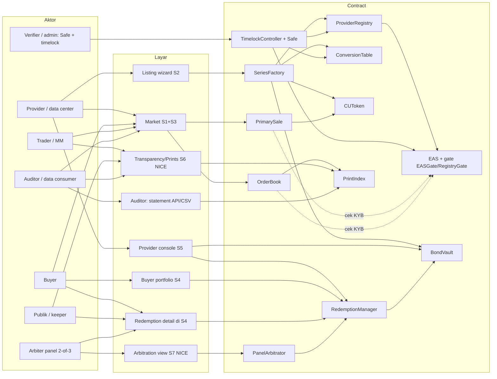
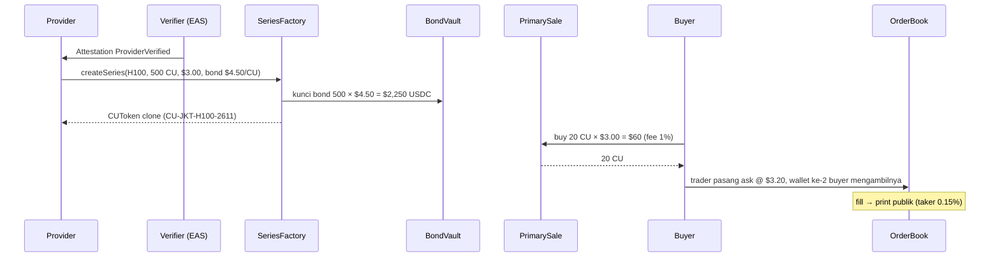
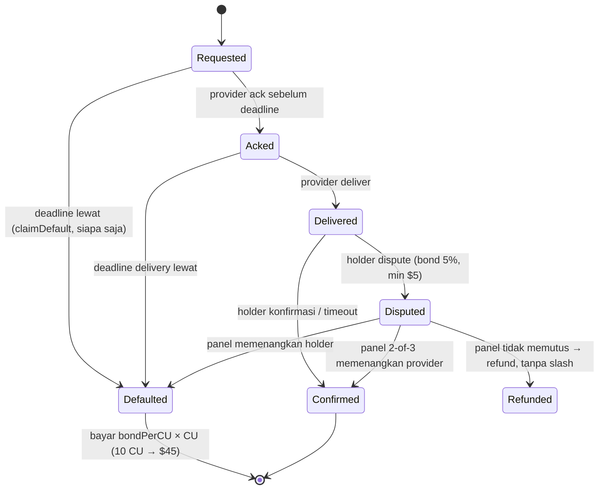
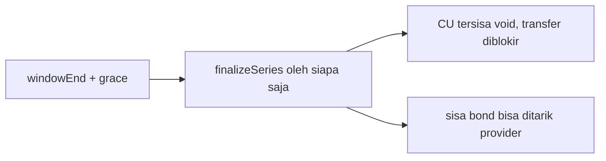
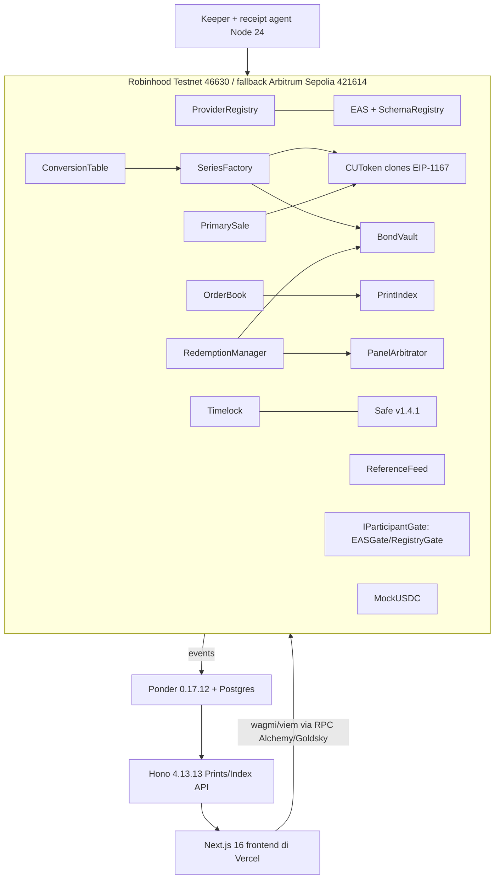

# Paron: dokumen product knowledge (lengkap)

Disusun Selasa 6 Okt 2026 (WIB) dari empat file: `paron-design.md`, `paron-stack.md`, `paron-gaps.md`, `open-questions-research.md`. Isinya tidak ditambah di luar file-file itu.

**Label yang dipakai:**
- **[MVP]** = dibangun dalam 27 jam hackathon (MUST).
- **[NICE]** = dikerjakan kalau sempat.
- **[ROADMAP]** = hanya disebut di pitch, tidak dibangun.
- **[BELUM TERVERIFIKASI]** = belum dicek, atau sumbernya pihak ketiga.
- ✅ terverifikasi · ⚠️ sebagian/inferensi · ❓ belum dicek.

> Footnote wajib di pitch, README, dan situs: *"Not affiliated with or endorsed by Ornn AI Inc. Ornn and OCPI are trademarks of their owners."* dan *"Not affiliated with or endorsed by Robinhood Markets, Inc. Robinhood and Arbitrum are trademarks of their respective owners."* Untuk slide yang menyebut ICE/HPR: *"Not affiliated with or endorsed by Ornn AI Inc. or ICE. OCPI and HPR are trademarks of their respective owners; figures cited from public sources."*

---

## 1. Gambaran proyek

### 1.1 Paron itu apa?
Paron adalah **marketplace institusional untuk unit komputasi GPU (compute unit, CU) yang ditokenisasi dan dijamin kolateral**.

Kalimat intinya: *data center terverifikasi mana pun bisa me-listing kapasitas GPU-nya sebagai CU berjaminan dalam beberapa klik. Siapa pun bisa membeli, memperdagangkan, atau me-redeem CU itu. Kalau provider gagal deliver, smart contract membayar pemegang dari bond (jaminan) provider tersebut.*

Hal-hal yang sudah dikunci Fatih:
- Nama: **Paron**.
- Settlement **USDC saja** di MVP (MockUSDC di testnet). IDRX adalah opsi masa depan dan tidak dibangun.
- Chain: **Robinhood Chain Testnet (46630)** sebagai utama, **Arbitrum Sepolia (421614)** sebagai fallback.
- Bond minimum **1,5 × harga primer per CU**.
- Gaya produk **institusional dan serius**, bukan meme launchpad. "pump.fun" hanya analogi untuk betapa gampangnya listing.
- Provisioning dan redemption terjadi **offchain di masing-masing provider**. Paron hanya pasarnya.
- Kolateral wajib, dan dibayarkan ke pemegang kalau default-nya terbukti.

### 1.2 Masalah yang diselesaikan
- Compute (jam GPU) mulai jadi komoditas. Sudah ada benchmark dari transaksi riil (OCPI milik Ornn) dan futures yang diumumkan di ICE (masih menunggu CFTC). Tapi **jam GPU yang benar-benar bisa dikirim (deliverable) masih dijual lewat deal privat dan bilateral.**
- Tidak ada lembaga kliring tepercaya untuk compute di Asia Tenggara. Pembeli tidak punya jaminan kalau provider "ghosting", bangkrut, atau menjual kapasitas yang sama dua kali.
- Benchmark butuh **"printed transactions"**, yaitu harga transaksi yang publik dan bisa diatribusikan. RFC CFTC justru khawatir soal indeks yang dibangun dari deal "bilateral and privately priced".

### 1.3 Untuk siapa?
| Peran | Siapa | Bisa apa |
|---|---|---|
| **Provider** | Data center / GPU cloud (mis. colo di Jakarta, tenant kampus AI di Batam) | Diverifikasi, listing series (posting bond), menetapkan harga primer, ack + deliver redemption, tarik sisa bond setelah expiry |
| **Verifier** | Penerbit kredensial yang di-allowlist (di MVP: multisig tim; nanti auditor/firma KYB) | Menerbitkan/mencabut attestation EAS `ProviderVerified` dan opsional `CapacityAttested` |
| **Buyer / holder** | Startup AI, lab, enterprise | Beli di primer, trading, redeem, konfirmasi/dispute delivery, klaim default |
| **Trader / market maker** | Fund, hedger, desk market-making milik provider | Pasang limit order, sediakan likuiditas, basis trade vs indeks eksternal |
| **Arbitrator** | Dipilih per series saat listing dari allowlist (MVP: panel 2-of-3; nanti adapter Kleros/UMA [NICE/ROADMAP]) | Memutus redemption yang di-dispute saja |
| **Keeper (siapa saja)** | Wallet mana pun | Memicu `claimDefault` setelah deadline lewat, finalisasi series yang expired |
| **Auditor / institusi** | Pihak yang butuh jejak audit dan data | Membaca prints, statement, dashboard transparansi (lihat fitur 5.10) |

### 1.4 Positioning: infrastruktur pasar fisik onchain di bawah benchmark Ornn / futures ICE
- **Satu kalimat:** *"Ornn membangun lantai bursa teregulasi dan benchmark-nya. Kami membangun pasar fisik onchain yang terbuka di bawahnya, tempat provider terverifikasi di mana pun bisa mengubah kapasitas jadi unit yang berjaminan, bisa dikirim, dan bisa diperdagangkan."*
- Fakta Ornn yang boleh dikutip (sumber di `compute-unit.md`, dirangkum di design §6):
  - OCPI disebut "the first compute index built only from printed transactions".
  - Futures H100 dan B200 cash-settled diumumkan di ICE (pending CFTC).
  - Ornn menjual kapasitas fisik (Ornn Compute). Pendanaan: $5,7 juta (Okt 2025) dan seed $33 juta dipimpin a16z crypto (Jun 2026).
  - Ornn sengaja memilih cash settlement: "financial parties have no interest in managing SLAs, API endpoints, SSH details."
- **Tiga cara Paron memperluas pasar itu, tanpa partnership:**
  1. *Reference price in:* harga referensi eksternal ditampilkan di samping harga onchain + basis. **Koreksi:** syarat pakai OCPI melarang tampilan atau pemakaian sebagai referensi tanpa lisensi tertulis. Jadi MVP memakai **referensi sintetis berlabel**, dan OCPI hanya dikutip sebagai teks di slide.
  2. *Prints out:* setiap fill, delivery, dan default adalah catatan publik. Index provider mana pun "**could ingest**" data itu (jangan pernah bilang "feeds").
  3. *Physical leg untuk hedger:* CU bisa jadi kaki fisik dari basis trade terhadap futures cash-settled. Kelayakan EFRP **[BELUM TERVERIFIKASI]** dan sepenuhnya keputusan bursa.
- Catatan penting: lingkup OCPI saat ini **hanya rental on-demand**, dan kontrak forward/reserved ada di luar lingkup. Jadi trade CU Paron **tidak** memenuhi syarat sebagai input OCPI menurut definisi sekarang.

### 1.5 Konteks hackathon
- **Ethereum Jakarta Hackathon 2026 (ETHJKT)** di HackQuest, track tunggal **RWA: "Build the Real World Onchain"**.
- Workshop pra-hackathon 5–7 Okt 2026.
- **Build: Jumat 9 Okt 09:00 WIB → submit Sabtu 10 Okt 12:00 WIB** (27 jam). Day 1 adalah sprint offline 12 jam di ETHJKT @ Hub (Jakarta Creative Hub), Day 2 online.
- Demo Day Minggu 11 Okt di Ganara Art (tim terpilih).
- Kriteria juri: Real-World Utility 25%, Onchain Implementation 25%, Innovation 20%, Feasibility & Scalability 20%, Demo & UX 10%.
- Aturan inti: proyek harus "built from scratch during the official hackathon period". Persiapan environment dan riset boleh dilakukan sebelumnya (detail di §9.4).

---

## 2. Nama dan filosofi

- **Paron** dalam bahasa Indonesia/Jawa berarti **landasan tempa (anvil)**, yaitu balok besi tempat pandai besi memukul setiap bilah.
- **Cerita brand:** setiap GPU berbeda-beda (H100, H200, B200, A100, …), seperti logam mentah. Di Paron, semuanya **ditempa jadi satu standar**: 1 CU = 1 jam GPU setara H100. Setelah ditempa, unit itu dijamin kolateral (bond terkunci sebelum unitnya ada) dan bisa diperdagangkan onchain. Proses listing di demo disebut "forge" (menempa) sebuah series.
- **Tagline yang tersedia:**
  - EN: *"Where compute is forged into one standard."* / *"Every GPU, one anvil, one unit."* / *"Strike once. Trade anywhere."*
  - ID: *"Ditempa jadi satu standar."* / *"Semua GPU, satu landasan, satu unit."*

---

## 3. Tiga opsi one-liner (pilih salah satu)

**Opsi 1: produk (fungsional)**
- EN: *"Paron turns GPU capacity into collateral-backed compute units. Any verified data center can list in a few clicks, anyone can trade them, and code pays holders if a provider doesn't deliver."*
- ID: *"Paron mengubah kapasitas GPU menjadi unit komputasi berjaminan kolateral. Data center terverifikasi bisa listing dalam beberapa klik, siapa pun bisa memperdagangkannya, dan smart contract membayar pemegang jika provider gagal deliver."*

**Opsi 2: makna nama (brand)**
- EN: *"Paron means anvil, the block every blade is struck on. On Paron, every GPU, from H100 to B200, is forged into one standard unit of compute, backed by collateral and tradable onchain."*
- ID: *"Paron adalah landasan tempa, tempat setiap bilah dibentuk. Di Paron, setiap GPU, dari H100 sampai B200, ditempa menjadi satu unit komputasi standar yang berjaminan kolateral dan bisa diperdagangkan onchain."*

**Opsi 3: saham tokenisasi → compute tokenisasi (narasi RWA; wajib footnote Robinhood)**
- EN: *"Tokenized stocks proved Wall Street's assets can live onchain. Paron does it for the asset AI runs on: the GPU-hour, forged into a collateral-backed unit, on Robinhood Chain, the L2 built for tokenized real-world assets."* (pendek: *"Stocks went onchain. Compute is next."*)
- ID: *"Saham tokenisasi membuktikan aset Wall Street bisa hidup onchain. Paron melakukannya untuk aset yang menggerakkan AI: jam GPU, ditempa menjadi unit berjaminan kolateral, di Robinhood Chain, L2 yang dibangun untuk aset dunia nyata yang ditokenisasi."* (pendek: *"Saham sudah onchain. Berikutnya komputasi."*)
- Guardrail: Stock Tokens hanya ada di Robinhood Chain **mainnet** dan merupakan sekuritas yang di-mint lewat KYB. Demo kita di **testnet** dan tidak menyentuh Stock Tokens, jadi jangan tampilkan Stock Tokens di produk.

---

## 4. Konsep inti

### 4.1 CU (Compute Unit)
- **1 CU = 1 jam GPU setara H100-SXM-80GB.**
- Setiap series **men-snapshot faktor konversi GPU-nya saat listing**, jadi perubahan tabel faktor di kemudian hari tidak mengubah harga unit yang sudah ada.
- Contoh:
  - Provider H200 me-listing 1.000 jam H200 → terbit **1.400 CU** (faktor 1,40).
  - Redeem 14 CU dari series itu → dapat 10 jam H200.
- Harga selalu dikutip **per CU**, jadi semua series bisa dibandingkan di satu kurva. Contohnya, H200 seharga $5,69/jam tampil sebagai $4,06/CU.

### 4.2 Tabel faktor konversi GPU
**Metode:**
- Skor kapabilitas berbasis spesifikasi saja, relatif terhadap H100 SXM: `0,70 × rasio TFLOPS BF16 dense + 0,30 × rasio memory bandwidth`.
- Hasilnya dicek-silang dengan rasio harga sewa di pasar, karena kapasitas memori dan ukuran NVLink domain punya premium harga yang tidak tertangkap oleh angka throughput saja.
- Faktor ini adalah **nilai kebijakan** di `ConversionTable`: perubahannya kena timelock, dan nilainya di-snapshot per series.

| GPU | BF16 Tensor dense | Memory BW | Skor spek | Rasio pasar vs H100 | **Faktor Paron** | Usulan revisi |
|---|---|---|---|---|---|---|
| H100 SXM 80GB | 989,5 TFLOPS | 3,35 TB/s | 1,00 | 1,00 | **1,00** | Definisi |
| H200 SXM 141GB | 989,5 TFLOPS | 4,8 TB/s | 1,13 | 1,35 (AIMultiple, median Sep-26) – 2,08 (OCPI 5 Okt 26) | **1,40** | Masih dalam rentang; memori 141 GB diberi premium oleh pasar |
| B200 SXM 180GB | 2,25 PFLOPS | ~8 TB/s | 2,31 | 2,01 – 3,00 | **2,50** | Masih dalam rentang |
| GB200 (per GPU, NVL72) | 2,5 PFLOPS | 8 TB/s | 2,49 | ~4,4 (listing tipis) | **3,50** | Premium untuk NVLink domain 72 GPU; data pasarnya sedikit |
| A100 SXM 80GB | 312 TFLOPS | 2,039 TB/s | 0,40 | 0,37 – 0,54 | **0,60** | ⚠ Di atas spek maupun pasar → **usulan 0,45** |
| RTX 4090 24GB | 165,2 TFLOPS | 1,008 TB/s | 0,21 | 0,135 | **0,35** | ⚠ Di atas keduanya → **usulan 0,20**, atau tidak listing GPU konsumer di MVP |

Revisi A100 dan RTX 4090 masih **open question** (§12.3, Q9).

Sumber: datasheet NVIDIA; settlement OCPI publik 5 Okt 2026 (H100 $2,52; H200 $5,23; B200 $7,55; A100 $0,92); median on-demand AIMultiple Sep 2026; floor GB200 di gpurentalprices.com. Rasio pasar bergerak tiap minggu, jadi pakai sebagai pita kewajaran, bukan input formula.

### 4.3 Series
- **Satu listing = satu token ERC-20**, contoh `CU-JKT-H100-2611` (provider, region, kelas GPU, window redemption).
- Setiap series membawa:
  - spec hash yang tidak bisa diubah (SLA, interconnect, region, metode akses, redemption minimum);
  - window redemption;
  - **bond terisolasi** miliknya sendiri.
- **Window bulanan kalender** (usulan MUST dari gap G5, nama gaya `CU-JKT-H100-2026-11`). Statusnya masih perlu dikonfirmasi Fatih (Q2). Tujuannya sejajar dengan futures ICE OCPI H100 (HPR), yang **ukuran kontraknya = jumlah jam dalam bulan kontrak**.
  - **720 CU = 1 GPU H100 selama 1 bulan 30 hari** (744 CU untuk bulan 31 hari). Artinya 1 series bulanan H100 = ukuran 1 kontrak HPR.
  - Helper "contract-month lot" di UI: "720 CU = 1 H100 for November (720 hours)".

### 4.4 Bond 1,5×
- **Bond per CU ≥ 1,5 × harga primer.** Provider boleh posting lebih banyak dan mendapat badge "200% backed".
- Bond penuh (`bondPerCU × maxSupply`) **ditarik di transaksi yang sama dengan pembuatan series**, jadi tidak ada CU tanpa jaminan.
- Invariant: `bond[s] ≥ bondPerCU × (circulating + inRedemption)`.
- Kenapa cukup:
  - Provider menerima `p` per CU, dan kalau default ia kehilangan `1,5p` per CU. Jadi default selalu rugi 0,5p dibanding yang pernah diterimanya.
  - Holder dibuat utuh di harga primer + 50%.
- Sisa risiko: **default strategis** saat harga GPU melonjak jauh di atas 1,5p. Mitigasinya: reputasi + KYB, coverage ratio yang terlihat, dan margin call berbasis indeks di v2 [ROADMAP].
- Pembeli di pasar sekunder yang membeli di atas 1,5p menanggung basis risk. UI menampilkan "Default compensation: $X per CU (fixed)".

### 4.5 Settlement USDC
- MVP memakai **MockUSDC** (6 desimal) yang kita deploy di kedua testnet, lengkap dengan faucet.
- Token settlement adalah **parameter constructor**, jadi USDG, IDRX, atau stablecoin lain bisa ditambahkan tanpa redesign.
- Stablecoin jangka panjang per venue dibahas di §10.4.

### 4.6 Expiry
- Compute adalah **flow good** (framing Ornn sendiri), sehingga series dibatasi waktu.
- Setelah `windowEnd` lewat (plus masa tenggang untuk request yang masih terbuka), siapa pun memanggil `finalizeSeries`:
  - CU yang belum di-redeem hangus (void), seperti kamar hotel yang tidak dipakai;
  - transfer token diblokir;
  - sisa bond provider bisa ditarik.
- Manfaatnya: setiap kewajiban punya akhir yang jelas, dan **tidak ada klaim tunai abadi berbasis harga oracle** (yang bisa dipakai orang untuk menguras kolateral dengan membeli di bawah harga referensi).

### 4.7 Onchain vs offchain
| Onchain (dipaksakan kode) | Offchain (urusan provider) |
|---|---|
| Attestation verifikasi, faktor konversi, term series | Dokumen KYB, kontrak, server fisik |
| Mint dibatasi bond, primary sale, order book, trade prints | Provisioning: SSH, API key, namespace Kubernetes |
| Request redemption, deadline ack/delivery, dispute, payout default dari bond | Menjalankan workload, support, operasional SLA |
| Custody, release, dan slashing bond | Upaya hukum di luar bond (term provider) |

Dua kegagalan yang dicegah sejak desain:
1. **Tidak ada mint tanpa jaminan.**
2. **Tidak ada redemption tunai berbasis harga oracle dan tidak ada pool bersama.** Payout hanya terjadi saat default terbukti, dengan `bondPerCU` tetap, dan hanya dari bond series itu sendiri.

---

## 5. Fitur

Setiap fitur dijelaskan dengan format: **apa**, **kenapa**, **alur**, **Dibangun dengan** (beserta versi dari `paron-stack.md`). Semua item stack muncul di minimal satu fitur.

**Versi dasar (berlaku untuk semua contract):**
- Solidity **0.8.37**, kompilasi via Foundry **v1.8.5** (`forge`/`cast`/`anvil`).
- `auto_detect_solc = true` diperlukan supaya EAS (pragma persis 0.8.29) ikut terkompilasi.
- Nyalakan optimizer (`optimizer = true`): runtime EAS tanpa optimizer 24.397 B, hanya 179 B di bawah batas ukuran contract, terlalu mepet. ✅ diuji di fork.

### 5.1 Provider registry + KYB [MVP]
- **Apa:** registry provider terverifikasi. Status verifikasi = attestation EAS `ProviderVerified` dari verifier yang di-allowlist. Bisa dicabut (revocable).
- **Kenapa:** hanya data center tepercaya yang boleh listing. Self-match juga dicegah lewat `entityId` KYB.
- **Alur:** provider mengirim KYB offchain → verifier menerbitkan attestation → `ProviderRegistry` mengecek attestation saat listing.
- **Dibangun dengan:**
  - `ProviderRegistry.sol`;
  - EAS contracts **1.9.0** (self-deploy di RH Testnet; di Arbitrum Sepolia pakai yang sudah ada: EAS `0x2521…E1dE`, SchemaRegistry `0x45CB…d475`);
  - EAS SDK **2.10.0**;
  - OpenZeppelin **5.6.1** (AccessControl);
  - EIP-712 (attestation tertanda);
  - opsional `CapacityAttested` [NICE].

### 5.2 Listing wizard + bond ("forge a series") [MVP]
- **Apa:** wizard beberapa langkah untuk memilih GPU, jumlah jam, window bulanan, harga primer, dan bond (≥1,5×). Hasilnya series ERC-20 baru.
- **Kenapa:** listing "semudah pump.fun", tapi tetap berjaminan penuh.
- **Alur:** pilih GPU → faktor konversi di-snapshot → approve USDC → `SeriesFactory.createSeries` membuat clone `CUToken` dan mengunci bond di `BondVault` dalam satu tx.
- **Dibangun dengan:**
  - Contract: `SeriesFactory`, `CUToken` (clone EIP-1167 via OZ Clones), `ConversionTable`, `BondVault`, `MockUSDC`;
  - OpenZeppelin 5.6.1 (+ Upgradeable **5.6.1** bila perlu, SafeERC20);
  - Frontend: Next.js **16.3.8**, React **19.3.0**, wagmi **2.19.5**, viem **2.57.3**, RainbowKit **2.2.11**, TanStack Query **5.104.1**, Tailwind **4.3.3**, shadcn CLI **4.21.3**;
  - Spec di-hash, dokumen opsional di IPFS.

### 5.3 Primary sale [MVP]
- **Apa:** penjualan pertama dengan harga tetap dari provider ke buyer, dibayar USDC. Fee 1%.
- **Kenapa:** provider menerima modal di depan, buyer dapat CU di harga primer.
- **Alur:** buyer approve USDC → `PrimarySale.buy` → CU di-mint ke buyer → USDC (dikurangi fee 1%) masuk ke provider → event print `PRIMARY`.
- **Dibangun dengan:**
  - Contract: `PrimarySale`, `MockUSDC`, gate `IParticipantGate`;
  - viem 2.57.3 / wagmi 2.19.5;
  - Ponder untuk print-nya.

### 5.4 Order book (CLOB-lite) [MVP]
- **Apa:** order book limit onchain sederhana per series, dengan fee taker 0,15% dan maker 0%.
- **Kenapa:** CU punya expiry, jadi kurva AMM tidak cocok. Order book juga menghasilkan trade prints yang bisa diatribusikan.
- **Alur:** maker memasang order (dana di-escrow) → taker mengisi → fill = event print → self-match diblokir lewat `entityId` KYB.
- **Dibangun dengan:**
  - Contract: `OrderBook.sol`, OZ ReentrancyGuard;
  - UI chart: lightweight-charts **5.2.1**;
  - Ponder untuk riwayat fill;
  - Testing: Foundry invariant/fuzz.

### 5.5 Redemption [MVP]
- **Apa:** state machine `Requested → Acked → Delivered → Confirmed`, dengan deadline untuk ack dan delivery.
- **Kenapa:** CU adalah klaim atas jam GPU nyata, bukan sekadar token.
- **Alur:** holder burn/escrow CU → provider ack (endpoint offchain, hanya hash-nya yang onchain) → deliver → holder konfirmasi, atau konfirmasi otomatis setelah timeout.
- **Dibangun dengan:**
  - `RedemptionManager.sol`;
  - EIP-712 untuk delivery receipt;
  - Ponder + Hono untuk status;
  - UI Next.js/shadcn.

### 5.6 Default, dispute, dan arbitrase [MVP]
- **Apa:** `claimDefault` permissionless setelah deadline lewat membayar `bondPerCU` per CU dari bond. Untuk ketidaksepakatan, ada dispute bond 5% dari klaim (min $5) yang diputus `PanelArbitrator` 2-of-3. Kalau panel tidak memutus tepat waktu, request di-refund tanpa slash.
- **Kenapa:** jaminan bisa dieksekusi oleh kode, tanpa perlu percaya pada Paron.
- **Alur:** lihat flow default di §7.
- **Dibangun dengan:**
  - `IArbitrator` + `PanelArbitrator`, `BondVault`, `RedemptionManager`;
  - adapter Kleros/UMA [ROADMAP];
  - Slither **0.11.6** untuk analisis statis.

### 5.7 Prints API + indeks + integritas [MVP]
- **Apa:** setiap fill/primer/delivery/default jadi print publik. Setiap print punya flag `eligible`. Indeks per kelas dihitung dengan VWAP winsorized, dengan status OK / THIN / DISRUPTED.
- **Kenapa:** benchmark butuh "printed transactions". Ini juga dasar Data API berbayar.
- **Alur:** event contract → indexer Ponder → API Hono (`/prints`, `/index`) → dashboard dan ekspor CSV.
- **Dibangun dengan:**
  - Indexer: Ponder **0.17.12** (PGlite saat dev → Postgres 16/17 saat deploy);
  - API: Hono **4.13.13**;
  - Alternatif indexer: Goldsky CLI **13.15.1** / graph-cli **0.98.1**;
  - Kontrak `PrintIndex`;
  - Chart: Recharts **3.10.1**;
  - Dashboard Dune [NICE].

### 5.8 Reference feed (sintetis) [MVP]
- **Apa:** `ReferenceFeed` yang memuat harga referensi **sintetis berlabel** di samping harga onchain, plus basis.
- **Kenapa:** menunjukkan konsep basis vs benchmark eksternal tanpa melanggar syarat lisensi OCPI.
- **Alur:** admin/keeper memposting nilai sintetis → UI menampilkannya dengan label "synthetic reference".
- **Dibangun dengan:**
  - `ReferenceFeed.sol`;
  - keeper (viem);
  - lightweight-charts.
- OCPI **tidak** ditampilkan di produk; integrasi resmi butuh lisensi [ROADMAP].

### 5.9 KYB gate untuk buyer/trader [MVP]
- **Apa:** `IParticipantGate` dengan dua implementasi:
  - `EASGate`: cek attestation;
  - `RegistryGate`: allowlist.
- **Kenapa:** pasar institusional, dan bisa naik ke ERC-3643 nanti [ROADMAP].
- **Dibangun dengan:** EAS 1.9.0 / SDK 2.10.0, OpenZeppelin 5.6.1. EIP-1271 dipakai supaya wallet Safe bisa ikut tanda tangan.

### 5.10 Dashboard transparansi / auditor [MVP sebagian, NICE sisanya]
- **Apa:** halaman per series yang menampilkan coverage ratio, saldo bond, supply beredar, riwayat redemption/default, dan prints. Tersedia statement yang bisa diekspor.
- **Kenapa:** institusi dan auditor butuh jejak audit.
- **Dibangun dengan:**
  - Next.js/React, Recharts, API Ponder/Hono;
  - link explorer: Blockscout (RH Testnet), Arbiscan + Etherscan V2 API (Arbitrum Sepolia);
  - Dune [NICE].

### 5.11 Governance (timelock + Safe) [MVP]
- **Apa:** parameter admin (tabel konversi, allowlist verifier/arbitrator, fee) diatur lewat OZ TimelockController yang dimiliki Safe multisig.
- **Kenapa:** tidak ada kunci tunggal yang bisa mengubah aturan diam-diam.
- **Dibangun dengan:**
  - Safe contracts **v1.4.1**:
    - RH Testnet: Safe UI + tx-service tersedia;
    - Arbitrum Sepolia: tanpa Safe UI, jadi pakai protocol-kit atau fallback allowlist + timelock. ✅ diuji di fork untuk kedua chain;
  - Safe protocol-kit **8.0.7**;
  - OZ TimelockController 5.6.1;
  - EIP-1271.

### 5.12 Keeper + agent delivery receipt [MVP sederhana]
- **Apa:** skrip keeper yang memicu `claimDefault` / `finalizeSeries` setelah deadline, plus agent yang menandatangani delivery receipt (EIP-712) di sisi provider.
- **Kenapa:** default dan expiry harus jalan tanpa campur tangan manusia.
- **Dibangun dengan:**
  - Node **24.21.0**, TypeScript **5.9.3**, viem 2.57.3;
  - RPC Alchemy atau Goldsky Edge;
  - hosting Railway / Render / Fly.io.

### 5.13 Fondasi lintas fitur (toolchain, test, CI, infra, docs) [MVP]
- **Dibangun dengan:**
  - Foundry v1.8.5 (unit/fuzz/invariant + fork test) dan Slither 0.11.6;
  - Vitest **5.0.3** (TS) dan Playwright **1.63.0** (e2e UI);
  - pnpm **12.9.1** (monorepo) dan Biome **2.5.15** (lint/format);
  - GitHub Actions + `foundry-rs/foundry-toolchain`;
  - Vercel (frontend);
  - Postgres 16/17 (prod indexer);
  - IPFS (dokumen spec);
  - login embedded wallet Privy **3.47.0** / @privy-io/wagmi **4.0.18** [ROADMAP / NICE].

---

## 6. Fitur per Aktor

Bagian ini menyusun ulang fitur dari §5 berdasarkan **siapa yang memakainya**. Semua angka diambil dari design §2–§4 dan §10:
- Fee: primary 1%, taker 0,15%, maker 0%.
- Window: ack 24 jam, delivery 48 jam setelah ack, dispute 72 jam setelah `markDelivered`. Versi demo: 60 dtk / 60 dtk / 90 dtk.
- Dispute bond: 5% dari klaim, minimal $5.
- Timelock: 48 jam di produksi, 5 menit di demo.

**Peta layar.** Nama layar di bagian ini dipetakan ke layar S1–S7 di §11.2:
| Nama layar di sini | Layar di desain | Status |
|---|---|---|
| **Market** | S1 Market + S3 Series page (order book, tape, bond health) | MVP |
| **Listing wizard** | S2 List capacity (wizard 3 langkah) | MVP |
| **Provider console** | S5 Provider console | MVP |
| **Buyer portfolio** | S4 Portfolio & redemptions | MVP |
| **Redemption detail** | Timeline per request di S4 (countdown + tombol Confirm / Dispute / Claim default) | MVP (bagian dari S4, bukan layar terpisah) |
| **Transparency/Prints** | S6 Prints & data (chart PrintIndex, statistik default, export) | NICE; data API-nya MUST |
| **Auditor** | Tidak ada layar terpisah di desain. Yang ada: `GET /v1/accounts/{addr}/statement`, CSV statement per akun, link explorer, Dune | API = MUST, CSV statement + Dune = NICE |
| (tambahan) **Arbitration view** | S7 | NICE |

---

### 6.1 Provider / data center

**Siapa dan tujuannya.** Data center atau GPU cloud, misalnya colo di Jakarta atau tenant kampus AI di Batam. Tujuannya menjual kapasitas GPU di depan (presell) ke pasar global, dapat modal di muka, dan membangun reputasi onchain.

**Fitur / aksi:**
| Aksi | Detail | Tag |
|---|---|---|
| KYB via EAS | KYB dilakukan offchain oleh verifier, lalu terbit attestation `ProviderVerified`. `ProviderRegistry` hanya mengizinkan listing kalau attestation itu ada dan belum dicabut. Status provider: Active / Suspended / Banned. | MVP. `CapacityAttested` opsional (MUST di gap §10.4, NICE di §7.1 desain) |
| Listing wizard 3 langkah | (1) **Capacity**: model GPU (faktor terisi otomatis), jumlah jam GPU, region, window, form spec (di-hash jadi `specHash`, JSON di IPFS). (2) **Terms**: harga primer/CU, bond/CU, window ack/delivery/dispute, pilihan arbitrator. (3) **Bond & launch**: satu transaksi approve USDC + `createSeries`. Target: di bawah 1 menit. | MVP |
| Bond 1,5× | `bondPerCU ≥ 1,5 × primaryPrice`. Bond penuh ditarik di tx yang sama dan terisolasi per series. Boleh posting lebih untuk badge "200% backed". | MVP |
| Pilih arbitrator | Dipilih dari allowlist saat listing. Holder melihatnya sebelum membeli, jadi pilihan ini ikut "dihargai" di series. | MVP |
| Terima hasil primary sale | Hasil penjualan dikurangi fee 1% langsung masuk ke provider (tidak di-escrow; open question Q1). Harga primer hanya boleh **naik** selama sale masih buka. | MVP |
| Ack + mark delivered | `acknowledge(reqId)` dalam 24 jam, provisioning offchain, lalu `markDelivered(reqId, receiptHash)` dalam 48 jam. | MVP |
| `declineAndPay` | Menolak secara sukarela dan langsung membayar default. Reputasinya turun lebih sedikit. | MVP (bagian state machine) |
| Agent provider | Skrip Node/viem yang otomatis ack + mark delivered, dengan kill switch untuk demo default. Delivery receipt EIP-712 dengan data `nvidia-smi` statusnya NICE. | MVP (agent), NICE (receipt bertanda tangan) |
| Market-making series sendiri | Pasang limit order di order book (maker 0%). Tetap kena aturan self-trade block. | MVP |
| Reclaim bond setelah expiry | Setelah `finalizeSeries`, `BondVault.withdrawRemaining` (hanya provider) menarik sisa bond untuk CU yang tidak pernah di-redeem atau sudah delivered. | MVP |
| Reputasi | Counter `deliveredCU`, `defaultedCU`, `disputesLost`, yang hanya ditulis oleh `RedemptionManager`. | MVP |

**Layar:** Listing wizard, Provider console (request masuk, status bond, hasil penjualan, reputasi, tombol "withdraw remaining bond"), Market.

**Contract yang disentuh:** `ProviderRegistry` (dibaca), `ConversionTable` (snapshot faktor), `SeriesFactory`, `CUToken` (clone), `BondVault`, `MockUSDC`, `PrimarySale`, `OrderBook`, `RedemptionManager`. EAS juga dibaca lewat registry.

---

### 6.2 Buyer (perusahaan AI / pengguna compute)

**Siapa dan tujuannya.** Startup AI, lab, atau enterprise. Tujuannya mengamankan jam GPU di harga tetap dengan jaminan kolateral, dan bisa menjual lagi kalau tidak terpakai.

**Fitur / aksi:**
| Aksi | Detail | Tag |
|---|---|---|
| KYB partisipan | Attestation EAS `ParticipantVerified` (entityId, role, country, expiry) dicek lewat `IParticipantGate` di transfer hook `CUToken` untuk series "institusional". | MVP |
| Beli di primer | Bayar `qty × primaryPrice` dalam USDC, CU di-mint langsung (tidak ada stok pra-mint). `maxCost` wajib diisi sebagai proteksi slippage. Fee 1% ditanggung provider (dipotong dari hasil penjualannya). | MVP |
| Jual / beli di sekunder | Lewat order book sebelum window tutup (taker 0,15%, maker 0%). | MVP |
| Request redemption | `requestRedemption(series, amount, deliveryRef)`. `deliveryRef` = hash detail akses offchain (mis. SSH public key), dienkripsi ke key provider dan disimpan di IPFS. CU di-**lock**, belum di-burn. Ada redemption minimum (mis. 8 CU = 1 node-hour 8 GPU; demo 1 CU). | MVP |
| Konfirmasi | `confirm(reqId)`. Kalau diam saja, otomatis final setelah window dispute 72 jam. CU di-burn dan bond provider dilepas. | MVP |
| Dispute | Dalam 72 jam setelah `markDelivered`, dengan dispute bond 5% (min $5). Hasilnya: menang → DEFAULTED, dibayar dari bond + dispute bond dikembalikan; kalah → dispute bond jatuh ke provider; panel tidak memutus → REFUNDED (CU dibuka lagi, dispute bond kembali, tanpa slash). | MVP |
| Klaim default | Kalau deadline lewat, buyer (atau siapa saja) memanggil `claimDefault`. Buyer menerima `bondPerCU × amount` dari bond series itu. Demo: 10 CU → **$45**. | MVP |
| Lihat kompensasi | UI menampilkan "Default compensation: $X per CU (fixed)", karena pembeli sekunder di atas 1,5p menanggung basis risk. | MVP |
| Statement akun | `/v1/accounts/{addr}/statement` (API), versi CSV. | API MUST, CSV NICE |
| Login gasless (Privy / paymaster) | — | NICE / ROADMAP |

**Layar:** Market, Buyer portfolio, Redemption detail.

**Contract yang disentuh:** `PrimarySale`, `MockUSDC`, `CUToken`, `OrderBook`, `RedemptionManager` (yang memicu `BondVault` untuk payout), dan gate (`EASGate` / `RegistryGate`).

---

### 6.3 Trader / market maker

**Siapa dan tujuannya.** Fund, hedger, atau desk market-making milik provider. Tujuannya menyediakan likuiditas, mendapat spread, dan menjalankan basis trade terhadap indeks eksternal.

**Fitur / aksi:**
| Aksi | Detail | Tag |
|---|---|---|
| KYB partisipan | `ParticipantVerified`. `entityId`-nya dipakai untuk blokir self-trade. | MVP |
| Limit order | Order book CLOB-lite per series: tick 0,01 USDC, prioritas harga-waktu, partial fill, cancel. Order yang menggantung meng-escrow asetnya. Maker 0%, taker 0,15% (ke treasury). Order ditolak setelah `windowEnd`. Level harga dibatasi (≤10 di stack, ≤20 per sisi di desain). | MVP |
| Self-trade block | Order yang maker dan taker-nya punya `entityId` KYB sama ditolak, jadi tidak ada wash trade yang masuk print. | MVP |
| Baca PrintIndex / basis | VWAP per kelas GPU (dalam satuan CU) vs referensi **sintetis** berlabel. | MVP (PrintIndex), NICE (ReferenceFeed sintetis + chart basis) |
| API trading terprogram | Sekarang: read API (order book, prints). Order bertanda tangan EIP-712 + EIP-1271 + program market maker. | Read API MVP; signed orders NICE/ROADMAP |
| Physical leg basis trade | CU dipegang/dikirim sebagai kaki fisik terhadap futures cash-settled. Kelayakan EFRP **[BELUM TERVERIFIKASI]** dan sepenuhnya keputusan bursa. | ROADMAP (narasi) |

**Layar:** Market (S1 + S3: order book, tape), Transparency/Prints.

**Contract yang disentuh:** `OrderBook`, `CUToken`, `MockUSDC`, gate, `PrintIndex` (dibaca), `ReferenceFeed` (dibaca).

---

### 6.4 Publik / keeper (siapa saja)

**Siapa dan tujuannya.** Wallet mana pun, termasuk bot keeper tim atau juri yang memegang HP saat demo. Tujuannya memastikan aturan berbasis waktu tetap jalan tanpa admin, dan bisa membaca data pasar secara terbuka.

**Fitur / aksi:**
| Aksi | Detail | Tag |
|---|---|---|
| Pemicu default permissionless | `claimDefault(reqId)` setelah deadline ack (24 jam) atau delivery (48 jam) lewat. Payout `bondPerCU × amount` dibayar **ke holder** dari bond series itu, sekali saja (invariant test #6). | MVP |
| Finalisasi series | `finalizeSeries(s)` setelah `windowEnd` + masa tenggang. CU tersisa void, transfer diblokir, dan sisa bond bisa ditarik provider. | MVP |
| Baca prints publik | `GET /v1/prints?gpu=&region=&from=&to=&format=csv`, `/v1/index/{gpu}`, `/v1/series/{id}`, plus `latestRoundData()` di `PrintIndex`. | MVP |
| Keeper otomatis | Skrip Node/viem yang memanggil `claimDefault` / `finalizeSeries`. | MVP (sederhana) |

**Layar:** Redemption detail (tombol "Claim default" bisa ditekan wallet mana pun), Market, Transparency/Prints.

**Contract yang disentuh:** `RedemptionManager`, `BondVault` (lewat `RedemptionManager`), `SeriesFactory` / `CUToken` (finalisasi series), `PrintIndex` (dibaca).

> Catatan: desain menyebut `finalizeSeries(s)` tanpa merinci di contract mana fungsi itu berada.

---

### 6.5 Arbiter (panel 2-of-3 yang dipilih provider)

**Siapa dan tujuannya.** Panel yang dipilih provider per series saat listing, dari allowlist. Di MVP: panel 2-of-3 (tanda tangan 2-of-3 atau Safe). Belum diputuskan apakah panelnya tim sendiri atau stub Kleros/UMA (open question Q3). Tujuannya memutus **hanya** redemption yang di-dispute.

**Fitur / aksi:**
| Aksi | Detail | Tag |
|---|---|---|
| Memutus dispute | `rule(reqId, outcome)`. **Delivered** → FINALIZED dan dispute bond holder jatuh ke provider. **NotDelivered** → DEFAULTED: holder dibayar dari bond provider + dispute bond dikembalikan. | MVP |
| Batas waktu putusan | 7 hari di produksi, 120 dtk di demo. Kalau lewat: **REFUNDED** (CU holder dibuka lagi, dispute bond kembali, tanpa slash). Tidak ada pihak yang menang dengan mengulur waktu. | MVP |
| Fee arbitrator | Diambil dari dispute bond pihak yang kalah. | Usulan model bisnis (§10.1) |
| Bukti | Receipt hash dari provider vs log holder. Opsional: attestation EAS `DeliveryReceipt` atau heartbeat bertanda tangan. | MVP (hash), NICE (receipt/heartbeat) |
| Adapter Kleros / UMA | Lewat interface `IArbitrator`. | NICE (stub + docs) / ROADMAP |

**Layar:** Arbitration view (S7, NICE). Kalau tidak sempat dibangun: Redemption detail + tanda tangan via Safe/skrip.

**Contract yang disentuh:** `PanelArbitrator` (implementasi `IArbitrator`), yang memanggil balik `RedemptionManager` → `BondVault`.

---

### 6.6 Auditor / institusi / konsumen data

**Siapa dan tujuannya.** Auditor, institusi yang perlu rekonsiliasi, fund, lender, dan index provider. Termasuk **calon** konsumen data seperti Ornn. **Tidak ada partnership**: Ornn hanya disebut sebagai pihak yang "could ingest" data publik Paron, tidak pernah "feeds". Tujuannya mendapat jejak audit, harga transaksi yang bisa diatribusikan, dan data risiko provider.

**Fitur / aksi:**
| Aksi | Detail | Tag |
|---|---|---|
| Prints API | `/v1/prints` (JSON + CSV). Setiap print memuat tipe GPU native, USD/jam GPU native, harga CU, kuantitas, region (benua + ISO negara), timestamp ms, series, **flag `eligible`**, dan tx hash. | MVP |
| PrintIndex winsorized | Rata-rata winsorized berbobot volume atas print yang eligible, dengan ambang volume minimum. Status di API: `OK` / **`THIN`**. Desain gap menambah `DISRUPTED` + batas carry-forward. Mengabaikan print yang tidak eligible (invariant #4). | MVP (OK/THIN), status DISRUPTED disebut di gap G13 |
| Integritas pasar | Self-trade block per `entityId`, flag eligibility per print, `METHODOLOGY.md` berversi, dan perubahan parameter lewat timelock. | MVP |
| Statement + audit trail | `/v1/accounts/{addr}/statement` (trade, fee, redemption, default), link event ke explorer (Blockscout / Arbiscan), CSV per akun. | API MUST, CSV NICE |
| Dashboard publik | Dune. | NICE |
| Data API berbayar | Kurva harga, skor risiko provider, statistik default. | Model bisnis (§10.1), di luar MVP |
| Ekspor untuk kontribusi benchmark | Data delivered-rental di bawah perjanjian kontribusi tertulis. **Bukan** klaim bahwa data ini masuk OCPI; lingkup OCPI saat ini hanya on-demand. | ROADMAP |
| Referensi OCPI berlisensi | Lewat push oracle. | ROADMAP (butuh lisensi tertulis) |

**Layar:** Transparency/Prints, Auditor (API statement + CSV + explorer + Dune), Market (coverage, rekor delivered/default).

**Contract yang disentuh:** hanya baca. `PrintIndex` (`latestRoundData()`), event dari `OrderBook` / `PrimarySale` / `RedemptionManager` / `SeriesFactory` lewat indexer Ponder, `BondVault` (saldo bond / coverage).

---

### 6.7 Verifier / admin (Safe multisig + timelock)

**Siapa dan tujuannya.** Di MVP: multisig tim (Safe v1.4.1 2-of-3 di RH Testnet). Nanti verifier bisa auditor atau firma KYB [ROADMAP]. Persona demonya masih open question Q4. Tujuannya menerbitkan kredensial dan mengubah parameter tanpa ada kunci tunggal yang bisa mengubah aturan diam-diam.

**Fitur / aksi:**
| Aksi | Detail | Tag |
|---|---|---|
| Terbitkan / cabut attestation | `ProviderVerified`, `ParticipantVerified`, dan opsional `CapacityAttested` via EAS. | MVP |
| Timelock `ConversionTable` | Perubahan faktor GPU lewat `TimelockController` (48 jam prod / 5 menit demo, proposer = Safe). Hanya berlaku untuk series **baru**. Timelock yang sama menjaga parameter fee dan allowlist (verifier, arbitrator). | MVP |
| Ganti gate ke allowlist | Kalau EAS gagal di go/no-go (cek 3), ganti `EASGate` → `RegistryGate` (allowlist berbasis role). Cukup satu argumen constructor, tidak perlu redesign. | MVP (fallback) |
| Fallback admin tanpa Safe UI | Di Arbitrum Sepolia: protocol-kit 8.0.7 (opsi A), atau role ADMIN/VERIFIER/ARBITER + timelock yang memegang DEFAULT_ADMIN (opsi B). | MVP (fallback) |
| Pause | `pause` di series (OZ Pausable). Desain tidak merinci siapa pemegang role-nya. | MVP (disebut di desain) |
| Fee | Fee primary 1% dan taker 0,15% **langsung dikirim ke treasury** oleh `PrimarySale` / `OrderBook`. Sumber tidak merinci fungsi withdraw terpisah, juga tidak menyebut bahwa treasury = Safe **[BELUM TERVERIFIKASI di sumber]**. | MVP (aliran fee) |
| Status provider | Active / Suspended / Banned di `ProviderRegistry`. | MVP |

**Layar:** Tidak ada layar admin khusus di desain. Aksi dijalankan lewat Safe{Wallet} (RH Testnet), skrip protocol-kit, atau `forge script`. Hasilnya terlihat di Market dan Transparency/Prints.

**Contract yang disentuh:** EAS + SchemaRegistry, `ProviderRegistry`, `ConversionTable`, `TimelockController`, Safe, `EASGate` / `RegistryGate`, allowlist arbitrator di `SeriesFactory`, `PanelArbitrator` (komposisi panel).

---

### 6.8 Matriks aktor × fitur

Legenda: ● = aktor utama, ○ = membaca/terdampak, – = tidak terlibat.

| Fitur | Provider | Buyer | Trader | Publik/keeper | Arbiter | Auditor/data | Verifier/admin | Tag |
|---|---|---|---|---|---|---|---|---|
| KYB via EAS (`ProviderVerified` / `ParticipantVerified`) | ● | ● | ● | – | – | ○ | ● (penerbit) | MVP |
| Listing wizard 3 langkah | ● | ○ | ○ | – | – | – | – | MVP |
| Bond 1,5× terisolasi | ● | ○ | ○ | ○ | ○ | ○ | – | MVP |
| Primary sale (fee 1%) | ● (penerima) | ● | – | – | – | ○ | ○ (treasury) | MVP |
| Order book (taker 0,15% / maker 0%) | ○ (MM) | ● | ● | – | – | ○ | ○ (treasury) | MVP |
| Self-trade block (`entityId`) | ○ | ○ | ● | – | – | ○ | – | MVP |
| Redemption (ack 24j / delivered 48j) | ● | ● | – | – | – | ○ | – | MVP |
| Pemicu default permissionless | ○ | ● | – | ● | – | ○ | – | MVP |
| Dispute 72j, bond 5% (min $5) | ○ | ● | – | – | ● | ○ | – | MVP |
| Payout dari bond provider | ○ (dipotong) | ● (penerima) | – | ○ | ○ | ○ | – | MVP |
| Prints API `/v1/prints` (eligible + THIN) | ○ | ○ | ● | ● | – | ● | – | MVP |
| PrintIndex winsorized | ○ | ○ | ● | ○ | – | ● | ○ | MVP |
| `ConversionTable` timelock | ○ | – | – | – | – | ○ | ● | MVP |
| Ganti gate ke allowlist (`RegistryGate`) | ○ | ○ | ○ | – | – | – | ● | MVP (fallback) |
| Fee ke treasury | ○ | – | ○ | – | ○ (fee arbiter) | ○ | ● | MVP (aliran), withdraw [BELUM TERVERIFIKASI] |
| Reclaim bond setelah expiry | ● | – | – | ● (`finalizeSeries`) | – | ○ | – | MVP |
| Statement CSV / Dune | ○ | ○ | ○ | – | – | ● | – | NICE |
| Signed orders EIP-712 / adapter Kleros-UMA / OCPI berlisensi / ERC-3643 | – | ○ | ● | – | ● | ● | ● | ROADMAP |

### 6.9 Diagram aktor → layar → contract

Catatan diagram: Transparency/Prints dan Auditor membaca data lewat indexer Ponder + API Hono (dari event contract), bukan langsung tx ke contract. Verifier/admin tidak punya layar khusus; aksinya lewat Safe{Wallet} / skrip.

---

## 7. Alur end-to-end

**Angka demo (lihat juga §11):**
- Harga primer **$3,00/CU**.
- Bond **$4,50/CU** (1,5×).
- Default pada **10 CU** → holder menerima **$45** dari bond.

### 7.1 Listing → primary → trade

### 7.2 Redemption dan default

### 7.3 Expiry

### 7.4 Arsitektur

---

## 8. Peta teknologi

### 8.1 Per layer
| Layer | Teknologi (versi) |
|---|---|
| Smart contract | Solidity 0.8.37, Foundry v1.8.5, OpenZeppelin 5.6.1 (+Upgradeable), EAS 1.9.0 (solc 0.8.29 via auto_detect), Safe v1.4.1 |
| Standar | ERC-20, EIP-712, EIP-1167, EIP-1271, ERC-3643 [ROADMAP] |
| Indexer/API | Ponder 0.17.12, PGlite → Postgres 16/17, Hono 4.13.13; alt Goldsky CLI 13.15.1, graph-cli 0.98.1 |
| Frontend | Next.js 16.3.8, React 19.3.0, viem 2.57.3, wagmi 2.19.5, TanStack Query 5.104.1, RainbowKit 2.2.11, Tailwind 4.3.3, shadcn CLI 4.21.3, lightweight-charts 5.2.1, Recharts 3.10.1, Privy 3.47.0 / @privy-io/wagmi 4.0.18 [ROADMAP] |
| SDK | EAS SDK 2.10.0, Safe protocol-kit 8.0.7 |
| Bahasa/tool | TypeScript 5.9.3, Node 24.21.0, pnpm 12.9.1, Biome 2.5.15 |
| Test/security | Foundry fuzz/invariant/fork, Slither 0.11.6, Vitest 5.0.3, Playwright 1.63.0 |
| Infra | GitHub Actions + foundry-toolchain, Vercel, Railway/Render/Fly.io, Alchemy / Goldsky Edge RPC, Blockscout, Arbiscan, Etherscan V2, IPFS, Dune |

### 8.2 Matriks fitur × teknologi
| Fitur | Contract | EAS | Safe/Timelock | Ponder/Hono | Next/wagmi/viem | Chart | Keeper/Node | Test/CI |
|---|---|---|---|---|---|---|---|---|
| 5.1 Registry/KYB | ✓ | ✓ | – | ✓ | ✓ | – | – | ✓ |
| 5.2 Listing+bond | ✓ | ✓ | – | ✓ | ✓ | – | – | ✓ |
| 5.3 Primary | ✓ | gate | – | ✓ | ✓ | – | – | ✓ |
| 5.4 Order book | ✓ | gate | – | ✓ | ✓ | lightweight-charts | – | ✓ |
| 5.5 Redemption | ✓ | – | – | ✓ | ✓ | – | receipt agent | ✓ |
| 5.6 Default/dispute | ✓ | – | allowlist arb | ✓ | ✓ | – | ✓ | ✓ + Slither |
| 5.7 Prints/index | PrintIndex | – | – | ✓ | ✓ | Recharts | – | ✓ |
| 5.8 Reference feed | ✓ | – | – | ✓ | ✓ | lightweight-charts | ✓ | ✓ |
| 5.9 KYB gate | ✓ | ✓ | EIP-1271 | – | ✓ | – | – | ✓ |
| 5.10 Transparansi | – | – | – | ✓ | ✓ | Recharts / Dune | – | Playwright |
| 5.11 Governance | Timelock | – | ✓ | – | – | – | – | fork test |
| 5.12 Keeper | – | – | – | ✓ | viem | – | ✓ | Vitest |
| 5.13 Fondasi | Foundry | – | – | – | – | – | – | Actions, Biome, pnpm |

---

## 9. Chain, go/no-go, catatan Foundry/EAS

### 9.1 Pilihan chain
- **Robinhood Chain Testnet (chainId 46630)** sebagai utama.
  - EAS **tidak** tersedia, jadi kita self-deploy EAS 1.9.0 + SchemaRegistry. ✅ diuji di fork.
  - Safe UI dan tx-service tersedia.
  - Explorer: Blockscout.
- **Arbitrum Sepolia (421614)** sebagai fallback.
  - EAS sudah ada: `0x2521…E1dE`, SchemaRegistry `0x45CB…d475`.
  - Tidak ada Safe UI, jadi pakai protocol-kit atau allowlist + timelock.
  - Explorer: Arbiscan / Etherscan V2.
- Faucet dan bridge: lihat `open-questions-research.md` (§1–2). Status ketersediaan per chain mengikuti temuan di sana; yang belum dicek ditandai ❓.

### 9.2 Go/no-go: Jumat 9 Okt 10:30 WIB
Lima cek dijalankan di RH Testnet antara 09:00–10:30 WIB. Satu hard fail = pindah ke Arbitrum Sepolia.
1. Deployer sudah ada dananya.
2. `forge script DeployAll --broadcast --verify` men-deploy MockUSDC + SchemaRegistry + EAS dan terverifikasi di Blockscout.
3. Register schema `ParticipantVerified`, buat satu attestation, lalu baca via `EASGate.isVerified`.
4. Buat Safe 2-of-3 di Safe{Wallet} dan eksekusi satu transaksi.
5. Ponder berhasil sync satu event.

**Soft fail:** kalau hanya cek 3 yang gagal → pakai `RegistryGate` dan tetap di RH. Kalau hanya cek 4 yang gagal → pakai opsi B (allowlist + timelock) dan tetap di RH. Codebase chain-agnostic, jadi pindah chain cukup lewat config.

### 9.3 Catatan Foundry/EAS (dari fork test)
- EAS 1.9.0 punya pragma persis 0.8.29, jadi set `auto_detect_solc = true` dan jangan pin solc global ke 0.8.37.
- Selalu `optimizer = true`: runtime EAS tanpa optimizer 24.397 B, cuma 179 B di bawah batas ukuran contract.
- Default account anvil punya delegasi EIP-7702 di kedua testnet, sehingga `forge create` gagal di fork. Pakai key acak baru.
- Fork RH perlu `--fork-block-number` (latest−20) karena RPC non-archive.

### 9.4 Aturan ETHJKT
- Kode produk ditulis **selama** hackathon. Yang boleh dikerjakan sebelumnya hanya riset, desain, dan setup environment.
- Pertanyaan klarifikasi aturan ke ETHJKT sudah didraf (bahasa Indonesia) di `open-questions-research.md` §5. **Belum dikirim.**

---

## 10. Model bisnis, narasi, guardrail

### 10.1 Fee (masih usulan)
| Fee | Besaran | Siapa yang bayar | Catatan |
|---|---|---|---|
| Listing | $0 di MVP; nanti ~$250 flat per series (atau gratis untuk provider dengan reputasi tinggi) | Provider | Listing harus tetap tanpa friksi |
| Primary sale | 1,0% dari hasil penjualan | Provider (dipotong otomatis) | Sumber pendapatan utama selama volume masih didominasi primer |
| Taker sekunder | 0,15% (maker 0%) | Taker | Memberi insentif ke penyedia likuiditas |
| Dispute | Fee arbitrator diambil dari dispute bond pihak yang kalah | Pihak yang kalah | Menutup biaya panel |
| Data | Prints onchain gratis; API analitik berbayar (kurva harga, skor risiko provider, statistik default) | Fund, index provider, lender | Nilai jangka panjangnya ada di dataset harga transaksi |
| Nanti [ROADMAP] | Bagi hasil yield bond (T-bill tokenisasi), credit line berbasis piutang CU, RFQ desk | — | Tidak masuk MVP |

**Ilustrasi unit economics (bukan forecast):**
- Kampus AI 100 MW ≈ 60.000+ GPU kelas H100 ≈ lebih dari 500 juta jam GPU per tahun.
- Kalau 1% di-presell pada ~$2,81/jam (indeks H100 Silicon Data, 5 Okt 2026), primary volume-nya ≈ $14 juta.
- Itu menghasilkan fee primer ≈ $140 ribu, belum termasuk fee sekunder.

### 10.2 Narasi
- **Hook:** compute sedang jadi komoditas, tapi jam GPU yang bisa dikirim masih dijual lewat deal privat.
- **Wow:** pembayaran default oleh siapa saja, langsung dari bond.
- **Close:** pipeline kapasitas AI Indonesia 2027 (Batam 360MW, BDx 640MW, Zankore 1GW). Paron membiarkan provider presell ke pasar global, dan setiap trade jadi print publik.
- **Link ke Arbitrum:** Robinhood Chain dibangun di atas Arbitrum Dedicated Blockchains, dan fallback kita Arbitrum Sepolia. Satu keluarga teknologi, satu codebase, tanpa rewrite.

### 10.3 Guardrail wording
- ✅ Boleh: "complements", "built for the market Ornn is creating", "compatible with benchmarks like Ornn's OCPI", "deployed on Robinhood Chain Testnet".
- ❌ Jangan:
  - "partner", "powered by Ornn", "Ornn's onchain arm";
  - logo atau copy situs Ornn;
  - "built for / backed by / partnered with Robinhood", logo Robinhood;
  - menyebut Paron "feeds" OCPI (bilang "could ingest");
  - menampilkan OCPI di app/API/chart tanpa lisensi tertulis;
  - menampilkan Stock Tokens.
- Footnote wajib ada di setiap materi (lihat bagian atas dokumen) dan di blok atribusi README.
- Di luar lingkup secara eksplisit: leverage/perps, vault indeks sintetis, cash settlement di harga oracle, governance token.

### 10.4 Stablecoin jangka panjang (keputusan ada di Fatih, Q11)
- Robinhood Chain mainnet **tidak punya Circle USDC maupun CCTP**. Satu-satunya stablecoin yang terdaftar adalah Paxos **USDG** (`0x5fc5…d168`, ~$709 juta supply onchain, LayerZero OFT, diregulasi MAS + MiCA). Ketersediaan USDG di AS bergantung pada no-objection OCC ❓.
- Arbitrum One punya USDC native (~$2,65 miliar onchain, CCTP V2 dengan Fast Transfer).
- **Rekomendasi:**
  - pertahankan settlement token sebagai parameter per deployment;
  - **USDC di Arbitrum One** sebagai venue institusional pertama;
  - **USDG di Robinhood Chain** kalau/ketika listing di sana.
- Hackathon tetap pakai MockUSDC. IDRX hanya [ROADMAP].

---

## 11. Script demo (2:30) + daftar layar

### 11.1 Script
| Waktu | Adegan | Layar |
|---|---|---|
| 0:00–0:20 | **Hook:** "Compute sedang jadi komoditas… jam GPU yang bisa dikirim masih dijual lewat deal privat. Kami menjadikannya unit onchain terbuka yang berjaminan kolateral." | S1 (dengan strip referensi) |
| 0:20–0:50 | **Listing dalam 3 klik:** provider Jakarta (badge verified) men-forge `CU-JKT-H100-2611`: 500 CU @ **$3,00**, bond **$2.250** terkunci ($4,50 × 500). Stopwatch di layar: selesai < 40 detik. | S2 |
| 0:50–1:20 | **Beli dan trading:** buyer membeli 20 CU di primer. Trader memasang ask $3,20, lalu wallet kedua buyer mengambilnya. Print muncul di tape, PrintIndex bergerak. Lalu series H200: $5,69/jam tampil sebagai $4,06/CU. | S3 |
| 1:20–1:45 | **Redemption normal:** redeem 8 CU. Agent provider ack dalam 3 detik, lalu menandai delivered dengan receipt hash. Holder konfirmasi, CU di-burn, reputasi provider jadi "8 CU delivered". | S4, S5 |
| 1:45–2:15 | **WOW, default:** kill switch agent dinyalakan. Redeem 10 CU, countdown ack 60 detik habis. **Siapa saja** (bisa juri pakai HP) menekan "Claim default", dan holder langsung menerima **$45 = 10 × $4,50** (belinya $30, jadi +50%) dari bond provider itu. Series lain tidak tersentuh. "No admin, no oracle, no insurance pool." | S4, S3 |
| 2:15–2:30 | **Close:** pipeline GW Indonesia 2027, lalu slide footnote (tidak berafiliasi dengan Ornn/Robinhood). | Slide |

Cadangan: window 60 detik, wallet yang sudah didanai, video backup direkam paling lambat Sab 06:00.

### 11.2 Layar
- **S1 Market:** tabel series (badge verified, GPU + faktor, region, window, harga terakhir/CU, volume 24 jam, bond/CU, coverage, rekor delivered/default) dan strip VWAP PrintIndex vs referensi.
- **S2 List capacity:** wizard 3 langkah (Capacity → Terms → Bond & launch) dengan kartu preview live.
- **S3 Series page:** kotak beli primer, order book, trades tape, bar kesehatan bond, term redemption, reputasi provider.
- **S4 Portfolio & redemptions:** daftar holding, modal Redeem, timeline per request dengan countdown dan tombol Confirm / Dispute / **Claim default**.
- **S5 Provider console:** request masuk (Ack / Mark delivered), status bond, hasil penjualan, tombol tarik sisa bond.
- **S6 Prints & data [NICE]**, **S7 Arbitration view [NICE]**.

### 11.3 Data seed
- Tiga provider terverifikasi.
- `CU-JKT-H100-2611` @ $3,00/CU.
- `CU-BTM-H200-2611` @ $4,06/CU (= $5,69 per jam H200).
- `CU-SGP-B200-2612`.

---

## 12. Risiko, Q&A juri, open questions, roadmap

### 12.1 Risiko
- **Default strategis** saat harga GPU melonjak di atas 1,5p. Mitigasinya: coverage terlihat, KYB, dan margin call berbasis indeks [ROADMAP]. Ini sisa risiko yang jujur, jadi ditunjukkan, tidak disembunyikan.
- **Kapasitas palsu:** kerugian maksimal dibatasi oleh bond ≥150%.
- **Regulasi:** CU adalah klaim layanan prabayar yang bisa dikirim (lebih dekat ke voucher/forward). Aset keuangan digital di Indonesia diawasi OJK sejak 10 Jan 2025 (POJK 27/2024). Peluncuran produksi butuh structuring hukum [ROADMAP].
- **Risiko build:**
  - Gas dan kompleksitas order book: batasi ≤10 level harga; kalau tertinggal per Jum 20:00, fallback ke board "list at price, take".
  - Timing demo.
  - Chain RH bermasalah: go/no-go jam 10:30.
- **Tidak berafiliasi:** salah wording bisa terdengar seperti klaim partnership, jadi selalu patuhi §10.3.

### 12.2 Q&A juri (ringkas)
| Pertanyaan | Jawaban |
|---|---|
| Kenapa tidak database saja? | Ada empat hal yang dipaksakan kode: bond ada sebelum unitnya ada, payout default permissionless, kepemilikan bisa ditransfer dan diperdagangkan 24/7, dan prints publik yang tidak bisa diubah. Tanpa chain, dibutuhkan clearinghouse tepercaya, padahal itu yang belum ada untuk compute di SEA. |
| Bagaimana tahu delivery terjadi? | Kita tidak perlu tahu. Yang dibuat bisa dibuktikan adalah *non-delivery*: deadline yang terlewat = default objektif, delivery dianggap optimis dengan jendela dispute, dan arbitrator hanya untuk sengketa yang nyata. |
| Provider bohong menandai delivered? | Holder melakukan dispute dengan mempertaruhkan 5%. Arbitrator memutus berdasarkan bukti. Provider yang bohong kehilangan bond dan mendapat strike publik. |
| Holder dispute palsu? | Dispute bond-nya hilang dan jatuh ke provider. Pelaku berulang terlihat onchain. |
| Sekuritas/derivatif? | Klaim layanan yang bisa dikirim, tanpa cash settlement terhadap indeks. Lapisan derivatif diserahkan ke venue teregulasi. |
| Bedanya dengan Akash/io.net? | Mereka mencocokkan workload spot dengan hardware. Paron memperdagangkan klaim kapasitas forward yang berjaminan, bisa ditransfer, dan punya batas waktu. |
| Partner Ornn / Robinhood? | Bukan. Hubungannya komplementer, tanpa afiliasi. Robinhood Chain adalah L2 permissionless dan siapa pun bisa deploy di sana. Kodenya chain-agnostic. |
| Kenapa order book, bukan AMM? | CU punya expiry, jadi LP AMM akan memegang token yang nilainya meluruh. Institusi mengutip harga limit, dan setiap fill adalah print yang bersih. |
| Likuiditas di awal? | Provider punya insentif untuk jadi market maker di series-nya sendiri, primary sale menghasilkan holder awal, dan basis terhadap indeks eksternal menarik arbitrageur. |

### 12.3 Open questions (masih terbuka)
1. Hasil penjualan langsung ke provider (desain saat ini), atau sebagian di-escrow sampai delivery?
2. Window bulanan kalender: perlu dikonfirmasi Fatih.
3. Arbitrator demo: panel tim atau stub Kleros/UMA?
4. Siapa verifier di demo: multisig "demo verifier" atau persona auditor mock?
5. Seberapa banyak Ornn disebut di panggung: rekomendasinya hanya di slide, dengan footnote.
6. Referensi harga: default = sintetis + kutipan di slide. Opsi lainnya adalah email ke data@ornn.com untuk lisensi, tapi itu aksi eksternal yang butuh persetujuan.
7. Fokus region: JKT/BTM/SGP, atau Indonesia saja?
8. Pembagian tim.
9. Revisi faktor: A100 0,60 → 0,45; RTX 4090 0,35 → 0,20 atau dikeluarkan.
10. Domain/handle (paron.exchange / paron.markets terlihat kosong per 6 Okt, sinyal saja): belum didaftarkan.
11. Stablecoin per venue (§10.4).
12. Bertanya ke ETHJKT soal pendanaan wallet dan smoke test sebelum kickoff. Draf ada di `open-questions-research.md` §5, **belum dikirim**, dan hanya boleh dikirim dengan persetujuan Fatih.

Hasil riset open items lain (faucet, bridge, kompatibilitas EAS, Safe) ada di `open-questions-research.md`. EAS dan Safe ✅ lolos fork test di kedua chain.

### 12.4 Roadmap (pitch saja, tidak dibangun)
- ERC-3643 penuh.
- Referensi OCPI berlisensi via push oracle (Chainlink/RedStone).
- Order bertanda tangan EIP-712 + program market maker.
- Atestasi hardware saat delivery [BELUM TERVERIFIKASI kecocokannya].
- Audit eksternal.
- Term series yang direview counsel + structuring OJK.
- Ekspor data untuk kontribusi benchmark.
- Dokumentasi siap EFRP (kelayakannya keputusan bursa).
- Pengawasan metodologi PrintIndex gaya IOSCO.
- Multi-settlement USDC/IDRX/USDG.
- Login Privy / paymaster gasless.
- Adapter Kleros/UMA.
- Margin call berbasis indeks.

---

## 13. Glosarium
- **CU (Compute Unit):** 1 jam GPU setara H100.
- **Series:** satu listing = satu token ERC-20 dengan spec, window, dan bond sendiri.
- **Bond:** kolateral USDC dari provider, ≥1,5× harga primer per CU, terisolasi per series.
- **Coverage ratio:** bond dibanding kewajiban CU yang beredar.
- **Primary sale:** penjualan pertama dengan harga tetap dari provider.
- **CLOB-lite:** order book limit onchain sederhana.
- **Maker / taker:** pemasang order / pengambil order.
- **Print:** catatan publik dari sebuah transaksi (fill, primer, delivery, default).
- **PrintIndex:** indeks VWAP winsorized dari print yang eligible; status OK/THIN/DISRUPTED.
- **VWAP winsorized:** rata-rata tertimbang volume dengan nilai ekstrem dipangkas.
- **Self-match:** trade dengan diri sendiri (wash trade); diblokir lewat `entityId`.
- **Redemption:** menukar CU jadi jam GPU nyata di provider.
- **Ack:** konfirmasi provider bahwa request redemption sudah diterima.
- **claimDefault:** fungsi permissionless untuk mencairkan bond setelah deadline lewat.
- **Dispute bond:** taruhan 5% (min $5) untuk mengajukan sengketa.
- **Arbitrator / PanelArbitrator:** pemutus sengketa (panel 2-of-3 di MVP).
- **Keeper:** bot/wallet siapa saja yang memicu fungsi berbasis waktu.
- **Expiry / finalizeSeries:** akhir window; CU yang tersisa void.
- **EAS:** Ethereum Attestation Service, untuk kredensial onchain (KYB).
- **Attestation:** pernyataan bertanda tangan onchain, mis. `ProviderVerified`.
- **KYB:** Know Your Business, verifikasi entitas usaha.
- **Safe:** smart account multisig.
- **Timelock:** penundaan wajib sebelum perubahan admin berlaku.
- **EIP-712:** standar tanda tangan data terstruktur.
- **EIP-1167:** minimal proxy (clone) untuk token series yang murah.
- **EIP-1271:** verifikasi tanda tangan smart contract wallet.
- **ERC-3643:** standar token permissioned (T-REX) [ROADMAP].
- **OCPI:** indeks harga compute milik Ornn (butuh lisensi untuk ditampilkan).
- **HPR:** kontrak futures OCPI H100 di ICE (pending CFTC).
- **Basis:** selisih harga onchain dengan harga referensi.
- **EFRP:** Exchange for Related Position.
- **MockUSDC:** USDC tiruan di testnet.
- **USDG:** stablecoin Paxos di Robinhood Chain mainnet.
- **Go/no-go:** keputusan pemilihan chain, Jum 9 Okt 10:30 WIB.
