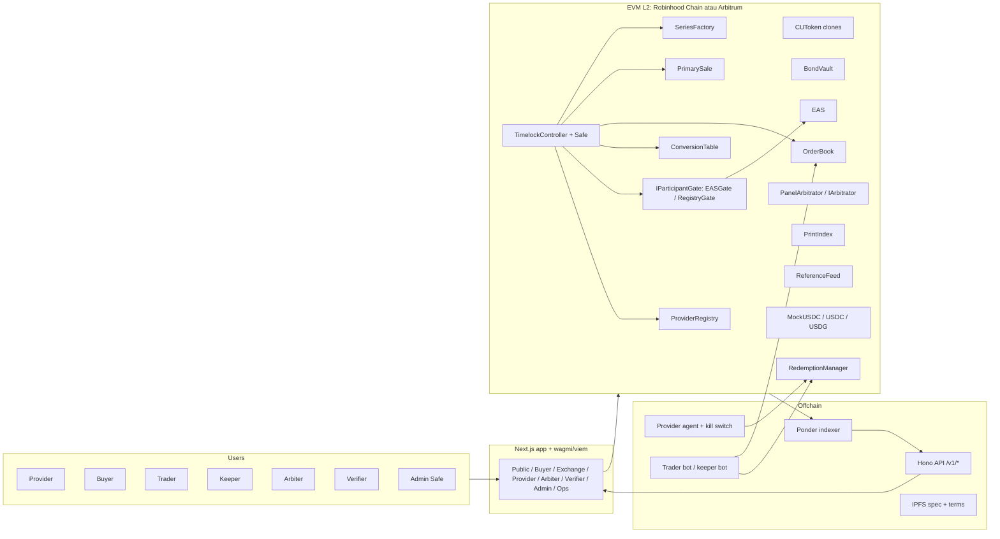

# Paron: rancangan produk lengkap (full product plan)

Pemilik: Hackathon Scout · Versi 1.3 · Jum 9 Okt 2026 ~11:45 WIB (v1.1: cross-check Spec Writer; v1.2: temuan produk AUDIT.md Principal Engineer PG-1..PG-14)
Status: **rancangan produk penuh**. Keputusan yang sudah APPROVED ditandai [APPROVED]. Usulan yang belum diputuskan Fatih ditandai [USULAN]. Fase dan jadwal setelah hackathon adalah usulan urutan, bukan janji tanggal.

> **Kalau ada beda tier antara dokumen ini dan 08 / sitemap §9.1, yang berlaku 08 dan sitemap §9.1.**
>
> Cara baca: dokumen ini adalah **gambaran besar produk final**. Detail teknis tiap bagian ada di dokumen lain (lihat §15). Untuk build 27 jam, yang mengikat tetap 08 (timeline solo) dan sitemap §9.1 (tier S0–S3). Kolom "Hackathon" di §4 dan §10 menunjukkan apa yang dibangun sekarang.

---

## 1. Ringkasan satu halaman

**Paron adalah pasar fisik onchain untuk kapasitas GPU.** Data center terverifikasi me-listing jam GPU sebagai unit komputasi (CU) yang dijamin bond ≥1,5×, dijual di primer, diperdagangkan di order book, dan di-redeem jadi akses compute nyata. Kalau provider gagal deliver, siapa pun bisa memicu pembayaran ke holder langsung dari bond provider itu. Setiap fill, delivery, dan default jadi **print publik** yang bisa dipakai pembuat benchmark.

- **Satuan:** 1 CU = 1 jam GPU setara H100 SXM 80GB. Faktor konversi per GPU di-snapshot saat listing (PK §4.1–4.2).
- **Instrumen:** satu series = satu ERC-20 per provider × region × kelas GPU × bulan kalender. 720 CU = 1 H100 selama 1 bulan 30 hari (PK §4.3, D-02 [APPROVED]).
- **Jaminan:** bond terisolasi per series, ditarik penuh saat series dibuat; tidak ada pool bersama (design §3–4).
- **Settlement:** stablecoin sebagai parameter deployment. Hackathon pakai MockUSDC; produksi USDC di Arbitrum One, USDG di Robinhood Chain (D-11 [APPROVED], PK §10.4).
- **Positioning:** melengkapi benchmark dan futures yang dibangun pihak lain (mis. Ornn/ICE), **tanpa afiliasi** (PK §1.4, §10.3).

**Tujuh aktor:** provider, buyer/holder, trader/market maker, keeper (siapa saja), arbiter, verifier, admin/governance, plus auditor/konsumen data sebagai pembaca (PK §6).

---

## 2. Masalah, pengguna, dan nilai

| Pengguna | Masalah hari ini | Yang Paron berikan |
|---|---|---|
| Provider / data center | Kapasitas dijual lewat deal bilateral yang lambat; susah presell ke pasar global | Listing beberapa klik, dana primer langsung masuk, reputasi onchain yang bisa dibuktikan |
| Buyer (perusahaan AI, lab) | Tidak ada jaminan kalau provider ghosting, bangkrut, atau double-sell | Kompensasi default tetap dari bond, bisa diklaim tanpa izin siapa pun |
| Trader / market maker | Tidak ada pasar sekunder untuk kapasitas forward | Order book dengan prints bersih, kurva harga antar bulan, basis vs referensi eksternal |
| Auditor / pembuat indeks | Harga compute dibangun dari deal privat yang tidak bisa diatribusikan | Prints publik + Prints API + PrintIndex dengan status integritas |
| Regulator / institusi | Butuh jejak audit dan identitas pihak | KYB via atestasi, governance dengan timelock, catatan publik yang tidak bisa diubah |

Sumber: PK §1.2–1.3, design §6, gaps §1–2.

---

## 3. Prinsip produk (mengikat untuk semua fase)

1. **Bond dulu, unit kemudian.** Tidak ada CU yang beredar tanpa jaminan penuh.
2. **Kita tidak memverifikasi delivery; kita membuat non-delivery bisa dibuktikan.** Deadline onchain, konfirmasi atau dispute holder, arbitrase hanya untuk sengketa.
3. **Prints adalah produk.** Setiap transaksi diatribusikan dan publik.
4. **Anti-mock.** Setiap aksi setiap aktor punya UI nyata yang memanggil kontrak sungguhan. Tidak ada fitur yang hanya bisa diuji lewat script (sitemap §1, §8).
5. **Institusional, bukan meme.** "pump.fun" hanya analogi untuk mudahnya listing.
6. **Reference price tidak pernah menentukan payout.** Referensi eksternal hanya untuk tampilan, coverage, dan (nanti) gating minting.
7. **Chain-agnostic.** Satu codebase, chain dipilih lewat satu file config (04).
8. **Tidak berafiliasi.** Ikuti guardrail wording PK §10.3 di semua materi.

---

## 4. Peta modul produk penuh

Kolom "Hackathon" memakai tier solo dari sitemap §9.1: **S0** jalur demo (Jum s/d ~20:00), **S1** ops/verifier/admin (s/d Sab 02:00), **S2** arbiter/dispute dan sisanya (s/d Sab 05:30), **S3/Later** setelah hackathon.

### 4.1 Identitas dan KYB
- **Produk penuh:** onboarding entitas (provider, buyer, trader, arbiter) dengan pengajuan KYB, review oleh verifier yang di-allowlist (firma KYB/auditor independen), satu schema EAS `ParticipantVerified(entityId, role, country, expiry)` dengan role `1 Provider`, `2 Buyer`, `3 Trader`, `4 MarketMaker` (D-24 [APPROVED]; label UI "Provider verified"), pencabutan, kedaluwarsa (sudah live di hackathon) dan perpanjangan, `entityId` dipakai untuk self-match prevention. Gate bisa diganti (EAS atau allowlist) lewat `IParticipantGate`. Nanti: ERC-3643 penuh, login Privy, paymaster gasless.
- **Hackathon:** S0 link attestation + `registerProvider`; S1 verifier issue atestasi manual dari `/verifier` (**approve live = never cut**), form self-attest `KybApplication` (D-41 [APPROVED]) kalau sempat; S2 revoke. Verifier = Safe tim. Atestasi sudah punya `expiry`.
- **Later:** verifier pihak ketiga, ERC-3643, Privy/gasless, alur perpanjangan atestasi.

### 4.2 Registry provider dan reputasi
- **Produk penuh:** profil provider publik (entitas, region, GPU, kapasitas teratestasi `CapacityAttested`), counter reputasi onchain (`deliveredCU`, `defaultedCU`, `voluntaryDefaultedCU`, `disputesLost`, `strikes`; P-25 [APPROVED]), badge coverage ("200% backed"), skor risiko provider di API berbayar.
- **Hackathon:** S0 registry + reputasi dasar (strike muncul setelah default di demo). Halaman provider publik penuh = S3.
- **Later:** `CapacityAttested` dari auditor, skor risiko, atestasi hardware saat delivery [BELUM TERVERIFIKASI].

### 4.3 Series dan listing
- **Produk penuh:** wizard listing tiga langkah (capacity, terms, bond; `createSeries` atau `createSeriesWithPermit` dengan spender `BondVault`) dengan spec standar `paron-spec/v1` (JSON Schema, di-pin ke IPFS, hash disimpan), tabel faktor konversi bertimelock (skala 1e4, mis. A100 = 4_500), window bulan kalender UTC, helper lot kontrak, `minRedemption` per series, opsi institusional, `termsHash` untuk dokumen hukum, naik harga primer hanya ke atas selama sale buka, pause oleh governance.
- **Hackathon:** S0 wizard + `createSeries` (series demo `CU-JKT-H100-2610`, 500 CU @ $3,00, bond $2.250, D-19 [APPROVED]); S2 raise price.
- **Later:** template `SERIES_TERMS.md` yang direview counsel, listing fee (~$250 flat atau gratis untuk reputasi tinggi) [USULAN, PK §10.1], `pauseListings()` global di SeriesFactory oleh PAUSER yang tidak boleh memblokir proteksi holder (PG-9) [USULAN], factory berversi untuk migrasi (series baru ke v2, series lama jalan sampai habis; PG-8) [USULAN].

### 4.4 Bond vault
- **Produk penuh:** akuntansi USDC terisolasi per series; `release`, `slash` hanya oleh RedemptionManager; `withdrawRemaining` oleh provider setelah finalisasi; invariant `bond ≥ bondPerCU × totalSupply` selama series belum final (D-18 [APPROVED]; CU terkunci di RedemptionManager sudah termasuk `totalSupply`). Nanti: bond diparkir di T-bill tertokenisasi dengan bagi hasil yield, top-up untuk margin call.
- **Hackathon:** S0 penuh. Bond bar menyusut $2.250 → $2.169 = 2.250 − 36 (redeem 8 CU selesai, bond dilepas) − 45 (default 10 CU) (05 §3.4–§3.5). Copy UI coverage: label "bond per CU ÷ reference (synthetic)" = 1,50 (angka ini statis), dan di sebelahnya tampilkan backing outstanding = bond ÷ (bondPerCU × CU beredar) supaya juri tidak membaca 1,50 setelah default sebagai kelemahan (PG-13) [USULAN, copy final di 06].
- **Later:** yield on bond, top-up/margin call berbasis indeks (mitigasi default strategis, lihat §13), `releaseUnsoldBond(s)` setelah sale tutup = `bondPerCU × (maxSupply − sold)` supaya bond untuk supply tidak terjual tidak terkunci sampai `windowEnd + grace`; invariant D-18 tetap terjaga (PG-6) [USULAN].

### 4.5 Primary sale
- **Produk penuh:** harga tetap dari series, `maxCost` wajib (proteksi slippage), fee primer 1% ke treasury (batas ≤5%), sisanya ke provider, tutup di `windowEnd − leadTime`, pause.
- **Hackathon:** S0 (beli 20 CU).
- **Later:** opsi escrow sebagian hasil penjualan sampai delivery (open question PK §12.3 no. 1, belum diputuskan untuk produksi).

### 4.6 Trading
- **Produk penuh:** order book per series (tick 0,01, price-time priority, partial fill, cancel, escrow), self-match prevention per `entityId` (revert `SelfMatch()`), fee taker 0,15% / maker 0% (batas ≤1%), UI gaya exchange (chart, depth, buy/sell, open orders, history), kurva forward antar bulan, basis vs referensi sintetis. Nanti: order bertanda tangan EIP-712, program market maker, RFQ desk untuk block trade, opsional pool hook Uniswap v4 dengan fee naik menjelang expiry.
- **Leverage:** [APPROVED] masuk roadmap dan tampil sebagai tab "Coming soon". Butuh margin engine, likuidasi, dan oracle harga, ditambah structuring hukum, jadi **tidak dibangun di hackathon** dan tidak dijanjikan tanggalnya.
- **Hackathon:** S0 order book (≤10 level per sisi, D-17 [APPROVED]); ask 5 CU @ $3,20 dipasang manual dari UI oleh wallet `W-TRD`. S1 (Sab ~01:30) bot trader otomatis yang memasang ask itu setelah pembelian 20 CU (P5-26 [APPROVED]), dengan trigger manual sebagai fallback. S2 tab leverage "Coming soon".
- **Later:** EIP-712 orders, MM program, RFQ, margin/leverage.

### 4.7 Redemption dan delivery
- **Definisi delivery (produk penuh) [USULAN, PG-4]:** "delivered" = akses dialokasikan untuk N GPU-jam yang mulai paling lambat T dan dipakai di dalam window series. Supaya redemption tidak melebihi kapasitas fisik (720 CU = 1 H100 selama sebulan), tiap series punya `maxRedeemPerDay` (atau `startAt` per request + kalender kapasitas provider), dan deadline delivery diskalakan pro-rata dengan jumlah ÷ jumlah GPU. Tanpa ini, holder yang redeem serentak atau di akhir bulan memaksa default by design.
- **Produk penuh:** request redemption (minimal per provider), ack ≤24j, `markDelivered` ≤48j dengan receipt hash, jendela dispute 72j, finalisasi otomatis. Detail akses dienkripsi ke kunci provider (EAS `ProviderEncryptionKey`, X25519 + IPFS). Agent provider bisa ack/deliver otomatis dan mengirim receipt bertanda tangan (EIP-712, data `nvidia-smi`). Kill switch agent dengan fallback env/jendela agent.
- **Hackathon:** S0 redemption + demo default; window demo 60s/60s/90s (D-20 [APPROVED]); `deliveryRef` = hash saja dengan label demo (D-44 [APPROVED]); S1 kill switch agent via endpoint lokal EIP-712 (D-42 [APPROVED]).
- **Later:** enkripsi delivery, receipt agent bertanda tangan, monitor pihak ketiga, rate cap + penjadwalan redemption (PG-4), skema receipt/SLA provider (T5-04).

### 4.8 Default, dispute, arbitrase
- **Produk penuh:** `claimDefault` permissionless setelah deadline (holder dibayar `bondPerCU × jumlah`), `declineAndPay` sukarela, dispute dengan bond 5% (min $5), panel arbitrator 2-of-3 yang dipilih provider dari allowlist, fallback netral (refund tanpa slash) kalau panel tidak memutus. Nanti: adapter Kleros/UMA lewat `IArbitrator`.
- **Hackathon:** S0 claim default 10 CU = $45 **dari wallet mana pun (never cut)**, plus tombol Dispute + modal, Decline & pay, dan Finalize. S1 `resolveNoRuling` di `/ops/keepers`. S2 ruling arbiter via paket tanda tangan di fragment URL + `ruleWithSignatures` (D-43 [APPROVED]) dan halaman `/disputes/[reqId]`.
- **Celah "opsi gratis" (PG-3, diketahui):** kalau panel tidak memutus, `resolveNoRuling` mengembalikan CU dan bond dispute, sehingga holder yang sudah menerima compute bisa dispute tanpa biaya lalu redeem lagi. Produk penuh [USULAN]: no-ruling dieskalasi ke arbitrator fallback (Kleros/UMA) alih-alih refund, **atau** hasil dibagi (bond dispute holder dikembalikan, tapi CU dibakar dan bond provider dilepas karena provider sudah menunjukkan receipt). Hackathon: perilaku tetap seperti 01 T12, dan dicatat di README known limitations + Q&A.
- **Later:** Kleros/UMA, fee arbitrator dari bond pihak kalah, eskalasi no-ruling (PG-3).

### 4.9 Data: prints, indeks, referensi
- **Produk penuh:** Ponder indexer, Prints API `/v1/prints` (JSON/CSV; GPU asli, harga asli per jam GPU, harga per CU, jumlah, region, timestamp ms, series, flag eligible, tx hash), `/v1/index/{gpu}` dengan PrintIndex (VWAP winsorized, minimum volume, status OK/THIN/DISRUPTED, `latestRoundData()` gaya Chainlink), statement CSV per akun, dashboard transparansi publik, ekspor kontribusi benchmark dengan perjanjian tertulis, metodologi gaya IOSCO dengan pengawasan independen. Referensi eksternal hanya `ReferenceFeed` sintetis berlabel sampai ada lisensi tertulis. `PrintIndex.poke` bisa dipanggil keeper.
- **Hackathon:** S0 Prints API + PrintIndex dasar; 24 endpoint di 03 (E1–E24), 16 test API di 02; reference feed sintetis berlabel; dashboard transparansi dan statement mengikuti tier sitemap.
- **Manipulasi indeks (PG-14):** dengan parameter demo (2 entitas, 1 CU), dua entitas KYB yang berkolusi bisa menentukan indeks H100. Produksi (T-04): naikkan `minParticipants` dan minimum volume, pakai winsorization; tulis ini di METHODOLOGY.
- **Later:** API analitik berbayar (kurva harga, skor risiko, statistik default), referensi berlisensi via push oracle (Chainlink/RedStone), dashboard Dune publik.

### 4.10 Governance dan treasury
- **Produk penuh:** Safe multisig 2-of-3 + TimelockController (48j produksi), semua perubahan parameter (fee, faktor konversi, allowlist arbitrator, gate, pauser) lewat proposal yang terlihat publik, fee langsung ke Safe tanpa fungsi withdraw (D-13 [APPROVED]), log `config_change`.
- **Hackathon:** S1 `/admin` dengan tab (proposals, parameters, gate, treasury, dll.) + eksekusi; **satu perubahan timelock dieksekusi dari UI (never cut)**, delay demo 5 menit (D-20 [APPROVED]).
- **Kejujuran governance (PG-7):** di testnet, owner Safe 2-of-3, arbiter panel (W-ARB-1..3), dan verifier semuanya dipegang Fatih (D-08). Wording README/Q&A: "single operator in testnet; independent signers in P3". Jangan klaim terdesentralisasi.
- **EN-2 [APPROVED Fatih, Jum 9 Okt ~11:06]:** verifier = EOA, proposer timelock = EOA di samping Safe, executor terbuka, supaya approve KYB dan eksekusi timelock (dua never-cut) tidak bergantung pada tanda tangan Safe 2-of-3 di dalam app.
- **[D-83, APPROVED Fatih langsung 2026-10-09 17:01 WIB]:** Safe multisig adalah rencana roadmap untuk saat Paron live di mainnet nanti. Peran admin tidak berubah (EN-2/D-54): tanpa EOA kedua, tanpa pindah ke Safe. Tidak ada batas freeze. Rincian operasional: 08 §7.1.
- **Later:** penandatangan independen, kebijakan treasury, tidak ada governance token (di luar lingkup).

### 4.11 Ops dan keeper
- **Produk penuh:** halaman `/ops/keepers` dengan tombol untuk semua aksi permissionless (claim default, finalize redemption, resolve no-ruling, finalize series, `PrintIndex.poke`), bot keeper otomatis, monitoring (status indexer, chain, kontrak), log event mentah.
- **Hackathon:** S1 `/ops/keepers` + `/demo` (panel demo publik); keeper bot dalam mode dry-run untuk demo. **Sandbox juri [DITOLAK Fatih ~11:06: fokus ke fitur supaya demo proper; tetap ide untuk Later]:** jalur berlabel "testnet sandbox" di `/demo` supaya juri online bisa mencoba sendiri: faucet → KYB satu klik dari bot *demo-verifier* berlabel → beli 1 CU di series sandbox terpisah yang agent providernya diset ghost → tunggu 60 dtk → claim default dari wallet sendiri. Pakai series atau deployment terpisah supaya state stage dan fixture 03 tetap bersih. Tidak dibangun di hackathon.
- **Later:** keeper terdesentralisasi/berinsentif, alerting.

### 4.12 Settlement, chain, dan onboarding dana
- **Produk penuh:** settlement token per deployment; USDC (Arbitrum One, CCTP) sebagai venue institusional pertama, USDG di Robinhood Chain kalau listing di sana (D-11 [APPROVED]), IDRX/multi-settlement nanti.
- **Hackathon:** MockUSDC + faucet publik 5.000 mUSDC per drip, cooldown 1 jam (T-05 [APPROVED]); chain Robinhood Chain Testnet, fallback Arbitrum Sepolia.
- **Later:** mainnet, multi-settlement, on/off-ramp.

### 4.13 Legal, kepatuhan, keamanan
- **Produk penuh:** halaman legal (disclaimer, risiko, terms), structuring hukum dan OJK sebelum produksi (POJK 27/2024), counsel-reviewed series terms, audit eksternal, bug bounty, dokumentasi siap EFRP (kelayakan = keputusan bursa).
- **Hackathon:** footnote not-affiliated hanya di pitch deck/slide [D-64] (09), halaman legal S2, lisensi repo MIT (T9-06 [APPROVED]), Slither di CI kalau sempat.
- **Atribusi AI (PG-11) [APPROVED Fatih ~11:06]:** README menyebut proyek ini dibangun dengan bantuan Grok Bot (notes §1 rule 6). Commit dari cloud agent harus atas nama Fatih (author git = Fatih), bukan atas nama agent.
- **Kepatuhan & ops produk penuh (PG-10) [USULAN, P1–P3]:** screening sanksi saat KYB; penanganan PII untuk dokumen `KybApplication.dataHash`; UX expiry/renewal KYB; revoke KYB membatalkan order maker yang masih resting (EN-9); risiko blacklist stablecoin pada push payment, solusinya pola pull/withdraw untuk payout holder (EN-12); pajak/invoice compute yang dikirim; skema receipt/SLA provider (T5-04); runbook insiden dan alerting.
- **Later:** audit, structuring, bug bounty, modul kepatuhan & ops di atas.

---

## 5. Aplikasi dan permukaan produk (end state)

Untuk hackathon semua ada di **satu situs Next.js** sebagai halaman; nanti dipisah jadi aplikasi sendiri [APPROVED]. Subdomain via middleware Next.js di hackathon hanya [USULAN] kalau murah (sitemap §2.3). URL demo dan submission = URL Vercel (D-10 [APPROVED]).

| Aplikasi (end state) | Pengguna | Route (semua 78, tier per route di sitemap) | Rincian |
|---|---|---|---|
| Situs publik + docs | Semua | `/`, `/markets`, `/providers`, `/docs/*`, `/legal/*`, `/status` | sitemap §4.1 |
| Akun & onboarding | Semua | `/onboarding/*`, `/account` | sitemap §4.2 |
| Buyer app | Buyer/holder | `/buy/*`, `/portfolio`, `/redemptions/*`, `/disputes/*` | sitemap §4.3 |
| Exchange (trader) | Trader/MM | `/trade/[seriesId]` (+ tab leverage "Coming soon") | sitemap §4.4 |
| Provider console | Provider | `/provider/*` (wizard, series, redemptions, agent, proceeds) | sitemap §4.5 |
| Arbiter app | Arbiter | `/arbiter/*` | sitemap §4.6 |
| Verifier app | Verifier | `/verifier/*` | sitemap §4.7 |
| Admin/governance | Safe signers | `/admin/*` | sitemap §4.8 |
| Ops/keeper | Siapa saja | `/ops/*` | sitemap §4.9 |
| Testnet tools | Juri, penguji | `/faucet`, `/demo` (publik) | sitemap §4.10 |
| Data API | Auditor, index provider | `/v1/*` | 03 |

Total 78 route; matriks 59 aksi → layar di sitemap §6.

---

## 6. Arsitektur end state

**Later (tidak dibangun sekarang):** MarginEngine + LiquidationModule + OracleAdapter (untuk leverage), RFQ desk, adapter Kleros/UMA, CapacityAttestation dari auditor, yield adapter untuk bond. Semua harus masuk lewat interface yang ada (`IArbitrator`, `IParticipantGate`, parameter settlement token) supaya tidak perlu redesign.

Detail kontrak: 01 (interface), 02 (invariant + test), design §3–4. Stack dan versi: paron-stack.md.

---

## 7. Siklus hidup utama (ringkas)

1. **Onboard:** entitas ajukan KYB → verifier approve → atestasi EAS → gate lolos.
2. **List:** provider isi wizard → `createSeries` menarik bond penuh → token series dideploy.
3. **Primary:** buyer beli di harga tetap → fee ke Safe, sisa ke provider.
4. **Trade:** order book, prints → PrintIndex → API.
5. **Redeem:** holder request → provider ack → deliver → konfirmasi atau dispute → final.
6. **Default:** deadline lewat → siapa pun `claimDefault` → holder dibayar dari bond, strike provider.
7. **Dispute:** holder bond 5% → panel 2-of-3 memutus atau fallback netral.
8. **Expiry:** setelah window + grace, `finalizeSeries` → CU sisa void → provider tarik sisa bond.
9. **Govern:** proposal Safe → timelock → eksekusi dari UI.

Detail: PK §7, design §2 dan §4, 05 (skenario demo).

---

## 8. Model bisnis (penuh)

| Sumber | Besaran | Status |
|---|---|---|
| Fee primer | 1% (batas kontrak ≤5%) | [APPROVED] untuk hackathon |
| Fee taker | 0,15%, maker 0% (batas ≤1%) | [APPROVED] untuk hackathon |
| Listing | $0 sekarang; nanti ~$250 flat atau gratis untuk reputasi tinggi | [USULAN] |
| Dispute | fee arbitrator dari bond pihak kalah | [USULAN] |
| Data | prints onchain gratis; API analitik berbayar | [USULAN] |
| Nanti | bagi hasil yield bond, credit line berbasis piutang CU, RFQ desk | [USULAN] |

Ilustrasi unit economics dan sumbernya ada di PK §10.1 (bukan forecast).

---

## 9. Roadmap bertahap [USULAN, tanpa tanggal]

| Fase | Tujuan | Isi utama | Syarat keluar |
|---|---|---|---|
| **P0 Hackathon** (Jum 9 – Sab 10 Okt) | Demo end-to-end yang bisa diuji juri | Tier S0–S2, never-cut list, deploy testnet, README + video | Submission HackQuest sebelum Sab 12:00 WIB |
| **P1 Hardening** | Tutup semua S3 dan utang teknis | Semua 78 route ke kualitas penuh, 136 test Foundry + fuzz/invariant, Slither, enkripsi delivery, receipt agent, guarded launch (cap bond per series) + factory berversi (PG-8), `releaseUnsoldBond` (PG-6), `pauseListings` (PG-9), pull payment (EN-12), kepatuhan & ops dasar (PG-10) | Semua MUST + FULL hijau, demo tanpa fallback |
| **P2 Pilot testnet** | Validasi dengan provider dan buyer nyata | Verifier pihak ketiga, 1–3 provider pilot, MM awal, dashboard publik, definisi delivery + `maxRedeemPerDay` (PG-4), eskalasi no-ruling (PG-3) | Redemption nyata berhasil dan terukur |
| **P3 Mainnet beta** | Venue institusional pertama | Audit eksternal, structuring hukum/OJK, USDC di Arbitrum One, timelock 48j, penandatangan independen | Audit bersih + opini hukum |
| **P4 Skala** | Likuiditas dan data | RFQ, EIP-712 orders + MM program, Kleros/UMA, referensi berlisensi, API berbayar, multi-settlement (USDG/IDRX), Privy/gasless | Volume dan prints cukup untuk indeks |
| **P5 Produk lanjutan** | Instrumen di atas CU | Margin call berbasis indeks, credit line, **leverage** (butuh margin, likuidasi, oracle, dan izin) | Keputusan hukum + risk framework |

---

## 10. Batas lingkup hackathon (matriks)

| Modul | S0 | S1 | S2 | S3 / Later |
|---|---|---|---|---|
| KYB | link attestation + `registerProvider` | **issue/approve live di `/verifier`**, self-attest kalau sempat | revoke | verifier pihak ketiga, ERC-3643 |
| Registry/reputasi | dasar + strike | – | – | profil publik penuh, skor risiko |
| Series/listing | wizard + create | – | raise price | terms counsel, listing fee |
| Bond vault | penuh | – | – | yield, margin call |
| Primary | beli | – | – | escrow opsional |
| Trading | order book + ask manual `W-TRD` | bot trader otomatis | tab leverage Coming soon | EIP-712, RFQ, MM, leverage |
| Redemption | request/ack/deliver/finalize | kill switch agent (+ fallback) | – | enkripsi, receipt agent |
| Default/dispute | **claim default dari wallet mana pun**, Dispute + modal, Decline & pay | keepers (`resolveNoRuling`) | ruling arbiter, `/disputes/[reqId]` | Kleros/UMA |
| Data | Prints API + PrintIndex + feed sintetis | `poke` di keepers | – | API berbayar, oracle berlisensi |
| Governance | – | **eksekusi 1 timelock dari `/admin`** | – | signer independen |
| Ops | – | `/ops/keepers`, `/demo`, keeper bot dry-run | – | keeper bot, alerting, sandbox juri (PG-2, ditolak untuk hackathon) |
| Legal | footnote/disclaimer | – | halaman legal | audit, OJK |

Tebal = never cut. Urutan potong kalau waktu habis: 08 (cut ladder).

---

## 11. Persyaratan non-fungsional

- **Upgrade/migrasi (PG-8):** kontrak immutable tanpa admin (bagus untuk trust), tapi bug di RedemptionManager/BondVault bisa mengunci dana permanen. Mitigasi produk penuh: guarded launch dengan cap bond per series, factory berversi, audit sebelum P3.
- **Keamanan:** ReentrancyGuard + checks-effects-interactions di semua transfer nilai; role minimal; timelock untuk semua parameter; tidak ada jalur lintas series di BondVault; secret hanya lewat secret input, `.env` tidak masuk git; testnet saja.
- **Kebenaran:** 74 invariant, 136 test Foundry (40 MUST), 16 test API (02).
- **Gas/kinerja:** order book dibatasi ≤10 level per sisi; loop matching terbatas. Angka gas dan finality diukur saat build (07 §10.2).
- **Data:** indexer ke API ke UI; mode `NEXT_PUBLIC_DATA_SOURCE=mock|live` hanya untuk pengembangan, demo selalu live.
- **UX:** copy UI bahasa Inggris (P6-01 [APPROVED]); setiap aksi punya status pending/sukses/gagal dan link tx; disclaimer di setiap halaman.
- **Observabilitas:** `/status` (chain, indexer, kontrak), log event, build log di `docs/build/STATUS.md`.

---

## 12. Metrik keberhasilan [USULAN]

- **Hackathon:** demo 2:30 berjalan live tanpa fallback; saat slot live, juri bisa claim default sendiri pakai HP `W-JUDGE` yang kita siapkan atau wallet mana pun (05 §2.4); tidak ada aksi yang hanya lewat script. Catatan PG-2: di luar slot live, juri online **tidak bisa** mencoba claim default (stage frozen, tidak ada request yang defaultable, outsider butuh KYB) Sandbox ditolak Fatih untuk hackathon, jadi ini dijawab di README (cara coba via video + slot live).
- **Produk:** jumlah provider terverifikasi, CU terdaftar, rasio delivery vs default, coverage rata-rata, volume primer dan sekunder, jumlah prints eligible, waktu rata-rata ack/delivery.

---

## 13. Risiko utama

Default strategis saat harga melonjak (payout tetap `bondPerCU`, jadi kalau spot > 1,5× harga primer provider untung dengan default lalu menjual ulang; jawaban Q&A: "1.5× covers up to a 50% price move; beyond that, reputation, listing bans and index-based top-ups"; PG-5), opsi gratis lewat dispute tanpa ruling (PG-3), redemption melebihi kapasitas fisik (PG-4), manipulasi indeks dengan sedikit peserta (PG-14), bug di kontrak immutable (PG-8), kapasitas palsu (dibatasi bond ≥150%), regulasi (OJK), risiko build (gas, timing demo, chain RH), wording afiliasi. Detail dan mitigasi: PK §12.1, design §8.

---

## 14. Catatan konsistensi yang ditemukan saat menyusun

1. **Leverage:** PK §10.3 dan design §7.1 menulis leverage/perps "di luar lingkup". Sekarang dibaca sebagai: tidak dibangun di hackathon dan bukan bagian MVP, tapi ada di roadmap jangka panjang (P5) dengan tab "Coming soon" [APPROVED]. Kalau ditanya juri: "on the roadmap, not built, needs margin, liquidation and oracle infrastructure plus regulatory structuring."
2. **Escrow hasil primer** (PK §12.3 no. 1) masih terbuka untuk produksi; hackathon = langsung ke provider.
3. **Faktor A100/RTX 4090:** hackathon pakai keputusan 01/07 (A100 = 4_500 pada skala 1e4, yaitu 0,45); RTX 4090 tidak di-listing di demo.
4. **Cross-check Spec Writer (v1.1):** tier KYB, bot trader, dan dispute disamakan dengan 08 / sitemap §9.1; invariant bond pakai D-18; schema KYB pakai D-24; jumlah endpoint 24.

5. **AUDIT.md Principal Engineer (v1.2):** temuan produk PG-2..PG-14 sudah dimasukkan ke §4.3/4.4/4.7/4.8/4.9/4.10/4.11/4.13, §9, §10, §11, §12, §13. Angka demo dicek cocok; bond akhir 2.169 butuh langkah redeem 8 CU (−$36), sekarang ditulis di §4.4 dan HANDOFF-BRIEF. Temuan spec (SC-1..SC-18, re-plan 08 jadi 4 lane, EN-4 hosting Ponder) dirutekan PE ke Spec Writer.
6. **Keputusan Fatih Jum 9 Okt ~11:06 [APPROVED]:** PG-1 registrasi HackQuest aman; build dipecah 4 lane agent paralel; EN-2 verifier/proposer EOA + executor terbuka; EN-3 go/no-go chain maks 45 menit (lebih cepat lebih baik), saldo testnet Robinhood sudah ada di 2 akun; PG-2 sandbox tidak dibangun; PG-11 README "dibantu oleh Grok Bot", commit atas nama Fatih.

---

## 15. Peta dokumen

| Butuh apa | Buka |
|---|---|
| Posisi sekarang dan aturan handoff | HANDOFF-BRIEF.md |
| Produk, aktor, flow, glosarium | paron-product-knowledge.md |
| Desain kontrak, state machine, demo, Q&A | paron-design.md |
| Stack dan versi | paron-stack.md |
| Gap infra pasar compute | paron-gaps.md |
| Semua layar, gate, tier solo | paron-sitemap.md |
| Interface kontrak | dev-docs/01 |
| Invariant dan test | dev-docs/02 |
| Indexer dan API | dev-docs/03 |
| Repo, env, deploy | dev-docs/04 |
| Skenario demo dan seed | dev-docs/05 |
| Wireframe dan copy | dev-docs/06 |
| Semua keputusan | dev-docs/07 |
| Timeline solo per jam | dev-docs/08 |
| Submission | dev-docs/09 |
