# Paron: sitemap produk LENGKAP (spec, bukan kode)

Disusun Kamis 8 Okt 2026, ~21:30 WIB. Diperbarui Jum 9 Okt 2026, ~09:45 WIB: persetujuan Fatih (leverage tab, P6-01, X6-19, D-41..D-44) dan tier build solo (§9.1). Ini sitemap **produk penuh**, bukan potongan MVP. Potongan 27 jam ada di §9.

**Sumber:**
- `paron-product-knowledge.md` → (PK §x). Terutama §5 Fitur dan §6 Fitur per Aktor.
- `dev-docs/01-contract-interfaces.md` → (01 §x). Signature fungsi; rekomendasi APPROVED Jum 9 Okt ~09:40 WIB (sisa terbuka: 07 §10).
- `dev-docs/03-data-contract.md` → (03 E1–E18). Endpoint API Ponder/Hono.
- `dev-docs/07-decisions-log.md` → (07 D-xx).
- Dokumen kanonik: `paron-design.md`, `paron-stack.md`, `paron-gaps.md`, `open-questions-research.md`.

**Legenda:**
- **[TBD]** = signature, endpoint, atau backend belum didefinisikan di dokumen mana pun. Perlu didesain.
- **[PENDING]** = menunggu keputusan Fatih. Label `P-xx`/`D-xx` merujuk ke register di 01/07.
- **[APPROVED]** = disetujui Fatih Jum 9 Okt ~09:40 WIB: tab leverage "Coming soon", copy UI Inggris (P6-01), tier mengikuti sitemap (X6-19), dan semua rekomendasi 07 (D-01..D-44 kecuali D-10, termasuk P-13/P-16/P-47/P-64/T-05/Q2). PENDING lain yang tidak terkait persetujuan ini dibiarkan.
- **Tim = Fatih solo.** Potongan build 27 jam (§9) sekarang mengasumsikan satu orang; tier build solo ada di §9.1.
- **MVP-27h** = dibangun saat hackathon (Jum 9 Okt 09:00 → Sab 10 Okt 12:00 WIB). Jam 12:00 pada kalimat ini **HISTORICAL, superseded by D-93**. Tenggat keras = Sab 10 Okt 2026 23:59 WIB. **NICE** = nice-to-have menurut design §7.1/§7.2, dibangun di 27 jam kalau sempat. **FULL** = produk penuh, setelah hackathon.
- **Bahasa copy UI = Inggris** [APPROVED P6-01, 06 §0.1]. Teks spec ini tetap bahasa Indonesia, tapi semua contoh copy/label/pesan error di layar ditulis dalam bahasa Inggris.
- **Sinkron dengan dev docs 03/04/06/07** (Kamis 8 Okt ~21:50 WIB): nama param API mengikuti 03, flag data source mengikuti 04 §4.5 / 06 §11.3, param route mengikuti 06 (`[reqId]` untuk redemption/dispute), gap §10 ditautkan ke 07 D-41..D-44.
- **Demo live** = "Ya" kalau halaman itu harus bisa dicoba juri/tim langsung di testnet saat demo.

---

## 1. Prinsip (pelajaran Fatih)

Fatih pernah kalah di hackathon karena juri menulis *"features still mocked and untestable"*: fitur admin cuma bisa dites lewat script. Aturan untuk Paron:

1. **Setiap aksi setiap aktor punya UI.** Termasuk admin, verifier, arbiter, dan aksi permissionless (keeper). Script (`forge script`, keeper bot, agent provider) boleh ada sebagai **otomasi tambahan**, tapi selalu ada tombol UI yang memanggil fungsi kontrak yang sama.
2. **Semua layar membaca/menulis ke kontrak testnet asli + indexer Ponder asli.** Checklist ada di §8.
3. **Buyer dan trader adalah area terpisah.**
   - **Buyer:** beli primer, portfolio, redemption, klaim, dispute, statement.
   - **Trader:** UI gaya exchange (chart, buy/sell, order book, depth, open orders, histori, posisi).
4. **Leverage TIDAK ada di desain.** Design §7.1 menyebut "leverage or perps" sebagai *explicitly out of scope*, dan bond hanya menjamin delivery. Yang ada cuma tab "Coming soon / roadmap" di `/trade/leverage`, **[APPROVED]** (Fatih, Jum 9 Okt ~09:40 WIB).
5. **Panel admin, verifier, dan arbiter = halaman di situs Next.js yang sama**, dengan role gate.
   - Opsional: subdomain `admin.` / `verify.` / `arbiter.` via rewrite di middleware Next.js (lihat §2.3).
   - Masa depan: app terpisah.
6. **`/demo` dan `/faucet` publik** dan terlihat oleh juri.

**[D-95, APPROVED Sab 10 Okt 2026 ~11:07 WIB.]** Halaman verifier, admin, ops, dan arbiter tetap ada di situs yang sama. Yang **HISTORICAL** untuk navigasi: anggapan bahwa Provider, Operator, dan Demo duduk di navbar pengguna, dan bahwa `/demo` ditautkan dari halaman lain. Navbar pengguna (CTA "Launch app") hanya Markets, Buy, Trade, Portfolio, Redemptions, Faucet, Index, Data. Provider di luar nav itu; dashboard `/provider/[address]`. Operator hanya lewat CTA kecil di footer atau bagian bawah landing. `/demo` tetap hidup; satu-satunya pintu adalah CTA landing "Launch demo". `/faucet` tetap di navbar pengguna. Detail: 07 §25. **Koreksi setelah #71:** pintu provider hanya CTA landing "Become a provider", bukan tautan sekunder di navbar aplikasi.

**Route indeks.** Halaman yang dibangun adalah `/h100-index` (`web/app/h100-index/page.tsx`). Path statis `/index` bentrok dengan `/` di Vercel, jadi `/index` mengalihkan 307 ke `/h100-index` (`web/next.config.ts`, `permanent: false`). Path API `/index/H100` tidak berubah (indexer `GET /v1/index/:gpu`). Di pohon dan matriks di bawah, nama halaman `/index` berarti `/h100-index` kecuali yang disebut sebagai path API `/v1/index/…`. `/index/[gpu]` tetap route produk penuh yang belum menjadi halaman terpisah.

**IA UI (10 Okt 2026):** navbar aplikasi yang dibuka dari "Launch app" hanya sisi pengguna: Markets, Buy, Trade, Portfolio, Redemptions, Faucet, Index, Data. **HISTORICAL:** kalimat lama bahwa "For providers" berdiri di kanan header, di luar baris itu, dan di Menu sebagai bagian terpisah. PR #71 menghapus "For providers" dari navbar aplikasi. Aturan revisi Fatih (koreksi D-95): pintu provider hanya CTA landing "Become a provider". Operator hanya lewat CTA kecil di footer landing, menuju `/operator` (judul "Operator tools") yang menaut ke `/verifier`, `/admin`, `/ops/keepers`, `/arbiter`, dan `/disputes`. Pintu Operator dari halaman lain sebagai jalur masuk adalah **HISTORICAL**. `/demo` tetap hidup; satu-satunya pintu masuk adalah CTA landing "Launch demo".

---

## 2. Konvensi

### 2.1 Role gate
Gate di UI hanya untuk kenyamanan. **Yang menegakkan aturan tetap kontrak** (01 §4).

| Gate | Cara cek di UI | Sumber |
|---|---|---|
| **Publik** | Tanpa wallet | — |
| **Wallet** | Wallet terhubung ke chain 46630 (atau 421614 kalau fallback) | design §11 |
| **KYB** | `IParticipantGate.isVerified(addr)` + `participantOf(addr)` (E13) | 01 §6.13 |
| **Provider** | `ProviderRegistry.isListable(addr)` / `getProvider(addr).status == Active` (E12) | 01 §6.1 |
| **Holder request** | `RedemptionManager.getRequest(reqId).holder == addr` | 01 §6.8 |
| **Panel** | Alamat ada di panel `PanelArbitrator` (di-set via `setPanel`) / punya `ARBITER_ROLE` | 01 §6.9 |
| **Verifier** | `VERIFIER_ROLE` di `RegistryGate`, atau attester tepercaya di `EASGate` | 01 §4.1, §6.13 |
| **Admin** | Owner Safe 2-of-3 (RH Testnet), atau proposer `TimelockController` / `ADMIN_ROLE` / `PAUSER_ROLE` (fallback opsi B) | 01 §4.1, design §11.4 |
| **Siapa saja** | Wallet apa pun, tanpa KYB, untuk aksi permissionless (`claimDefault`, `finalizeSeries`, `finalizeRedemption`, `resolveNoRuling`, `poke`, `faucet`) | 01 §6.3, §6.8, §6.10, §6.12 |

**Aturan tampilan halaman ber-role (usulan):** semua halaman ber-role tetap bisa **dilihat read-only** oleh siapa saja (antrian, parameter, histori), tapi tombol aksinya terkunci dan menyebut role yang dibutuhkan. Tujuannya: juri bisa melihat bahwa fitur admin itu nyata, transparansi naik, dan tidak ada data tersembunyi. Halaman ber-role tetap **noindex** dan dikeluarkan dari `sitemap.xml`.

### 2.2 Eksekusi aksi admin dari UI (tanpa script)
- **RH Testnet (Safe UI + tx-service tersedia):** halaman admin menyusun tx Safe (target = `TimelockController.schedule/execute`, atau langsung ke kontrak untuk aksi non-timelock) memakai Safe protocol-kit **8.0.7** + Safe tx-service. Owner lain menandatangani di halaman yang sama (`/admin/proposals`) atau di Safe{Wallet}.
- **Arbitrum Sepolia (tanpa Safe UI):**
  - opsi B (design §11.4): EOA proposer memanggil `schedule`/`execute` langsung dari UI;
  - opsi A: tanda tangan offchain via protocol-kit di browser. Cara berbagi tanda tangan antar-owner tanpa tx-service tidak butuh keputusan baru: opsi B design §11.4 menghindarinya (07 §8, terkait D-36).
- **Panel arbiter:** `PanelArbitrator.ruleWithSignatures(reqId, outcome, signatures[])` (01 §6.9). Tiap anggota menandatangani EIP-712 di `/arbiter/cases/[reqId]`. Cara mengumpulkan tanda tangan tanpa backend: **D-43 [APPROVED]**. Paket tanda tangan `{chainId, arbitrator, reqId, outcome, rulingDeadline, signatures[]}` dibawa di fragment URL (`#sig=…`, tidak terkirim ke server) + tombol "Copy package", cache localStorage; mode Safe (`threshold == 1`, Safe sebagai anggota) sebagai mode kedua di RH.

### 2.3 Subdomain (opsional, kalau murah)
- `admin.paron.exchange` → rewrite ke `/admin/*`, `verify.` → `/verifier/*`, `arbiter.` → `/arbiter/*`. Cukup satu file middleware Next.js yang membaca header `host`.
- **Syarat:** domain dan wildcard DNS di Vercel. **Domain `paron.exchange` BELUM dibeli** (open question Q10). Jadi untuk hackathon pakai path biasa; subdomain menyusul setelah domain ada.
- Masa depan: app terpisah per panel, lebih aman untuk kunci admin.

### 2.4 Pemetaan ke layar desain S1–S7 (design §7.2, PK §11.2)
S1 Market → `/markets`. S2 List capacity → `/provider/series/new`. S3 Series page → `/markets/[seriesId]` + `/buy/[seriesId]` + `/trade/[seriesId]`. S4 Portfolio & redemptions → `/portfolio` + `/redemptions/*` + `/claims` + `/disputes/*`. S5 Provider console → `/provider/*` (sejak D-95, dashboard di `/provider/[address]`; `/provider` mengalihkan). S6 Prints & data → `/h100-index` (halaman; `/index` mengalihkan 307), `/data`, `/transparency`. S7 Arbitration view → `/arbiter/*`.

---

## 3. Pohon sitemap (mermaid)

```mermaid
flowchart LR
  ROOT["/"] --> PUB[Publik]
  ROOT --> ACC[Akun]
  ROOT --> BUY[Buyer]
  ROOT --> TRD[Trader]
  ROOT --> PRV[Provider]
  ROOT --> ARB[Arbiter]
  ROOT --> VER[Verifier]
  ROOT --> ADM[Admin]
  ROOT --> OPS[Ops / keeper]
  ROOT --> TST[Testnet]

  PUB --> P1["/how-it-works"] & P2["/markets"] & P4["/providers"] & P6["/h100-index"] & P8["/transparency"] & P10["/data"] & P11["/docs"] & P14["/legal/*"] & P15["/status"]
  P2 --> P3["/markets/[seriesId]"]
  P4 --> P5["/providers/[providerId]"]
  P6 --> P7["/index/[gpu]"]
  P8 --> P9["/transparency/[seriesId]"]
  P11 --> P12["/docs/methodology"] & P13["/docs/contracts"]
  P14 --> L1["/legal/terms"] & L2["/legal/risk"] & L3["/legal/disclaimer"]

  ACC --> A1["/connect"] & A2["/onboarding"] & A5["/account"]
  A2 --> A3["/onboarding/kyb"] & A4["/onboarding/provider"]
  A5 --> A6["/account/notifications"] & A7["/account/api-keys"]

  BUY --> B1["/buy"] & B3["/portfolio"] & B4["/redemptions"] & B7["/claims"] & B8["/disputes"] & B11["/statements"]
  B1 --> B2["/buy/[seriesId]"]
  B4 --> B5["/redemptions/new"] & B6["/redemptions/[reqId]"]
  B8 --> B9["/disputes/new"] & B10["/disputes/[reqId]"]

  TRD --> T1["/trade"]
  T1 --> T2["/trade/[seriesId]"] & T3["/trade/orders"] & T4["/trade/history"] & T5["/trade/positions"] & T6["/trade/leverage (coming soon)"]

  PRV --> V1["/provider"]
  V1 --> V2["/provider/series"] & V5["/provider/bond"] & V6["/provider/redemptions"] & V8["/provider/disputes"] & V9["/provider/agent"] & V10["/provider/payouts"] & V11["/provider/team"]
  V2 --> V3["/provider/series/new"] & V4["/provider/series/[id]"]
  V6 --> V7["/provider/redemptions/[reqId]"]

  ARB --> R1["/arbiter"]
  R1 --> R2["/arbiter/cases/[reqId]"] & R3["/arbiter/history"]

  VER --> C1["/verifier"]
  C1 --> C2["/verifier/applications/[id]"] & C3["/verifier/attestations"] & C5["/verifier/capacity"]
  C3 --> C4["/verifier/attestations/new"]

  ADM --> D1["/admin"]
  D1 --> D2["/admin/proposals"] & D3["/admin/conversion-table"] & D4["/admin/parameters"] & D5["/admin/gate"] & D6["/admin/treasury"] & D7["/admin/pause"] & D8["/admin/arbiters"] & D9["/admin/feeds"] & D10["/admin/providers"] & D11["/admin/index"] & D12["/admin/roles"]

  OPS --> O1["/ops"]
  O1 --> O2["/ops/keepers"] & O3["/ops/events"]

  TST --> X1["/faucet"] & X2["/demo"]
```

---

## 4. Spesifikasi per route

Format per route: **Tujuan** · **Gate** · **Komponen/aksi** · **Kontrak/API** · **State** (empty/loading/error) · **Tag** + Demo live.

State umum yang berlaku di semua halaman (tidak diulang per route):
- **Loading:** skeleton.
- **Indexer tertinggal** (`/v1/health` lag > N blok): banner kuning "Indexer is X blocks behind. Balances are read directly from the chain."
- **Wrong network:** tombol switch chain.
- **Tx pending:** toast + link explorer (Blockscout di RH, Arbiscan di Arb Sepolia).
- **Revert:** custom error dari 01 diterjemahkan ke pesan manusia, misalnya `BondBelowFloor` → "Bond must be at least 1.5× the primary price."

### 4.1 Publik

#### `/` (landing)
- **Tujuan:** menjelaskan Paron dalam 10 detik: one-liner, strip PrintIndex, CTA ke Buy / Trade / List capacity / Demo.
- **Gate:** Publik.
- **Komponen/aksi:** hero + one-liner (PK §3); strip ringkas H100 VWAP + status OK/THIN; 3 series teratas; "Default compensation fixed" explainer; footnote tidak berafiliasi dengan Ornn/Robinhood (PK §10.3).
- **Kontrak/API:** E2 `GET /v1/index/{gpu}`, E4 `GET /v1/series`.
- **State:** belum ada series → "No series yet. See /demo." Index THIN → badge abu-abu "Thin data".
- **Tag:** MVP-27h · Demo live: Ya (layar pembuka).

#### `/how-it-works`
- **Tujuan:** edukasi: CU, bond 1,5×, redemption state machine, default, expiry, order book vs AMM.
- **Gate:** Publik.
- **Komponen/aksi:** diagram flow (PK §7), contoh angka demo ($3,00 / $4,50 / $45), FAQ dari Q&A juri (PK §12.2).
- **Kontrak/API:** opsional E14 `GET /v1/gpus` untuk tabel faktor live.
- **State:** statis kecuali tabel faktor (fallback: teks "See /docs/contracts").
- **Tag:** FULL (versi ringkas di `/` cukup untuk 27h) · Demo live: Tidak.

#### `/markets`  (S1)
- **Tujuan:** tabel semua series untuk menjelajah publik.
- **Gate:** Publik.
- **Komponen/aksi:**
  - kolom: provider (badge verified + drawer attestation), GPU + faktor, region, window, harga terakhir/CU, volume 24 jam, bond/CU, coverage, rekor delivered/default (design §7.2 S1);
  - filter: GPU, region, status. Server: E4 `status=active|paused|finalized|all` (03 §3.7). Filter turunan "sale open" (field `sale_open`) dan "expired" (`window_end_ms < now`, belum finalized) tersedia di server: E4 `sale_open=true` dan `expired=true` (03, sudah ada di 03, P3-39);
  - header strip: PrintIndex vs referensi **sintetis** berlabel (NICE).
- **Kontrak/API:** E4 `GET /v1/series`, E2, E13 `GET /v1/participants/{addr}` (badge), E15 `GET /v1/reference/{gpu}` (NICE).
- **State:** kosong → CTA "List capacity" + link `/demo`. Series expired → abu-abu, transfer diblokir.
- **Tag:** MVP-27h · Demo live: Ya.

#### `/markets/[seriesId]`  (S3 publik, read-only)
- **Tujuan:** detail series netral: term, bond, prints, reputasi provider. Dari sini user lanjut ke `/buy/[seriesId]` atau `/trade/[seriesId]`.
- **Gate:** Publik.
- **Komponen/aksi:**
  - kartu term (spec hash + link IPFS, `termsHash` kalau ada, window, ack 24j / delivery 48j / dispute 72j, arbitrator);
  - bar kesehatan bond (`bondOf`), "Default compensation: $X per CU (fixed)";
  - trades tape, reputasi provider.
- **Kontrak/API:** E5 `GET /v1/series/{id}`, E1 `GET /v1/prints?series=`, E12, `BondVault.bondOf(seriesId)`, `SeriesFactory.getSeries` / `isSaleOpen` / `isRedeemWindowOpen`.
- **State:** `UnknownSeries` → 404. Paused → banner "Series paused. Redemptions, defaults and disputes still work." (01 P-31).
- **Tag:** MVP-27h · Demo live: Ya.

#### `/providers`
- **Tujuan:** direktori provider terverifikasi.
- **Gate:** Publik.
- **Komponen/aksi:** kartu provider (status Active/Suspended/Banned, deliveredCU, defaultedCU, disputesLost, jumlah series).
- **Kontrak/API:** belum ada endpoint list provider di 03 → **[TBD] `GET /v1/providers`**. Sementara diturunkan dari E4 (group by provider) + E12 per alamat.
- **State:** kosong → "No verified providers yet."
- **Tag:** FULL · Demo live: Tidak.

#### `/providers/[providerId]`
- **Tujuan:** profil + rekam jejak provider (reputasi publik, strike).
- **Gate:** Publik.
- **Komponen/aksi:** status, counter reputasi, daftar series, histori default/dispute, attestation (link EAS explorer kalau ada).
- **Kontrak/API:** E12 `GET /v1/providers/{addr}`, `ProviderRegistry.getProvider`, E4 `?provider=`, E10 `GET /v1/redemptions?provider=`.
- **State:** alamat tidak terdaftar → "Not a registered provider." Banned → banner merah.
- **Tag:** MVP-27h (versi ringkas; dipakai badge reputasi S3) · Demo live: Ya (reputasi "8 CU delivered" + strike setelah default).

#### `/h100-index`  (S6; dulu `/index`)
- **Alihkan:** `/index` → `/h100-index` status 307. Path API `/index/H100` tidak berubah.
- **Tujuan:** PrintIndex semua kelas GPU (VWAP winsorized dalam satuan CU) + status.
- **Gate:** Publik.
- **Komponen/aksi:** kartu per GPU (nilai, status OK / THIN / DISRUPTED, `lastOkAt`), link methodology.
- **Kontrak/API:** E2 `GET /v1/index/{gpu}`, `PrintIndex.statusOf(gpuModel)` / `latestRoundData(gpuModel)`.
- **State:** belum ada print eligible → status THIN + "Not enough volume yet." DISRUPTED → banner + carry-forward (03, D-15).
- **Tag:** MVP-27h, Tier 2 (S6; design §7.2 menandai NICE, tapi **X6-19 [APPROVED]**: ikuti tier sitemap) · Solo: Tier S3 (§9.1) · Demo live: Ya kalau dibangun (index bergerak setelah fill). Strip index di `/` dan `/markets` tetap Tier 0.

#### `/index/[gpu]`
- **Tujuan:** chart histori index vs referensi sintetis + basis.
- **Gate:** Publik.
- **Komponen/aksi:** chart lightweight-charts / Recharts, toggle "Spot reference (synthetic demo data)". **OCPI tidak boleh tampil** (PK §10.3).
- **Kontrak/API:** E3 `GET /v1/index/{gpu}/history` (NICE), E15 `GET /v1/reference/{gpu}` (NICE).
- **State:** histori kosong → chart kosong + teks "Waiting for prints."
- **Tag:** FULL (NICE di 27h) · Demo live: Tidak.

#### `/transparency`
- **Tujuan:** dashboard transparansi agregat: total bond terkunci, coverage per series, delivered CU, default rate, dispute.
- **Gate:** Publik.
- **Komponen/aksi:** tabel coverage, statistik default, link explorer per kontrak, link Dune (NICE).
- **Kontrak/API:** E4, E16 `GET /v1/deliveries` (NICE), E17 `GET /v1/disputes` (NICE), `BondVault.bondOf`.
- **State:** kosong → nol semua, bukan data palsu.
- **Tag:** MVP-27h, Tier 2 (S6; **X6-19 [APPROVED]**) · Solo: Tier S3 (§9.1) · Demo live: Ya kalau dibangun. Bond bar yang menyusut setelah default tetap terlihat di `/markets/[seriesId]` (Tier 0).

#### `/transparency/[seriesId]`
- **Tujuan:** jejak audit lengkap satu series: semua event (create, buy, trade, redeem, deliver, default, dispute, finalize, withdraw).
- **Gate:** Publik.
- **Komponen/aksi:** timeline event + tx hash, invariant `bond ≥ bondPerCU × (supply + locked)` ditampilkan live.
- **Kontrak/API:** E5, E1 `?series=`, E10 `?series=`, `CUToken.totalSupply`, `BondVault.bondOf`.
- **State:** series baru → timeline cuma "SeriesCreated".
- **Tag:** FULL · Demo live: Tidak.

#### `/data`
- **Tujuan:** halaman Prints API untuk konsumen data (auditor, fund, index provider; "could ingest", bukan klaim partnership).
- **Gate:** Publik.
- **Komponen/aksi:** tabel prints live dengan flag `eligible`, filter gpu/region/from/to, tombol unduh CSV, contoh `curl` (demo panggung, design §10.5), schema field.
- **Kontrak/API:** E1 `GET /v1/prints?gpu=&region=&from=&to=&format=csv`, E2, E9 (penjelasan statement).
- **State:** tanpa print → tabel kosong + contoh schema.
- **Tag:** MVP-27h, Tier 2 (S6; **X6-19 [APPROVED]**) · Solo: Tier S3 (§9.1). API E1 `/v1/prints` sendiri tetap MUST (design §10.4), jadi live `curl` 15 dtk tetap bisa tanpa halaman ini · Demo live: Ya kalau dibangun.

#### `/docs`
- **Tujuan:** dokumentasi produk + README publik: arsitektur, blok atribusi (design §7.5), footnote.
- **Gate:** Publik.
- **Komponen/aksi:** konten statis markdown.
- **Kontrak/API:** —
- **State:** —
- **Tag:** MVP-27h (versi README) · Demo live: Tidak.

#### `/docs/methodology`
- **Tujuan:** `METHODOLOGY.md` PrintIndex (winsorized VWAP, ambang volume, status, carry-forward), plus metode faktor konversi.
- **Gate:** Publik.
- **Komponen/aksi:** teks berversi + nilai parameter live.
- **Kontrak/API:** parameter PrintIndex (`setParams` / getter **[TBD]**: getter `IndexParams` tidak dirinci di 01), E14.
- **State:** parameter belum di-set → "[TBD T-04]".
- **Tag:** FULL (NICE di 27h) · Demo live: Tidak.

#### `/docs/contracts`
- **Tujuan:** daftar alamat kontrak per chain + link explorer terverifikasi, tabel faktor, role holder.
- **Gate:** Publik.
- **Komponen/aksi:** tabel alamat dari config deploy, `ConversionTable.listGpuModels` + `factorOf`, pemegang role.
- **Kontrak/API:** view kontrak langsung, E14.
- **State:** chain fallback aktif → tampilkan alamat Arb Sepolia + banner.
- **Tag:** MVP-27h (wajib untuk README / juri) · Demo live: Ya (juri bisa klik ke explorer).

#### `/legal/terms`, `/legal/risk`, `/legal/disclaimer`
- **Tujuan:**
  - **terms:** template term series (`SERIES_TERMS.md`, G14, NICE);
  - **risk:** basis risk pembeli sekunder di atas 1,5p, CU hangus saat expiry, default strategis, testnet only;
  - **disclaimer:** testnet, token tanpa nilai uang, bukan nasihat keuangan + POJK 27/2024 (PK §12.1); **tanpa** teks "not affiliated" [D-64, 06 §0.2].
- **Gate:** Publik.
- **Komponen/aksi:** statis. Link dari footer + checkbox di `/buy/[seriesId]`.
- **Kontrak/API:** — (opsional tampilkan `termsHash` series).
- **State:** —
- **Tag:** MVP-27h untuk disclaimer + risk ringkas (footnote wajib); terms = FULL · Demo live: Tidak.

#### `/status`
- **Tujuan:** status sistem: chain aktif (RH / fallback), RPC, lag indexer, alamat kontrak, hasil go/no-go.
- **Gate:** Publik.
- **Komponen/aksi:** indikator hijau/kuning/merah, blok terakhir chain vs indexer.
- **Kontrak/API:** E18 `GET /v1/health`, `eth_blockNumber` via viem.
- **State:** API mati → "Indexer is down.", UI tetap baca chain langsung.
- **Tag:** MVP-27h (ringan, berguna saat demo) · Demo live: Ya.

### 4.2 Akun

#### `/connect`
- **Tujuan:** sambung wallet + pilih chain.
- **Gate:** Publik.
- **Komponen/aksi:** RainbowKit 2.2.11 (wagmi 2.19.5 / viem 2.57.3), chain 46630 / 421614. Login embedded Privy = NICE/ROADMAP.
- **Kontrak/API:** —
- **State:** chain salah → switch. Wallet tanpa gas → link `/faucet`.
- **Tag:** MVP-27h · Demo live: Ya.

#### `/onboarding`
- **Tujuan:** pemilih peran (Buyer / Trader / Provider) → langkah KYB.
- **Gate:** Wallet.
- **Komponen/aksi:** checklist: gas ✓, mUSDC ✓, KYB ✓, (provider) registrasi ✓.
- **Kontrak/API:** `isVerified`, `MockUSDC.balanceOf`, E13.
- **State:** semua hijau → redirect ke area peran.
- **Tag:** MVP-27h · Demo live: Ya.

#### `/onboarding/kyb`
- **Tujuan:** pengajuan KYB partisipan (buyer/trader/provider) dan menautkan attestation.
- **Gate:** Wallet.
- **Komponen/aksi:**
  - form data entitas (nama, negara ISO-2, peran). Data KYB offchain (design §2: "KYB done offchain by a verifier");
  - status pengajuan;
  - tombol **"Link attestation"** → `EASGate.linkAttestation(uid)` kalau attestation sudah diterbitkan.
- **Kontrak/API:** `EASGate.linkAttestation(bytes32 uid)`, `participantOf(addr)`, E13. **Penyimpanan pengajuan KYB = D-41 [APPROVED]:** self-attestation EAS schema `KybApplication(bytes32 entityId, uint8 role, bytes2 country, bytes32 dataHash)`. Tombol "Submit application" = `EAS.attest` oleh pemohon; detail entitas tetap offchain, hanya hash yang onchain. Dibaca lewat `GET /v1/kyb/applications?status=` (tambahan 03, belum ada). Cadangan: verifier menerbitkan manual (`/verifier/attestations/new`). Status MVP: Pending / Approved / Expired / Revoked; "Rejected" = NICE.
- **State:** pending → "Waiting for verifier." Rejected (NICE, D-41) → reason. Expired (`expiry`) → "Attestation expired. Please reapply."
- **Tag:** MVP-27h (form minimal + link attestation) · Demo live: Ya.

#### `/onboarding/provider`
- **Tujuan:** registrasi provider setelah KYB (role = Provider).
- **Gate:** KYB.
- **Komponen/aksi:** tombol **"Register as provider"** → `ProviderRegistry.registerProvider()`.
- **Kontrak/API:** `registerProvider()`, `getProvider`, E12.
- **State:** `NotVerified` → kembali ke KYB. `AlreadyRegistered` → redirect `/provider`.
- **Tag:** MVP-27h · Demo live: Ya.

#### `/account`
- **Tujuan:** profil wallet: status KYB, `entityId`, peran, expiry attestation, chain, saldo mUSDC.
- **Gate:** Wallet.
- **Komponen/aksi:** kartu identitas, link statement, link `/faucet`.
- **Kontrak/API:** `participantOf`, E13, `MockUSDC.balanceOf`.
- **State:** belum KYB → CTA onboarding.
- **Tag:** MVP-27h (ringkas) · Demo live: Ya.

#### `/account/notifications`
- **Tujuan:** preferensi notifikasi (deadline ack/delivery mendekat, request masuk, default bisa diklaim, dispute dibuka, putusan).
- **Gate:** Wallet.
- **Komponen/aksi:** toggle per event, kanal (email/webhook).
- **Kontrak/API:** **[TBD]**: tidak ada sistem notifikasi di dokumen mana pun. Sumber event: indexer (E10, E17).
- **State:** —
- **Tag:** FULL · Demo live: Tidak.

#### `/account/api-keys`
- **Tujuan:** kunci API untuk Data API berbayar (kurva, skor risiko, statistik default) dan trading terprogram.
- **Gate:** KYB.
- **Komponen/aksi:** buat/cabut key, kuota.
- **Kontrak/API:** **[TBD]**. Prints onchain + `/v1/*` gratis dan publik. API berbayar = model bisnis (PK §10.1), di luar MVP.
- **State:** —
- **Tag:** FULL (ROADMAP) · Demo live: Tidak.

### 4.3 Buyer (area terpisah dari Trader)

#### `/buy`  (pasar primer)
- **Tujuan:** daftar series yang **primary sale-nya masih buka**.
- **Gate:** Publik untuk lihat. Beli butuh KYB.
- **Komponen/aksi:** kartu series (harga primer, sisa supply, bond/CU, coverage, window, provider + reputasi), filter GPU/region/bulan.
- **Kontrak/API:** E4 `GET /v1/series?status=active` + filter klien `sale_open == true` (atau filter server E4 `sale_open=true`, sudah ada di 03, P3-39), `PrimarySale.remaining(seriesId)`, `SeriesFactory.isSaleOpen`.
- **State:** tidak ada sale yang buka → "All primary sales are closed. Check /trade for the secondary market."
- **Tag:** MVP-27h · Demo live: Ya.

#### `/buy/[seriesId]`  (S3 kotak beli primer)
- **Tujuan:** membeli CU di harga primer.
- **Gate:** KYB (`BuyerNotVerified` kalau belum).
- **Komponen/aksi:**
  - input qty → `quote(seriesId, qty)` (cost + fee);
  - `maxCost` otomatis + toleransi;
  - approve mUSDC (atau permit);
  - tombol **Buy** → `PrimarySale.buy(seriesId, qty, maxCost)`;
  - ringkasan "Default compensation: $X per CU (fixed)" + checkbox `/legal/risk`;
  - term redemption + arbitrator yang dipilih provider.
- **Kontrak/API:** `PrimarySale.quote` / `buy` / `remaining`, `MockUSDC.approve` / `permit`, E5.
- **State:** `SaleClosed`, `SeriesPaused`, `SupplyExceeded(remaining)`, `SlippageExceeded`, saldo mUSDC kurang → link `/faucet`.
- **Tag:** MVP-27h · Demo live: Ya (beli 20 CU = $60).

#### `/portfolio`  (S4)
- **Tujuan:** semua holding CU per series + nilai + status window.
- **Gate:** Wallet.
- **Komponen/aksi:** tabel holding (qty, harga terakhir, kompensasi default/CU, hari tersisa ke `windowEnd`), CU terkunci di redemption; tombol **Redeem** (→ `/redemptions/new?series=`), **Sell** (→ `/trade/[seriesId]`).
- **Kontrak/API:** E8 `GET /v1/accounts/{addr}/holdings`, `CUToken.balanceOf`.
- **State:** kosong → CTA `/buy`. Series mendekati expiry → peringatan "Unredeemed CU expire after the window ends."
- **Tag:** MVP-27h · Demo live: Ya.

#### `/redemptions`
- **Tujuan:** daftar semua request redemption milik holder + countdown.
- **Gate:** Wallet.
- **Komponen/aksi:** tabel (series, jumlah, state, deadline berikutnya, aksi cepat: Confirm / Dispute / Claim default).
- **Kontrak/API:** E10 `GET /v1/redemptions?holder=`, `RedemptionManager.stateOf(reqId)` (untuk DEFAULTABLE turunan waktu, 01 P-21).
- **State:** kosong → "No redemptions yet."
- **Tag:** MVP-27h · Demo live: Ya.

#### `/redemptions/new`
- **Tujuan:** mengajukan redemption.
- **Gate:** Wallet (holder CU).
- **Komponen/aksi:**
  - pilih series + jumlah (≥ `minRedemption`);
  - form akses offchain (SSH public key / email) → 27 jam: di-hash saja (`deliveryRef = keccak256`); target: dienkripsi ke key provider → pin IPFS (D-44);
  - tombol **Redeem** → `requestRedemption(seriesId, amount, deliveryRef)`.
- **Kontrak/API:** `RedemptionManager.requestRedemption`, `SeriesFactory.isRedeemWindowOpen`, E5. Publikasi public key provider = **D-44 [APPROVED]**. 27 jam: `deliveryRef` = keccak256 teks, tanpa enkripsi, dengan label UI "Demo: access details are hashed, not delivered". Desain target: key X25519 lewat self-attestation EAS `ProviderEncryptionKey`, ciphertext di IPFS.
- **State:** `OutsideRedemptionWindow`, `BelowMinRedemption(min)`, saldo kurang.
- **Tag:** MVP-27h (enkripsi boleh disederhanakan jadi hash saja, ditandai) · Demo live: Ya (redeem 8 CU, lalu 10 CU).

#### `/redemptions/[reqId]`  (Redemption detail)
- **Tujuan:** timeline satu request + semua aksi holder **dan aksi permissionless**.
- **Gate:** Publik untuk lihat. Aksi holder = Holder request. **Claim default = siapa saja.**
- **Komponen/aksi:**
  - timeline state (Requested → Acknowledged → Delivered → Finalized / Defaulted / Disputed / Refunded) + countdown live (24j / 48j / 72j; demo 60/60/90 dtk);
  - tombol: **Confirm** (`confirm`), **Dispute** (→ `/disputes/new?req=`), **Claim default** (`claimDefault`, terlihat untuk wallet apa pun), **Finalize** setelah window dispute (`finalizeRedemption`);
  - receipt hash provider.
- **Kontrak/API:** `getRequest`, `stateOf`, `confirm`, `claimDefault`, `finalizeRedemption` [P-47/D-40 APPROVED], E11 `GET /v1/redemptions/{reqId}`.
- **State:** `InvalidState`, `NotDefaultable` (countdown belum habis), `DisputeWindowOpen` (finalize terlalu cepat).
- **Tag:** MVP-27h · Demo live: **Ya, momen WOW** (juri menekan Claim default dari HP → $45).

#### `/claims`
- **Tujuan:** pusat klaim default: semua request **DEFAULTABLE** milik holder (dan, dengan toggle, milik siapa pun) + histori payout.
- **Gate:** Wallet untuk klaim. Siapa saja boleh mengklaim untuk holder mana pun (payout tetap ke holder).
- **Komponen/aksi:** tabel defaultable + tombol **Claim default** per baris; histori "Paid $X from series Y's bond".
- **Kontrak/API:** E10 `GET /v1/redemptions?holder=&state=DEFAULTABLE` (contoh ada di 03), `claimDefault(reqId)`, E9 untuk histori.
- **State:** kosong → "No open claims."
- **Tag:** MVP-27h (boleh digabung ke `/redemptions` sebagai tab) · Demo live: Ya.

#### `/disputes`
- **Tujuan:** daftar dispute milik holder.
- **Gate:** Wallet.
- **Komponen/aksi:** tabel (request, dispute bond, deadline putusan, status/putusan).
- **Kontrak/API:** E17 `GET /v1/disputes` (NICE di 03; param 03 hanya `arbitrator` + `status=open|ruled|all`; filter `holder` tersedia di 03, sudah ada di 03, P3-40).
- **State:** kosong.
- **Tag:** FULL (di 27h cukup tab di `/redemptions`) · Demo live: Tidak.

#### `/disputes/new`
- **Tujuan:** membuka dispute atas request yang sudah DELIVERED, dalam window 72 jam.
- **Gate:** Holder request.
- **Komponen/aksi:** ringkasan klaim (`bondPerCU × amount`), dispute bond = `disputeBondFor(seriesId, amount)` (5%, min $5), approve mUSDC, unggah bukti (log holder → hash/IPFS; offchain), tombol **Dispute** → `dispute(reqId)`.
- **Kontrak/API:** `RedemptionManager.disputeBondFor` / `dispute`, `MockUSDC.approve`. Penyimpanan bukti = IPFS, tanpa field bukti di signature `dispute` **[TBD]**.
- **State:** `DisputeWindowClosed`, `NotHolder`, `InvalidState`.
- **Tag:** MVP-27h (wajib, karena test Foundry "dispute → both rulings") · Demo live: Ya (sebagai cadangan; demo utama = default).

#### `/disputes/[reqId]`
- **Tujuan:** status satu dispute: deadline putusan (7 hari; demo 120 dtk), putusan, hasil dana.
- **Gate:** Publik lihat. Aksi = siapa saja.
- **Komponen/aksi:** countdown putusan; tombol **Resolve no-ruling** setelah deadline → `resolveNoRuling(reqId)` (REFUNDED, tanpa slash); hasil (dispute bond ke siapa, payout).
- **Kontrak/API:** `PanelArbitrator.getDispute(reqId)`, `RedemptionManager.resolveNoRuling` [P-47/D-40 APPROVED], `stateOf`.
- **State:** `RulingDeadlineNotReached`, `AlreadyRuled`.
- **Tag:** MVP-27h · Demo live: Ya (opsional).

#### `/statements`
- **Tujuan:** statement akun (trade, fee, redemption, default, dispute) untuk rekonsiliasi.
- **Gate:** Wallet (data publik; halaman menampilkan alamat sendiri, atau alamat apa pun lewat input).
- **Komponen/aksi:** filter periode, tabel ledger, unduh JSON/CSV.
- **Kontrak/API:** E9 `GET /v1/accounts/{addr}/statement` (JSON MUST, CSV NICE).
- **State:** kosong → "No activity yet."
- **Tag:** MVP-27h (JSON + tabel) · Demo live: Tidak (cukup ditunjukkan).

### 4.4 Trader (UI gaya exchange)

#### `/trade`
- **Tujuan:** daftar pasar sekunder (seperti daftar pair di DEX/CEX).
- **Gate:** Publik.
- **Komponen/aksi:** tabel series: last, bid/ask, spread, volume 24 jam, perubahan, hari ke expiry; favorit.
- **Kontrak/API:** E4, `OrderBook.bestBid` / `bestAsk`.
- **State:** tidak ada order → "—" + CTA pasang order.
- **Tag:** MVP-27h (boleh pakai komponen tabel yang sama dengan `/markets`) · Demo live: Ya.

#### `/trade/[seriesId]`  (layar exchange utama)
- **Tujuan:** trading: chart, order book, depth, buy/sell, open orders, tape.
- **Gate:** Publik lihat. Order butuh KYB (`TraderNotVerified`).
- **Komponen/aksi:**
  - chart harga/CU (lightweight-charts 5.2.1, dari prints) + garis PrintIndex + referensi sintetis berlabel (NICE);
  - order book (≤10 level per sisi, P-10) + depth chart;
  - panel order: Buy/Sell, **Limit** atau **IOC** (`immediateOrCancel`), harga (tick 0,01), qty, preview fee (taker 0,15% / maker 0%);
  - tape fill + badge `eligible`;
  - tab bawah: Open orders (cancel), Histori, Posisi.
- **Kontrak/API:** `OrderBook.placeOrder(seriesId, side, price, qty, immediateOrCancel)`, `cancelOrder(orderId)`, `getLevels(seriesId, side, depth)`, `bestBid` / `bestAsk`, `CUToken.approve` / `MockUSDC.approve` (escrow); E6 `GET /v1/series/{id}/orderbook`, E1 `?series=`, E7 `GET /v1/orders?maker=`.
- **State:**
  - **`SelfMatch`** → "This order would match your own KYB entity and is blocked to prevent wash trading.";
  - `InvalidTick`, `TooManyPriceLevels`, `OrderBookClosed` (setelah `windowEnd`), `SeriesPaused`;
  - order book kosong.
- **Tag:** MVP-27h · Demo live: Ya (ask $3,20 diambil wallet kedua → print + index bergerak).

#### `/trade/orders`
- **Tujuan:** semua open order lintas series + cancel massal.
- **Gate:** Wallet.
- **Komponen/aksi:** tabel order (series, sisi, harga, qty, terisi), tombol Cancel / Cancel all (loop tx).
- **Kontrak/API:** E7 `GET /v1/orders?maker=` (status default 03 = `OPEN,PARTIAL`), `OrderBook.cancelOrder`, `getOrder`.
- **State:** `NotOrderOwner`, `OrderNotFound`. Kosong.
- **Tag:** MVP-27h (sebagai tab di `/trade/[seriesId]`; halaman penuh = FULL) · Demo live: Ya (tab).

#### `/trade/history`
- **Tujuan:** histori fill trader (harga, qty, fee, maker/taker, eligible).
- **Gate:** Wallet.
- **Komponen/aksi:** tabel + unduh CSV.
- **Kontrak/API:** E1 `GET /v1/prints` `?account=` (maker atau taker, sudah ada di 03, P3-38), E9.
- **State:** kosong.
- **Tag:** FULL (tab ringkas di 27h) · Demo live: Tidak.

#### `/trade/positions`
- **Tujuan:** posisi per series: qty, harga rata-rata, PnL vs last/index, kompensasi default fixed (basis risk kalau beli > 1,5p).
- **Gate:** Wallet.
- **Komponen/aksi:** tabel posisi + peringatan expiry + link Redeem (ke area buyer).
- **Kontrak/API:** E8 + E9 (rata-rata harga diturunkan dari ledger; rumus **[TBD]**).
- **State:** kosong.
- **Tag:** FULL · Demo live: Tidak.

#### `/trade/leverage`  (Coming soon)
- **Tujuan:** placeholder roadmap. **Leverage/perps tidak ada di desain** (design §7.1: explicitly out of scope; bond hanya menjamin delivery).
- **Gate:** Publik.
- **Komponen/aksi:** kartu "Coming soon / roadmap" + alasan (CU expiry, tanpa cash settlement berbasis oracle). **Tanpa** form, harga, atau angka palsu.
- **Kontrak/API:** tidak ada.
- **State:** statis.
- **Tag:** tab "Coming soon" **[APPROVED]** (Fatih, Jum 9 Okt ~09:40 WIB). Fitur leverage = FULL/ROADMAP (tetap out of scope); placeholder statis dibangun di Tier S2 solo (§9.1) · Demo live: Tidak · noindex.

### 4.5 Provider  (S5 Provider console + S2 wizard)

#### `/provider`
- **Tujuan:** dashboard provider: request yang butuh aksi (dengan countdown), bond, hasil penjualan, reputasi.
- **Gate:** Provider (non-provider → CTA `/onboarding/provider`).
- **Komponen/aksi:** kartu "Needs ack" / "Needs delivery" (deadline paling dekat di atas), ringkasan bond per series, proceeds, status agent.
- **Kontrak/API:** E10 `?provider=&state=REQUESTED,ACKNOWLEDGED` (03: `state` dipisah koma), E12, E4 `?provider=`.
- **State:** Suspended/Banned → banner "You can't list new series. Obligations on existing series still apply." (01 P-26).
- **Tag:** MVP-27h · Demo live: Ya.

#### `/provider/series`
- **Tujuan:** daftar series milik provider.
- **Gate:** Provider.
- **Komponen/aksi:** tabel (symbol, terjual / maxSupply, harga, bond, status sale/window/finalized), tombol "Forge new series".
- **Kontrak/API:** E4 `?provider=`.
- **State:** kosong → CTA wizard.
- **Tag:** MVP-27h · Demo live: Ya.

#### `/provider/series/new`  (S2 wizard 3 langkah)
- **Tujuan:** listing ("forge") series dalam < 1 menit.
- **Gate:** Provider (`isListable`).
- **Komponen/aksi:**
  - **Langkah 1, Capacity:** model GPU (faktor terisi otomatis), jam GPU, region (ISO-2 + benua), window (bulan kalender UTC, D-02 [APPROVED]), form `paron-spec/v1` → pin IPFS → `specHash`, opsional `termsHash`, toggle institusional.
  - **Langkah 2, Terms:** harga primer/CU, bond/CU (default 1,5×, slider naik → badge "200% backed"), ack/delivery/dispute window (dalam batas), `minRedemption`, pilih arbitrator dari allowlist.
  - **Langkah 3, Bond & launch:** kartu preview live ("1,000 H200-hours = 1,400 CU; at $3.00/CU and a 1.5× bond, $6,300 locked" (design §7.2)), stopwatch, tombol **Launch** → `createSeriesWithPermit` (1 tx, P-37) atau approve + `createSeries`.
- **Kontrak/API:** E14 `GET /v1/gpus`, `ConversionTable.factorOf`, `SeriesFactory.createSeries(SeriesParams)` / `createSeriesWithPermit(...)`, `predictTokenAddress`, allowlist arbitrator (getter **[TBD]**; `arbitratorAllowed` mapping), `MockUSDC.permit` / `approve`.
- **State:** `BondBelowFloor`, `ArbitratorNotAllowed`, `*WindowOutOfBounds`, `InvalidWindow`, `UnknownGpuModel`, mUSDC kurang untuk bond → link faucet, pin IPFS gagal → retry.
- **Tag:** MVP-27h · Demo live: **Ya** (500 CU @ $3,00, bond $2.250, < 40 dtk).

#### `/provider/series/[id]`
- **Tujuan:** kelola satu series.
- **Gate:** Provider pemilik series.
- **Komponen/aksi:**
  - **Raise primary price** → `raisePrimaryPrice(seriesId, newPrice)` (hanya naik; bond tetap ≥1,5×, P-30);
  - **Pause / Unpause sale** (own series) → **tidak di MVP**: pause hanya oleh Safe `PAUSER_ROLE` (P-13/D-32 [APPROVED]); tampilkan status pause saja;
  - statistik sale, order book series (link `/trade/[seriesId]` untuk market-making), redemption terbuka;
  - tombol **Finalize series** (siapa saja; muncul setelah `windowEnd + grace`) → `finalizeSeries`.
- **Kontrak/API:** `SeriesFactory.getSeries` / `raisePrimaryPrice` / `pauseSeries` / `finalizeSeries`, `RedemptionManager.openRequestCount`, E5.
- **State:** `PriceCanOnlyIncrease`, `SaleClosed`, `OpenRequestsRemaining(count)`, `SeriesNotExpired`.
- **Tag:** MVP-27h (raise price + finalize) · Demo live: Ya (finalize opsional). 06 P6-17 menandai raise price NICE; **X6-19 [APPROVED]**: ikuti tier sitemap (MVP-27h). Solo: raise price turun ke Tier S2 (§9.1).

#### `/provider/bond`
- **Tujuan:** kesehatan bond semua series + **reclaim bond setelah expiry**.
- **Gate:** Provider.
- **Komponen/aksi:** tabel per series (bond terkunci, wajib = `bondPerCU × (supply + locked)`, coverage, slashed, dilepas); tombol **Withdraw remaining bond** setelah finalisasi → `withdrawRemaining(seriesId)`.
- **Kontrak/API:** `BondVault.bondOf(seriesId)` / `withdrawRemaining`, E4 / E5.
- **State:** `NotFinalized` (tombol disabled + "Finalize the series first."), `AlreadyWithdrawn`.
- **Tag:** MVP-27h · Demo live: Ya (bond bar menyusut setelah default; withdraw pakai series demo yang sudah expired, kalau disiapkan).

#### `/provider/redemptions`
- **Tujuan:** antrian request masuk.
- **Gate:** Provider.
- **Komponen/aksi:** tabel (req, series, jumlah, state, deadline), aksi cepat **Ack** / **Mark delivered**.
- **Kontrak/API:** E10 `?provider=`, `stateOf`.
- **State:** kosong → "No requests."
- **Tag:** MVP-27h · Demo live: Ya.

#### `/provider/redemptions/[reqId]`
- **Tujuan:** proses satu request.
- **Gate:** Provider series.
- **Komponen/aksi:**
  - tombol "Decrypt access details" = NICE (D-44 opsi B; di 27 jam hanya hash yang tampil);
  - **Ack** → `acknowledge(reqId)`;
  - **Mark delivered** (input/unggah receipt → hash) → `markDelivered(reqId, receiptHash)`;
  - **Decline & pay** → `declineAndPay(reqId)` (default sukarela, hit reputasi lebih kecil);
  - countdown deadline.
- **Kontrak/API:** `RedemptionManager.acknowledge` / `markDelivered` / `declineAndPay` / `getRequest`, E11. Receipt EIP-712 + `nvidia-smi` = NICE.
- **State:** `AckDeadlinePassed`, `DeliveryDeadlinePassed`, `ZeroReceipt`, `NotProvider`.
- **Tag:** MVP-27h · Demo live: Ya (manual sebagai cadangan agent).

#### `/provider/disputes`
- **Tujuan:** dispute terhadap provider: bukti, deadline putusan, hasil.
- **Gate:** Provider.
- **Komponen/aksi:** tabel dispute + unggah bukti tandingan (offchain/IPFS) + link kasus arbiter.
- **Kontrak/API:** E17 `GET /v1/disputes` (NICE; filter `provider` tersedia di 03, sudah ada di 03, P3-40), `getDispute`.
- **State:** kosong.
- **Tag:** FULL (27h: badge di `/provider/redemptions`) · Demo live: Tidak.

#### `/provider/agent`
- **Tujuan:** kendali + monitoring agent provider (auto-ack + mark delivered) **dari UI**, termasuk kill switch untuk demo default.
- **Gate:** Provider.
- **Komponen/aksi:** status agent (online, tx terakhir), toggle **Auto-ack ON/OFF** (kill switch), log receipt, (NICE) heartbeat `nvidia-smi` UUID.
- **Kontrak/API:** agent = Node 24 + viem yang memanggil `acknowledge` / `markDelivered`. **Kanal kendali UI → agent = D-42 [APPROVED]:** endpoint kontrol lokal di agent (bind `127.0.0.1`, env `PROVIDER_AGENT_HTTP_PORT` / `PROVIDER_AGENT_ALLOWED_ORIGIN`, opsional `NEXT_PUBLIC_AGENT_URL`). Perintah = pesan EIP-712 `AgentCommand{provider, autoAck, nonce, expiry}` yang ditandatangani wallet provider di UI. Penonton di perangkat lain melihat status turunan dari chain ("Last ack {n}s after request"). Fallback fisik: env `PROVIDER_AGENT_KILL_SWITCH` / jendela agent. Panggilan HTTPS → `http://127.0.0.1` (mixed content / Private Network Access) belum diuji.
- **State:** agent offline → banner + "Agent offline. Process requests manually in /provider/redemptions."
- **Tag:** MVP-27h (toggle + status; kill switch dipakai di demo; mekanisme D-42) · Demo live: **Ya** (kill switch di proyektor). **X6-19 [APPROVED]**: tetap MVP-27h. Solo: toggle UI Tier S1, fallback fisik D-42 opsi E kalau waktu habis (§9.1).

#### `/provider/payouts`
- **Tujuan:** hasil primary sale (setelah fee 1%), bond yang dilepas, bond yang di-slash, dispute bond yang diterima.
- **Gate:** Provider.
- **Komponen/aksi:** ledger + unduh CSV.
- **Kontrak/API:** E9 `GET /v1/accounts/{addr}/statement`.
- **State:** kosong.
- **Tag:** FULL (27h: kartu proceeds di `/provider`) · Demo live: Tidak.

#### `/provider/team`
- **Tujuan:** beberapa wallet operator untuk satu entitas provider (ops, market-making desk).
- **Gate:** Provider.
- **Komponen/aksi:** daftar wallet dengan `entityId` sama, peran internal.
- **Kontrak/API:** **[TBD]**: kontrak hanya mengenal satu alamat provider per series (`provider = msg.sender`, 01 §5.1). Delegasi operator tidak didesain. Untuk sekarang: tampilkan wallet ber-`entityId` sama dari E13 (read-only).
- **State:** —
- **Tag:** FULL (ROADMAP) · Demo live: Tidak.

### 4.6 Arbiter  (S7)

#### `/arbiter`
- **Tujuan:** antrian kasus dispute untuk panel 2-of-3 (dipilih provider per series dari allowlist).
- **Gate:** Panel (read-only untuk publik).
- **Komponen/aksi:** tabel kasus (req, series, klaim, dispute bond, deadline putusan, state onchain: open / ruled / no-ruling). **Tidak ada kolom "signatures x/2"** karena tanda tangan yang belum disubmit tidak terlihat di indexer (D-43, tanpa backend). Jumlah tanda tangan hanya tampil di halaman kasus, dari paket lokal/URL yang sedang dibuka. Setelah disubmit, kolom `signers` dari E17 (event `RulingSubmitted`) yang ditampilkan.
- **Kontrak/API:** E17 `GET /v1/disputes` (NICE di 03; wajib di sini), `PanelArbitrator.getDispute`.
- **State:** kosong → "No open cases." Deadline lewat → "Ruling deadline passed. Only 'Resolve no-ruling' is available."
- **Tag:** MVP-27h, Tier 1 (S7; design §7.2 menandai NICE, tapi **X6-19 [APPROVED]**: ikuti tier sitemap demi anti-mock) · Solo: digabung ke `/arbiter/cases/[reqId]` sebagai satu halaman, Tier S2 (§9.1) · Demo live: Ya (minimal satu kasus diputus dari UI di deployment latihan, D-43).

#### `/arbiter/cases/[reqId]`
- **Tujuan:** memeriksa bukti dan memutus.
- **Gate:** Panel.
- **Komponen/aksi:**
  - bukti: receipt hash provider vs log holder (IPFS);
  - pilihan **Delivered** / **NotDelivered**;
  - **Sign: Delivered** / **Sign: Not delivered** (EIP-712 `Ruling{reqId, outcome, rulingDeadline}`) → paket ditambahkan ke fragment URL; **Copy package** / **Open shared package**;
  - penghitung "Signatures in this package: x/2" dihitung **dari paket lokal/URL** (UI me-recover tiap signer, cek anggota panel dan duplikat), **bukan** dari indexer;
  - **Submit ruling** (siapa saja) aktif saat paket berisi 2 tanda tangan valid → `ruleWithSignatures(reqId, outcome, signatures[])`; setelah tx sukses, halaman menampilkan state onchain (`getDispute`, E17 `signers`);
  - mode Safe: `rule(reqId, outcome)` lewat tx Safe;
  - hasil ditampilkan (dispute bond ke siapa, payout).
- **Kontrak/API:** `PanelArbitrator.getDispute` / `ruleWithSignatures` / `rule`, `RedemptionManager.onRuling` (callback), E17 (`signers` setelah submit). Pengumpulan tanda tangan = D-43 [APPROVED] (§2.2).
- **State:** `InsufficientSignatures(got, need)`, `DuplicateSigner`, `NotPanelMember`, `RulingDeadlinePassed`, `AlreadyRuled`.
- **Tag:** MVP-27h, Tier 1 (S7; **X6-19 [APPROVED]**) · Solo: Tier S2 (§9.1) · Demo live: Ya.

#### `/arbiter/history`
- **Tujuan:** histori putusan panel (transparansi arbiter).
- **Gate:** Publik read-only.
- **Komponen/aksi:** tabel putusan + statistik (persentase Delivered/NotDelivered, no-ruling).
- **Kontrak/API:** E17 `?status=ruled`.
- **State:** kosong.
- **Tag:** FULL · Demo live: Tidak.

### 4.7 Verifier

#### `/verifier`
- **Tujuan:** antrian pengajuan KYB (provider/buyer/trader) + ringkasan attestation aktif.
- **Gate:** Verifier (read-only untuk publik, tanpa data pribadi).
- **Komponen/aksi:** tabel pengajuan (entitas, peran, negara, tanggal), filter status.
- **Kontrak/API:** sumber pengajuan = attestation `KybApplication` (D-41 [APPROVED]) via `GET /v1/kyb/applications?status=` (tambahan 03, belum ada); E13 untuk status onchain.
- **State:** kosong → "No applications". Schema `KybApplication` belum ter-deploy → verifier tetap bisa menerbitkan manual lewat `/verifier/attestations/new` (cadangan D-41).
- **Tag:** MVP-27h · Demo live: Ya.

#### `/verifier/applications/[id]`
- **Tujuan:** meninjau satu pengajuan dan menyetujui/menolak.
- **Gate:** Verifier.
- **Komponen/aksi:**
  - **Approve** → terbitkan attestation `ParticipantVerified(entityId, role, country, expiry)` via EAS SDK 2.10.0 (`EAS.attest`, `refUID` = UID pengajuan, D-41) **atau** `RegistryGate.setParticipant(...)` (mode fallback);
  - **Reject** (NICE: attestation `KybDecision`, D-41 [APPROVED]).
- **Kontrak/API:** EAS `attest` (schema UID dari config), `RegistryGate.setParticipant(account, entityId, role, country, expiry)`.
- **State:** `UntrustedAttester` (verifier belum di-allowlist → arahkan ke `/admin/gate`), attestation sudah ada.
- **Tag:** MVP-27h · Demo live: Ya (verifikasi satu wallet juri secara live).

#### `/verifier/attestations`
- **Tujuan:** daftar attestation yang diterbitkan + **cabut**.
- **Gate:** Verifier (read-only publik).
- **Komponen/aksi:** tabel (alamat, entityId, peran, expiry, status); tombol **Revoke** → EAS `revoke` atau `RegistryGate.revokeParticipant(account)`.
- **Kontrak/API:** EAS `revoke`, `RegistryGate.revokeParticipant`, E13.
- **State:** dicabut → `AttestationRevoked` di `isVerified`.
- **Tag:** MVP-27h · Demo live: Ya (opsional).

#### `/verifier/attestations/new`
- **Tujuan:** terbitkan attestation manual tanpa pengajuan (mis. wallet tim/juri saat demo).
- **Gate:** Verifier.
- **Komponen/aksi:** form alamat + entityId + peran + negara + expiry → attest / `setParticipant`.
- **Kontrak/API:** sama dengan `/verifier/applications/[id]`.
- **State:** validasi alamat, `ZeroEntity`.
- **Tag:** MVP-27h · Demo live: Ya.

#### `/verifier/capacity`
- **Tujuan:** attestation opsional `CapacityAttested(seriesId, specHash, gpuHours)` per series.
- **Gate:** Verifier.
- **Komponen/aksi:** pilih series → cek spec → attest; tampilkan badge di `/markets/[seriesId]`.
- **Kontrak/API:** EAS `attest` (schema `CapacityAttested`), E5.
- **State:** series tanpa attestation → badge abu-abu.
- **Tag:** FULL (MUST di gap §10.4 vs NICE di design §7.1 → ikut tier sitemap, X6-19 [APPROVED]) · Demo live: Tidak.

### 4.8 Admin  (Safe 2-of-3 + TimelockController)

Pola umum: aksi yang **lewat timelock** dibuat sebagai proposal (`TimelockController.schedule(target, value, data, predecessor, salt, delay)`), lalu **dieksekusi dari UI** setelah delay (48 jam prod / 5 menit demo) via `execute(...)`. Kalau proposer = Safe, tx-nya adalah tx Safe yang disusun dengan protocol-kit 8.0.7 (§2.2). Aksi **non-timelock** (status provider, pause, disruption) langsung dikirim (01 §7).

#### `/admin`
- **Tujuan:** dashboard governance: role holder, proposal antre / siap dieksekusi, parameter aktif, chain aktif.
- **Gate:** Admin (read-only publik).
- **Komponen/aksi:** kartu "Ready to execute", "Waiting for delay", owner Safe + threshold, delay timelock, gate aktif, treasury.
- **Kontrak/API:** `TimelockController.getMinDelay` / `isOperationReady` / `isOperationPending`, Safe `getOwners` / `getThreshold` (protocol-kit), log admin T16 `config_change` (**endpoint [TBD]**: tabel ada di 03, endpoint tidak).
- **State:** wallet bukan admin → read-only + label "Requires a Safe owner".
- **Tag:** MVP-27h · Demo live: Ya.

#### `/admin/proposals`
- **Tujuan:** pusat proposal timelock: buat, tanda tangan (Safe), eksekusi, batalkan.
- **Gate:** Admin.
- **Komponen/aksi:**
  - daftar operasi (target, fungsi ter-decode, ETA, status Pending / Ready / Done / Cancelled);
  - tombol **Sign (Safe)**, **Execute** (`execute`), **Cancel** (`cancel(id)`, butuh canceller role);
  - form "New proposal" generik berbasis ABI. Dipakai juga oleh halaman admin lain.
- **Kontrak/API:** `TimelockController.schedule` / `execute` / `cancel` / `getTimestamp`, event `CallScheduled` / `CallExecuted` (OZ) → indexer (**[TBD]**: event timelock belum ada di daftar handler 03), Safe tx-service (RH).
- **State:** `TimelockUnexpectedOperationState` (OZ) → "Timelock delay has not passed yet." Signature Safe kurang → "1 of 2 signatures".
- **Tag:** MVP-27h · Demo live: **Ya** (proposal faktor dijadwalkan sebelum demo, dieksekusi live setelah 5 menit).

#### `/admin/conversion-table`
- **Tujuan:** kelola faktor GPU (presisi 1e4). Perubahan hanya berlaku untuk series baru.
- **Gate:** Admin.
- **Komponen/aksi:** tabel faktor live (H100 1,00 · H200 1,40 · B200 2,50 · GB200 3,50 · A100 0,60 · RTX4090 0,35), usulan revisi Q9 (A100 0,45, RTX4090 0,20 / hapus) ditampilkan sebagai **draft**; **Propose set factor** / **Propose remove** → proposal timelock.
- **Kontrak/API:** `ConversionTable.listGpuModels` / `factorOf` / `setFactor` / `removeGpuModel` (via timelock), E14.
- **State:** `InvalidFactor` (0), `UnknownGpuModel`.
- **Tag:** MVP-27h · Demo live: Ya.

#### `/admin/parameters`
- **Tujuan:** fee dan parameter protokol lain.
- **Gate:** Admin.
- **Komponen/aksi:**
  - fee primer (100 bps) → `PrimarySale.setPrimaryFeeBps`; fee taker (15 bps) → `OrderBook.setTakerFeeBps` (via timelock; batas atas T-01 ≤500 / ≤100 bps, D-40 [APPROVED]);
  - parameter read-only: batas window (immutable per deployment, P-08), bond floor 1,5× (konstanta), `leadTime` [TBD T-03], `rulingWindow` [P-07], dispute bond 5% / min $5.
- **Kontrak/API:** `setPrimaryFeeBps(uint16)`, `setTakerFeeBps(uint16)`, getter parameter (beberapa **[TBD]**).
- **State:** `FeeTooHigh`.
- **Tag:** MVP-27h (fee) · Demo live: Tidak (cukup terlihat).

#### `/admin/gate`
- **Tujuan:** gate KYB aktif + **ganti ke allowlist** + allowlist attester.
- **Gate:** Admin.
- **Komponen/aksi:**
  - status gate per kontrak (`EASGate` / `RegistryGate`);
  - **Propose setGate(RegistryGate)** di `ProviderRegistry` / `PrimarySale` / `OrderBook` (via timelock) (P-64/D-40 [APPROVED]);
  - peringatan: clone `CUToken` lama menyimpan gate saat `initialize`;
  - **Trust/untrust attester** → `EASGate.setAttester(attester, trusted)` (timelock).
- **Kontrak/API:** `setGate(address)` via Timelock (P-64/D-40 [APPROVED]; clone `CUToken` menyimpan gate saat `initialize`), `EASGate.setAttester`.
- **State:** gate EAS gagal (go/no-go cek 3) → banner "RegistryGate mode active".
- **Tag:** MVP-27h (status + setAttester; `setGate` pasca-deploy via Timelock, P-64/D-40 [APPROVED]) · Demo live: Tidak.

#### `/admin/treasury`
- **Tujuan:** saldo treasury (fee 1% + 0,15%), alamat treasury, pemindahan dana.
- **Gate:** Admin.
- **Komponen/aksi:**
  - saldo mUSDC treasury + histori fee masuk;
  - **Propose setTreasury** (PrimarySale + OrderBook, via timelock);
  - **Transfer from treasury** = tx Safe biasa (`MockUSDC.transfer`) yang disusun di UI.
- **Kontrak/API:** `MockUSDC.balanceOf(treasury)`, `PrimarySale.setTreasury` / `OrderBook.setTreasury`, Safe protocol-kit. **Treasury = Safe/Timelock** (P-16/D-13 [APPROVED]). Fee di-push langsung, jadi **tidak ada fungsi withdraw di kontrak**.
- **State:** `ZeroAddress`.
- **Tag:** MVP-27h (saldo + histori; transfer Safe = FULL) · Demo live: Ya (saldo naik $0,60 setelah beli 20 CU).

#### `/admin/pause`
- **Tujuan:** pause/unpause series.
- **Gate:** Admin (Safe `PAUSER_ROLE`, P-13/D-32 [APPROVED]).
- **Komponen/aksi:** daftar series + toggle **Pause**. Penjelasan cakupan: pause memblokir `buy` + order baru; **tidak** memblokir cancel, redemption, `claimDefault`, dispute, ruling, finalize, withdraw (P-31).
- **Kontrak/API:** `SeriesFactory.pauseSeries` / `unpauseSeries`.
- **State:** `AccessControlUnauthorizedAccount`.
- **Tag:** MVP-27h · Demo live: Ya (opsional).

#### `/admin/arbiters`
- **Tujuan:** allowlist arbitrator + komposisi panel.
- **Gate:** Admin.
- **Komponen/aksi:** daftar arbitrator ter-allowlist; **Propose allow/disallow** → `setArbitratorAllowed` (timelock); panel: anggota + threshold → **Propose setPanel** (timelock). Adapter Kleros/UMA = ROADMAP.
- **Kontrak/API:** `SeriesFactory.setArbitratorAllowed(address, bool)`, `PanelArbitrator.setPanel(address[], uint8)`, event `ArbitratorAllowlistUpdated`.
- **State:** `InvalidThreshold`.
- **Tag:** MVP-27h (read + propose) · Demo live: Tidak.

#### `/admin/feeds`
- **Tujuan:** ReferenceFeed **sintetis**: push nilai + label.
- **Gate:** Admin / `FEED_SIGNER_ROLE` (P-14).
- **Komponen/aksi:** nilai terakhir per GPU + `observedAt`; form **Push** → `push(gpuModel, value, observedAt)`; label (wajib berisi "synthetic") → `setLabel` (timelock). **OCPI tidak boleh** dimasukkan tanpa lisensi tertulis.
- **Kontrak/API:** `ReferenceFeed.push` / `pushSigned` / `setLabel` / `label` / `isSynthetic` / `latestRoundData`.
- **State:** `StaleObservation`, `NoData`.
- **Tag:** FULL (NICE di 27h, mengikuti ReferenceFeed NICE) · Demo live: Tidak.

#### `/admin/providers`
- **Tujuan:** status provider (Active / Suspended / Banned).
- **Gate:** Admin (`ADMIN_ROLE`, langsung tanpa timelock, P-26).
- **Komponen/aksi:** tabel provider + **Set status** + alasan (offchain). Penjelasan: series lama tetap berjalan.
- **Kontrak/API:** `ProviderRegistry.setStatus(provider, status)`, E12.
- **State:** `UnknownProvider`.
- **Tag:** MVP-27h · Demo live: Tidak.

#### `/admin/index`
- **Tujuan:** parameter PrintIndex + market disruption manual.
- **Gate:** Admin.
- **Komponen/aksi:** parameter (window, volume minimum, partisipan minimum, α, carry-forward; nilai [TBD T-04]) → **Propose setParams** (timelock); toggle **Disrupted** per GPU → `setDisrupted` (ADMIN, P-54).
- **Kontrak/API:** `PrintIndex.setParams(IndexParams)`, `setDisrupted(gpuModel, bool)`, `statusOf`.
- **State:** —
- **Tag:** FULL (27h: read-only status) · Demo live: Tidak.

#### `/admin/roles`
- **Tujuan:** grant/revoke role (VERIFIER, ARBITER, PAUSER, FEED_SIGNER, MINTER) + daftar pemegang.
- **Gate:** Admin.
- **Komponen/aksi:** tabel role → pemegang; **Propose grant/revoke** (`grantRole` / `revokeRole` via timelock, karena DEFAULT_ADMIN = Timelock).
- **Kontrak/API:** OZ `AccessControl.grantRole` / `revokeRole` / `hasRole`, event `RoleGranted` / `RoleRevoked`.
- **State:** —
- **Tag:** FULL (27h: read-only daftar pemegang) · Demo live: Tidak.

### 4.9 Ops / keeper (permissionless)

#### `/ops`
- **Tujuan:** ringkasan operasional: indexer, keeper bot, antrian aksi permissionless.
- **Gate:** Publik.
- **Komponen/aksi:** jumlah item di tiap antrian, status keeper bot, lag indexer.
- **Kontrak/API:** E18, E10, E4.
- **State:** keeper bot mati → "Keeper bot offline. Every action can still be run manually in /ops/keepers."
- **Tag:** MVP-27h (digabung dengan `/ops/keepers`) · Demo live: Ya.

#### `/ops/keepers`
- **Tujuan:** **UI untuk setiap aksi permissionless**, supaya tidak ada yang cuma bisa lewat script.
- **Gate:** Siapa saja (wallet).
- **Komponen/aksi:** 5 antrian dengan tombol per baris:
  1. Request **DEFAULTABLE** → **Claim default** (`claimDefault`, payout ke holder).
  2. DELIVERED yang window dispute-nya lewat → **Finalize redemption** (`finalizeRedemption`).
  3. DISPUTED yang deadline putusannya lewat → **Resolve no-ruling** (`resolveNoRuling`).
  4. Series lewat `windowEnd + grace` tanpa request terbuka → **Finalize series** (`finalizeSeries`).
  5. Index GPU basi → **Poke** (`PrintIndex.poke(gpuModel)`).
- **Kontrak/API:** fungsi di atas + `stateOf`, `openRequestCount`, E10 `?actionable=CLAIM_DEFAULT|FINALIZE|RESOLVE_NO_RULING` (03 §3.13), E4 `?status=active` + filter klien `window_end_ms + grace < now` untuk antrian finalize series (E4 `expired=true` bisa dipakai untuk prefilter, sudah ada di 03, P3-39; kelayakan final tetap dicek klien/onchain karena grace + openRequestCount).
- **State:** antrian kosong → "Nothing to run." Revert balapan (keeper bot lebih dulu) → "Already executed by 0x…".
- **Tag:** MVP-27h · Demo live: Ya.

#### `/ops/events`
- **Tujuan:** event stream mentah dari indexer (semua kontrak) + log perubahan admin.
- **Gate:** Publik.
- **Komponen/aksi:** feed event (filter kontrak/tipe), link tx.
- **Kontrak/API:** tabel Ponder + T16 `config_change`. Endpoint event mentah **[TBD]** (tidak ada di 03 §3.2).
- **State:** kosong.
- **Tag:** FULL · Demo live: Tidak.

#### `/operator`
- **Tujuan:** halaman "Operator tools" yang mengumpulkan verifier, admin, keepers, arbiter, dan disputes.
- **Gate:** Publik. Aksi tetap di halaman masing-masing.
- **Komponen/aksi:** tautan ke `/verifier`, `/admin`, `/ops/keepers`, `/arbiter`, `/disputes`. Tidak masuk navbar pengguna. Pintu masuk publik: CTA kecil di footer landing saja (koreksi D-95, #71). Kalimat lama "dan tautan Operator di halaman-halaman itu" sebagai pintu masuk adalah **HISTORICAL**.
- **Kontrak/API:** tidak ada panggilan baru.
- **State:** statis.
- **Tag:** MVP-27h · Demo live: Ya (dari footer landing).

### 4.10 Testnet (publik, terlihat oleh juri)

#### `/faucet`
- **Tujuan:** dapatkan mUSDC + gas testnet untuk mencoba semua flow.
- **Gate:** Wallet.
- **Komponen/aksi:**
  - tombol **Claim mUSDC** → `MockUSDC.faucet()` (5.000 mUSDC per drip, cooldown 1 jam, T-05/D-40 [APPROVED]) + countdown cooldown;
  - link faucet gas: Alchemy 0,1 ETH / 24 jam ✅, QuickNode, Chainstack (OQR §1). Faucet resmi RH di balik Vercel bot check.
- **Kontrak/API:** `MockUSDC.faucet()`, `balanceOf`, `lastFaucet`.
- **State:** `FaucetCooldown(nextAt)` → countdown. Tanpa gas → instruksi faucet gas.
- **Tag:** MVP-27h · Demo live: **Ya**.

#### `/demo`
- **Tujuan:** panduan demo terpandu untuk juri: langkah-langkah script 2:30 (PK §11.1) dengan link ke layar asli, status live tiap langkah, dan persona wallet.
- **Gate:** Publik.
- **Komponen/aksi:**
  - checklist 6 langkah (List → Buy → Trade → Redeem → Default → Close) yang **dicentang otomatis dari event indexer** (bukan hardcode). **[D-92, APPROVED 2026-10-09 18:10 WIB]** Series pada checklist ini = series panggung `CU-JKT-H100-2610` (series 4). Seed di Markets tetap `CU-JKT-H100-2611` (series 1). Rekaman memakai putaran baru di series 4. Preset wizard PR #53 masih mengisi `2611`; handler menggantinya ke `2610` di PR UI mendatang;
  - tombol "Open screen" per langkah; stopwatch listing;
  - panel "Try it yourself": `/faucet` → `/onboarding/kyb` → `/buy` → claim default;
  - alamat kontrak + explorer.
- **Kontrak/API:** E4, E1, E10, E18, `/docs/contracts`.
- **State:** seed belum jalan → "Demo seed has not run yet." (bukan data palsu). Chain fallback → banner.
- **Tag:** MVP-27h · Demo live: **Ya**.

---

## 5. Ringkasan route

| Area | Route | Jumlah | MVP-27h | NICE | FULL |
|---|---|---|---|---|---|
| Publik | `/`, `/how-it-works`, `/markets`, `/markets/[seriesId]`, `/providers`, `/providers/[providerId]`, `/h100-index` (alihkan 307 dari `/index`), `/index/[gpu]`, `/transparency`, `/transparency/[seriesId]`, `/data`, `/docs`, `/docs/methodology`, `/docs/contracts`, `/legal/terms`, `/legal/risk`, `/legal/disclaimer`, `/status` | 18 | 12 | 0 | 6 |
| Akun | `/connect`, `/onboarding`, `/onboarding/kyb`, `/onboarding/provider`, `/account`, `/account/notifications`, `/account/api-keys` | 7 | 5 | 0 | 2 |
| Buyer | `/buy`, `/buy/[seriesId]`, `/portfolio`, `/redemptions`, `/redemptions/new`, `/redemptions/[reqId]`, `/claims`, `/disputes`, `/disputes/new`, `/disputes/[reqId]`, `/statements` | 11 | 10 | 0 | 1 |
| Trader | `/trade`, `/trade/[seriesId]`, `/trade/orders`, `/trade/history`, `/trade/positions`, `/trade/leverage` | 6 | 3 | 0 | 3 |
| Provider | `/provider`, `/provider/series`, `/provider/series/new`, `/provider/series/[id]`, `/provider/bond`, `/provider/redemptions`, `/provider/redemptions/[reqId]`, `/provider/disputes`, `/provider/agent`, `/provider/payouts`, `/provider/team` | 11 | 8 | 0 | 3 |
| Arbiter | `/arbiter`, `/arbiter/cases/[reqId]`, `/arbiter/history` | 3 | 2 | 0 | 1 |
| Verifier | `/verifier`, `/verifier/applications/[id]`, `/verifier/attestations`, `/verifier/attestations/new`, `/verifier/capacity` | 5 | 4 | 0 | 1 |
| Admin | `/admin`, `/admin/proposals`, `/admin/conversion-table`, `/admin/parameters`, `/admin/gate`, `/admin/treasury`, `/admin/pause`, `/admin/arbiters`, `/admin/feeds`, `/admin/providers`, `/admin/index`, `/admin/roles` | 12 | 9 | 0 | 3 |
| Ops | `/ops`, `/ops/keepers`, `/ops/events` | 3 | 2 | 0 | 1 |
| Testnet | `/faucet`, `/demo` | 2 | 2 | 0 | 0 |
| **Total** | | **78** | **57** | **0** | **21** |

Catatan hitungan:
- **X6-19 [APPROVED]** (Fatih, Jum 9 Okt ~09:40 WIB): S6 (`/index`, `/data`, `/transparency`) dan S7 (`/arbiter`, `/arbiter/cases/[reqId]`) mengikuti tier sitemap, jadi kembali MVP-27h (S7 Tier 1, S6 Tier 2), walaupun design §7.2 menandainya NICE. Kolom NICE sekarang 0. Tier build solo ada di §9.1.
- "MVP-27h" termasuk halaman yang di 27 jam dibangun **sebagai tab / versi ringkas** di halaman induk (mis. `/claims` sebagai tab `/redemptions`, `/trade/orders` sebagai tab `/trade/[seriesId]`).
- Dibanding daftar dasar, route **tambahan** ada 11: `/index/[gpu]`, `/transparency/[seriesId]`, `/docs/methodology`, `/docs/contracts`, `/onboarding/provider`, `/disputes`, `/verifier/attestations/new`, `/verifier/capacity`, `/admin/providers`, `/admin/index`, `/admin/roles`.

---

## 6. Matriks cakupan: aksi (PK §6 Fitur per Aktor) → layar

Setiap baris di PK §6.1–6.7 punya minimal satu layar. ✅ = aksi tulis/baca utama ada di layar itu.

| # | Aktor (PK §) | Aksi | Layar utama | Layar pendukung | Fungsi / API | Tag |
|---|---|---|---|---|---|---|
| 1 | Provider (6.1) | KYB via EAS | `/onboarding/kyb` ✅ | `/onboarding/provider`, `/verifier/applications/[id]` | `linkAttestation`, `registerProvider`, EAS `attest` | MVP |
| 2 | Provider | Listing wizard 3 langkah | `/provider/series/new` ✅ | `/provider/series` | `createSeries(WithPermit)` | MVP |
| 3 | Provider | Bond 1,5× | `/provider/series/new` ✅ (langkah 3) | `/provider/bond`, `/markets/[seriesId]` | `createSeries` → `BondVault.deposit`, `bondOf` | MVP |
| 4 | Provider | Pilih arbitrator | `/provider/series/new` ✅ (langkah 2) | `/admin/arbiters` | allowlist `SeriesFactory` | MVP |
| 5 | Provider | Terima hasil primary sale | `/provider` ✅ (kartu proceeds) | `/provider/payouts` | E9 | MVP / FULL |
| 6 | Provider | Ack + mark delivered | `/provider/redemptions/[reqId]` ✅ | `/provider/redemptions`, `/provider/agent` | `acknowledge`, `markDelivered` | MVP |
| 7 | Provider | `declineAndPay` | `/provider/redemptions/[reqId]` ✅ | — | `declineAndPay` | MVP |
| 8 | Provider | Agent provider (+ kill switch) | `/provider/agent` ✅ | `/demo` | kanal agent D-42 [APPROVED] | MVP |
| 9 | Provider | Market-making series sendiri | `/trade/[seriesId]` ✅ | `/provider/series/[id]` | `placeOrder`, `cancelOrder` | MVP |
| 10 | Provider | Reclaim bond setelah expiry | `/provider/bond` ✅ | `/provider/series/[id]` (finalize), `/ops/keepers` | `finalizeSeries`, `withdrawRemaining` | MVP |
| 11 | Provider | Reputasi | `/providers/[providerId]` ✅ | `/provider`, `/markets/[seriesId]` | E12, `getProvider` | MVP |
| 12 | Provider | Naikkan harga primer (design §3 #3) | `/provider/series/[id]` ✅ | — | `raisePrimaryPrice` | MVP |
| 13 | Buyer (6.2) | KYB partisipan | `/onboarding/kyb` ✅ | `/account` | `linkAttestation`, `isVerified` | MVP |
| 14 | Buyer | Beli di primer | `/buy/[seriesId]` ✅ | `/buy` | `quote`, `buy` | MVP |
| 15 | Buyer | Jual / beli di sekunder | `/trade/[seriesId]` ✅ | `/portfolio` (link Jual) | `placeOrder` | MVP |
| 16 | Buyer | Request redemption | `/redemptions/new` ✅ | `/portfolio` | `requestRedemption` | MVP |
| 17 | Buyer | Konfirmasi | `/redemptions/[reqId]` ✅ | `/redemptions` | `confirm` | MVP |
| 18 | Buyer | Dispute | `/disputes/new` ✅ | `/disputes/[reqId]`, `/disputes` | `disputeBondFor`, `dispute` | MVP |
| 19 | Buyer | Klaim default | `/claims` ✅ | `/redemptions/[reqId]`, `/ops/keepers` | `claimDefault` | MVP |
| 20 | Buyer | Lihat kompensasi fixed | `/buy/[seriesId]` ✅ | `/portfolio`, `/markets/[seriesId]`, `/trade/positions` | `getSeries.bondPerCU` | MVP |
| 21 | Buyer | Statement akun | `/statements` ✅ | `/provider/payouts`, `/trade/history` | E9 | MVP (JSON) / NICE (CSV) |
| 22 | Buyer | Login gasless (Privy / paymaster) | `/connect` ✅ | — | Privy 3.47.0 | NICE / ROADMAP |
| 23 | Trader (6.3) | KYB partisipan | `/onboarding/kyb` ✅ | — | sama dengan #13 | MVP |
| 24 | Trader | Limit order (+ IOC, cancel) | `/trade/[seriesId]` ✅ | `/trade/orders` | `placeOrder`, `cancelOrder`, `getLevels` | MVP |
| 25 | Trader | Self-trade block | `/trade/[seriesId]` ✅ (pesan error `SelfMatch` + badge `eligible`) | `/data` | `SelfMatch()` | MVP |
| 26 | Trader | Baca PrintIndex / basis | `/trade/[seriesId]` ✅ (chart) | `/index`, `/index/[gpu]` | E2, E3, E15 | MVP / NICE |
| 27 | Trader | API trading terprogram | `/data` ✅ (read API) | `/account/api-keys` (signed orders) | E1, E6; EIP-712 orders = ROADMAP | MVP read / ROADMAP |
| 28 | Trader | Physical leg basis trade | `/trade/positions` ✅ (narasi + posisi) | `/docs` | — (EFRP [BELUM TERVERIFIKASI]) | ROADMAP |
| 29 | Trader | Leverage | `/trade/leverage` (coming soon) | — | tidak ada | tab APPROVED; fitur out of scope / ROADMAP |
| 30 | Publik/keeper (6.4) | Pemicu default permissionless | `/ops/keepers` ✅ | `/redemptions/[reqId]`, `/claims` | `claimDefault` | MVP |
| 31 | Publik/keeper | Finalisasi series | `/ops/keepers` ✅ | `/provider/series/[id]` | `finalizeSeries` | MVP |
| 32 | Publik/keeper | Finalisasi redemption (auto-final setelah 72j) | `/ops/keepers` ✅ | `/redemptions/[reqId]` | `finalizeRedemption` [P-47 APPROVED] | MVP |
| 33 | Publik/keeper | Resolve no-ruling | `/ops/keepers` ✅ | `/disputes/[reqId]` | `resolveNoRuling` [P-47 APPROVED] | MVP |
| 34 | Publik/keeper | Poke index | `/ops/keepers` ✅ | `/index` | `PrintIndex.poke` | MVP |
| 35 | Publik/keeper | Baca prints publik | `/data` ✅ | `/markets/[seriesId]`, `/index` | E1, E2 | MVP |
| 36 | Publik/keeper | Keeper otomatis (status) | `/ops` ✅ | `/status` | E18 | MVP |
| 37 | Arbiter (6.5) | Memutus dispute | `/arbiter/cases/[reqId]` ✅ | `/arbiter` | `ruleWithSignatures` / `rule` | MVP (S7, X6-19 APPROVED) |
| 38 | Arbiter | Batas waktu putusan | `/arbiter/cases/[reqId]` ✅ (countdown) | `/disputes/[reqId]`, `/ops/keepers` | `getDispute`, `resolveNoRuling` | MVP (S7, X6-19 APPROVED) |
| 39 | Arbiter | Fee arbitrator | `/arbiter/history` ✅ (ditampilkan) | `/admin/arbiters` | tidak diimplementasi di MVP (P-09) | FULL |
| 40 | Arbiter | Bukti | `/arbiter/cases/[reqId]` ✅ | `/disputes/new`, `/provider/disputes` | IPFS hash | MVP (S7, X6-19 APPROVED) |
| 41 | Arbiter | Adapter Kleros / UMA | `/admin/arbiters` ✅ (allowlist adapter) | — | `IArbitrator` | NICE / ROADMAP |
| 42 | Auditor (6.6) | Prints API | `/data` ✅ | `curl` langsung ke API | E1 | MVP (API Tier 0; halaman Tier 2) |
| 43 | Auditor | PrintIndex winsorized | `/index` ✅ | strip di `/` + `/markets` (Tier 0), `/index/[gpu]`, `/docs/methodology` | E2, E3 | MVP (API + strip Tier 0; halaman Tier 2) |
| 44 | Auditor | Integritas pasar | `/docs/methodology` ✅ | `/data` (flag eligible), `/transparency` | — | MVP |
| 45 | Auditor | Statement + audit trail | `/statements` ✅ | `/transparency/[seriesId]`, `/ops/events` | E9 | MVP / NICE |
| 46 | Auditor | Dashboard publik (Dune) | `/transparency` ✅ (link) | — | Dune | NICE |
| 47 | Auditor | Data API berbayar | `/account/api-keys` ✅ | `/data` | [TBD] | ROADMAP |
| 48 | Auditor | Ekspor kontribusi benchmark | `/data` ✅ (bagian roadmap) | — | — | ROADMAP |
| 49 | Auditor | Referensi OCPI berlisensi | `/admin/feeds` ✅ (slot feed berlisensi) | `/index/[gpu]` | butuh lisensi | ROADMAP |
| 50 | Verifier/admin (6.7) | Terbitkan / cabut attestation | `/verifier/applications/[id]` ✅, `/verifier/attestations` ✅ | `/verifier/attestations/new`, `/verifier/capacity` | EAS `attest` / `revoke`, `setParticipant` / `revokeParticipant` | MVP |
| 51 | Verifier/admin | Timelock `ConversionTable` (+ fee, allowlist) | `/admin/conversion-table` ✅ | `/admin/proposals`, `/admin/parameters`, `/admin/arbiters`, `/admin/gate` | `schedule` / `execute` → `setFactor` dst. | MVP |
| 52 | Verifier/admin | Ganti gate ke allowlist | `/admin/gate` ✅ | `/status` | `setGate` [P-64 APPROVED] | MVP (fallback) |
| 53 | Verifier/admin | Fallback admin tanpa Safe UI | `/admin/proposals` ✅ (mode EOA proposer / protocol-kit) | — | `schedule` / `execute` | MVP (fallback) |
| 54 | Verifier/admin | Pause | `/admin/pause` ✅ | `/provider/series/[id]` | `pauseSeries` | MVP |
| 55 | Verifier/admin | Fee (aliran ke treasury) | `/admin/treasury` ✅ | `/admin/parameters` | `setTreasury`, Safe transfer | MVP / FULL |
| 56 | Verifier/admin | Status provider | `/admin/providers` ✅ | `/providers/[providerId]` | `setStatus` | MVP |
| 57 | Admin (01 §7) | Parameter PrintIndex + disruption | `/admin/index` ✅ | `/index` | `setParams`, `setDisrupted` | FULL |
| 58 | Admin (01 §4.1) | Kelola role | `/admin/roles` ✅ | — | `grantRole` / `revokeRole` | FULL |
| 59 | Semua | Dapat mUSDC testnet | `/faucet` ✅ | `/onboarding` | `faucet()` | MVP |

Hasil: **59 aksi, 0 tanpa layar.** Aksi arbiter (#37, #38, #40) ada di S7, yang sekarang MVP-27h (X6-19 [APPROVED]). Kalau S7 tidak dibangun, putusan hanya bisa lewat script/Safe dan kena kritik "mocked". Aksi yang cuma bisa lewat script = **tidak ada**. Bot keeper dan agent provider hanyalah otomasi dari tombol yang sama.

---

## 7. Kontrak & API → layar (ringkas)

| Kontrak / API | Layar penulis | Layar pembaca |
|---|---|---|
| `ProviderRegistry` | `/onboarding/provider`, `/admin/providers` | `/providers/*`, `/provider` |
| `ConversionTable` | `/admin/conversion-table` (timelock) | `/provider/series/new`, `/docs/contracts` |
| `SeriesFactory` | `/provider/series/new`, `/provider/series/[id]`, `/admin/pause`, `/admin/arbiters`, `/ops/keepers` | `/markets/*`, `/buy/*` |
| `CUToken` | (lewat PrimarySale / OrderBook / RedemptionManager) | `/portfolio` |
| `BondVault` | `/provider/bond` | `/markets/[seriesId]`, `/transparency/*` |
| `PrimarySale` | `/buy/[seriesId]`, `/admin/parameters`, `/admin/treasury` | `/buy` |
| `OrderBook` | `/trade/[seriesId]`, `/trade/orders`, `/admin/parameters`, `/admin/treasury` | `/trade` |
| `RedemptionManager` | `/redemptions/*`, `/claims`, `/disputes/*`, `/provider/redemptions/[reqId]`, `/ops/keepers` | `/provider`, `/redemptions` |
| `PanelArbitrator` | `/arbiter/cases/[reqId]`, `/admin/arbiters` | `/arbiter`, `/disputes/[reqId]` |
| `PrintIndex` | `/ops/keepers` (poke), `/admin/index` | `/index/*`, `/trade/[seriesId]` |
| `ReferenceFeed` | `/admin/feeds` | `/markets`, `/index/[gpu]` (label sintetis) |
| `MockUSDC` | `/faucet`, approve di semua flow, `/admin/treasury` | `/account` |
| `EASGate` / `RegistryGate` / EAS | `/onboarding/kyb`, `/verifier/*`, `/admin/gate` | `/account`, badge di semua layar |
| `TimelockController` + Safe | `/admin/proposals` (+ semua halaman admin) | `/admin` |
| API E1–E18 | — | semua halaman baca (E18 → `/status`) |

---

## 8. Checklist anti-mock

Wajib lolos sebelum submit (Sab 10 Okt, freeze UI 09:00 WIB). **HISTORICAL, superseded by D-90:** jam freeze UI 09:00 WIB tidak mengikat. Tenggat keras Sab 2026-10-10 12:00 WIB tetap.

- [ ] **Tidak ada data hardcode di UI.** Semua angka berasal dari kontrak testnet (viem `readContract`) atau indexer Ponder (`/v1/*`). Satu-satunya pengecualian: **ReferenceFeed sintetis**, yang selalu berlabel "Spot reference (synthetic demo data)".
- [ ] **Fixture mock 03 §4 (`fixtures/v1/`) hanya untuk dev paralel.** Env `NEXT_PUBLIC_DATA_SOURCE` (04 §4.5, nilai `mock` | `live`, default `live`) dipaksa `live` di Vercel production, dan CI menggagalkan build produksi kalau nilainya `mock`. Di mode `mock`, 06 §11.3 sudah mewajibkan banner "Mock data (fixtures). Transactions are disabled." dan semua tombol tx disabled, jadi mode ini tidak pernah boleh tampil ke juri.
- [ ] **Setiap tombol aksi mengirim tx asli** ke alamat kontrak yang terverifikasi di explorer (Blockscout / Arbiscan), lalu menampilkan tx hash + link.
- [ ] **Setiap aksi admin/verifier/arbiter/keeper bisa dijalankan dari UI** (§6 baris 30–58). Script hanya otomasi tambahan.
- [ ] **Halaman ber-role bisa dilihat read-only** oleh juri, dengan data asli (antrian, parameter, pemegang role).
- [ ] **Juri bisa mencoba sendiri** dengan wallet baru: `/faucet` → `/onboarding/kyb` (verifier menyetujui live di `/verifier/applications/[id]`) → `/buy/[seriesId]` → `/redemptions/new` → claim default di `/redemptions/[reqId]`.
- [ ] **`/demo` mencentang langkah dari event indexer**, bukan dari state lokal.
- [ ] **Empty state jujur:** "No data yet", bukan angka contoh.
- [ ] **Satu tx timelock dieksekusi live** dari `/admin/proposals` (delay demo 5 menit, dijadwalkan sebelum giliran demo).
- [ ] **`/status` hijau** (RPC + indexer) sebelum naik panggung. Rekam video cadangan sebelum Sab 06:00 (design §7.3). **HISTORICAL, superseded by D-90:** jam 06:00 itu tidak mengikat.
- [ ] **Footnote** Ornn/Robinhood ada di footer semua halaman. OCPI tidak tampil di app.

---

## 9. Rekomendasi potongan build 27 jam

> **Update Jum 9 Okt ~09:40 WIB: tim = Fatih solo.** Tier 0/1/2 di bawah adalah **tier sitemap** (X6-19 [APPROVED]). Tier ini disusun dengan asumsi build plan design §7.3, yaitu tiga orang (dev kontrak, dev frontend, product/pitch). Untuk satu orang yang juga harus mengerjakan 12 kontrak + test Foundry, indexer Ponder, deploy, seed, README, pitch, dan video, tier ini **tidak realistis**. Yang berlaku untuk build adalah **tier solo S0–S3 di §9.1**. Tidak ada route yang dihapus; yang berubah hanya tier build-nya.

### 9.0 Tier sitemap (asumsi tim 3 orang, referensi)

57 route bertag MVP-27h. Kuncinya: Tier 0 + Tier 1 cuma **sekitar 25 halaman fisik** di Next.js, karena banyak route jadi **tab**. Halaman admin juga memakai **satu komponen generik** "ContractActionForm" yang dibangkitkan dari ABI + config: input → encode → kirim langsung, atau via `schedule` timelock / tx Safe.

- **Tier 0, jalur demo (Jum 20:00 WIB), ±12 halaman:**
  - `/` + `/markets`, `/markets/[seriesId]` dengan tab Buy/Trade;
  - `/provider/series/new`, `/provider`, `/provider/redemptions/[reqId]`;
  - `/portfolio`, `/redemptions/new`, `/redemptions/[reqId]`;
  - `/faucet`, `/onboarding/kyb`, `/demo`.
- **Tier 1, anti-mock admin/verifier/arbiter/keeper (Jum 20:00 → Sab 06:00), ±13 halaman:**
  - `/verifier` + `/verifier/applications/[id]` + `/verifier/attestations`;
  - `/arbiter` + `/arbiter/cases/[reqId]` (S7, X6-19 [APPROVED]; D-43);
  - `/admin` + `/admin/proposals` + `/admin/conversion-table` + `/admin/pause` + `/admin/treasury`, dengan halaman admin lain sebagai tab config;
  - `/ops/keepers`, `/disputes/new`, `/disputes/[reqId]`.
- **Tier 2, kalau sempat (Sab 00:00–06:00):** `/index`, `/data`, `/transparency` (S6, X6-19 [APPROVED]), `/status`, `/docs/contracts`, `/providers/[providerId]`, `/trade` (list), `/legal/risk` + `/legal/disclaimer`, plus tab `/trade/leverage` "Coming soon" [APPROVED].
- **FULL (21 route):** di luar 27 jam.

### 9.1 Tier build SOLO (berlaku)

Penanda: ⚠️ = tier sitemap yang tidak realistis untuk solo, dengan usulan trim. Waktu = jendela target mengikuti urutan design §7.3: kontrak freeze Sab 06:00, UI freeze Sab 09:00, submit Sab 11:30. Ini estimasi, bukan jaminan. **HISTORICAL, superseded by D-90:** jam 06:00, 09:00, dan 11:30 tidak mengikat. Tenggat keras Sab 2026-10-10 12:00 WIB tetap.

| Tier solo | Target | Isi (route → bentuk build) | Catatan |
|---|---|---|---|
| **S0: jalur demo** | Jum ~20:00 WIB | `/` + `/markets` = **satu halaman**. `/markets/[seriesId]` + `/buy/[seriesId]` + `/trade/[seriesId]` = **satu halaman bertab** (route lain cuma deep link ke tab). `/provider/series/new` (wizard). `/provider` dengan aksi Ack / Mark delivered / Decline & pay **inline** (`/provider/redemptions/[reqId]` = deep link ke komponen yang sama). `/portfolio` bertab (Holdings / Redemptions / Claims), `/redemptions/new` sebagai modal yang bisa di-deep-link. `/redemptions/[reqId]` (Confirm, **Claim default** untuk wallet apa pun, Finalize, tombol Dispute → modal `/disputes/new`). `/faucet`. `/onboarding/kyb` (link attestation + `registerProvider`). | ±8 komponen halaman. ⚠️ Tier 0 sitemap (12 halaman) dipangkas lewat penggabungan, bukan penghapusan |
| **S1: anti-mock minimum** | Jum 20:00 → Sab ~02:00 | `/ops/keepers` (5 antrian, satu komponen list + tombol). `/verifier` = **satu halaman**: form issue (`/verifier/attestations/new`) + daftar pengajuan (`/verifier/applications/[id]` sebagai drawer). D-41 [APPROVED] dibangun **cadangan D dulu** (penerbitan manual oleh verifier), self-attest `KybApplication` hanya kalau sempat. `/admin` = **satu halaman** dengan tab ContractActionForm: proposals (schedule/execute), conversion-table, pause, treasury (read). `/provider/agent` sebagai toggle di `/provider` (D-42 [APPROVED] opsi A; fallback fisik opsi E). `/demo` checklist dari event indexer. | ±4 halaman. ⚠️ Tier 1 sitemap (13 halaman) → 4 halaman + tab |
| **S2: kalau S0+S1 selesai** | Sab 02:00–06:00 | `/arbiter/cases/[reqId]` dengan daftar kasus `/arbiter` di halaman yang sama (D-43 [APPROVED]: paket tanda tangan di fragment URL). `/disputes/[reqId]` (Resolve no-ruling; juga tersedia di `/ops/keepers`). `/verifier/attestations` (revoke). Raise price di `/markets/[seriesId]` tab provider. Tab `/trade/leverage` "Coming soon" (statis, ±15 menit). `/legal/risk` + `/legal/disclaimer` sebagai footer + modal. `/status` ringan. `/docs/contracts` = tabel alamat di README + link. | ⚠️ S7 turun dari Tier 1 ke S2: lihat risiko di bawah |
| **S3: setelah hackathon kecuali ada sisa waktu** | — | `/index`, `/index/[gpu]`, `/data`, `/transparency` (S6; live `curl` ke E1 tetap bisa tanpa halaman), `/providers/[providerId]` (reputasi tetap tampil di series page S0), `/trade` list, `/trade/orders` / `history` / `positions` sebagai halaman penuh, `/admin/*` sebagai halaman terpisah (fungsinya sudah ada di tab `/admin`), `/disputes` list, `/statements` (E9 JSON bisa ditunjukkan langsung). Semua route FULL. | ⚠️ Tier 2 sitemap → hampir semuanya S3 |

**Risiko trim yang perlu disadari:**
- **S7 (arbiter) di S2.** Kalau S2 tidak tercapai, putusan dispute hanya bisa lewat Safe/script. Itu celah anti-mock, walaupun dispute tidak ada di naskah demo 2:30. Mitigasi kalau terpaksa:
  - README menyebut celah ini secara jujur;
  - jalur dispute tetap diuji Foundry ("dispute → both rulings", design §7.1);
  - **cadangan terakhir (usulan):** halaman "Debug Contracts" Scaffold-ETH 2 (opsi frontend yang disebut design §7.1) bisa memanggil `ruleWithSignatures` / fungsi admin lewat UI. Ini lebih baik daripada script, tapi harus diberi label "developer console", bukan diklaim sebagai UI produk.
- **D-42 (kill switch dari UI) bergantung pada uji mixed content / Private Network Access** (07 D-42). Kalau gagal, pakai fallback fisik (env / jendela agent) di proyektor. Ini disetujui sebagai fallback di D-42.
- **S6 di S3** berarti `/data` dan `/index` tidak ada sebagai halaman. Narasi "prints out" tetap bisa didemokan lewat live `curl` E1 + strip index di `/markets`.

**Yang tidak boleh dipotong (solo juga):**
1. **Claim default** dari wallet mana pun (S0).
2. **Verifikasi KYB live** dari UI verifier (S1, cadangan D-41 cukup).
3. **Satu eksekusi timelock** dari `/admin` (S1, delay demo 5 menit).

**Urutan prioritas kalau waktu habis (solo):**
1. S0.
2. `/ops/keepers` → `/verifier` → `/admin` (proposals + execute).
3. Sisa S1 (agent toggle, `/demo`).
4. S2.
5. S3.

**Keputusan yang sudah APPROVED (Jum 9 Okt ~09:40 WIB):**
- D-41 penyimpanan pengajuan KYB (EAS self-attest `KybApplication`, cadangan penerbitan manual)
- D-42 kill switch agent (localhost + EIP-712; fallback env/jendela agent)
- D-43 paket tanda tangan arbiter + `ruleWithSignatures`
- D-44 `deliveryRef` hash sekarang, EAS `ProviderEncryptionKey` nanti
- X6-19 tier mengikuti sitemap
- P6-01 copy UI bahasa Inggris
- tab leverage "Coming soon"

**Ketergantungan yang tadinya terbuka, sekarang APPROVED (07 §10, Jum 9 Okt ~09:40 WIB, bagian dari "semua rekomendasi"):**
- P-13 pemegang pause = Safe `PAUSER_ROLE`; provider tidak bisa pause sendiri di MVP (D-32)
- P-16 treasury = Safe/Timelock, fee di-push, tanpa fungsi withdraw (D-13)
- P-47 nama fungsi = `finalizeRedemption` / `resolveNoRuling` (D-40)
- P-64 `setGate` via Timelock di ProviderRegistry/PrimarySale/OrderBook (D-40)
- T-05 faucet = 5.000 mUSDC per drip, cooldown 1 jam (D-40)
- Q2 window = bulan kalender UTC; demo mengikuti D-19/D-20 (D-02)

**Diputuskan Fatih Jum 9 Okt ~10:34 WIB [APPROVED]:** D-10 = URL Vercel dulu (domain placeholder di sitemap.xml diganti URL Vercel saat deploy), P5-26 = bot trader jalan otomatis saat demo, T9-06 = lisensi MIT.

---

## 10. Item terbuka dari sitemap ini

| # | Item | Status | Dipakai di |
|---|---|---|---|
| S-1 | Penyimpanan pengajuan KYB | **D-41 [APPROVED]**: self-attestation EAS `KybApplication(bytes32 entityId, uint8 role, bytes2 country, bytes32 dataHash)`, approve = `ParticipantVerified` ber-`refUID`; cadangan = penerbitan manual verifier | `/onboarding/kyb`, `/verifier/*` |
| S-2 | Kanal kendali UI → agent provider (kill switch) | **D-42 [APPROVED]**: endpoint lokal agent `127.0.0.1` + perintah EIP-712 `AgentCommand`; fallback env/jendela agent | `/provider/agent`, `/demo` |
| S-3 | Pengumpulan tanda tangan panel 2-of-3 tanpa backend | **D-43 [APPROVED]**: paket tanda tangan di fragment URL + "Copy package", submit via `ruleWithSignatures`; mode Safe sebagai mode kedua di RH | `/arbiter/cases/[reqId]` |
| S-4 | Berbagi tanda tangan Safe di Arb Sepolia tanpa tx-service | Tidak perlu D baru (07 §8): opsi B design §11.4 menghindarinya; terkait D-36 | `/admin/proposals` |
| S-5 | Public key provider untuk enkripsi `deliveryRef` | **D-44 [APPROVED]**: 27 jam = hash saja + label "Demo: access details are hashed, not delivered"; target = EAS `ProviderEncryptionKey` (X25519) + IPFS | `/redemptions/new`, `/provider/redemptions/[reqId]` |
| S-6 | Endpoint/filter tambahan: `GET /v1/providers`, `GET /v1/kyb/applications` (D-41), log `config_change`, event timelock, event mentah | Sudah di 03: E19 providers, E20/E21 KYB applications (hanya jika D-41 opsi B), E22 config-changes, E23 timelock operations (sudah tidak terblokir: event timelock ada di 01), E24 events (FULL), P3-41..50; filter E1 `account`, E4 `sale_open`/`expired`, E17 `holder`/`provider` sudah ditambahkan di 03 (P3-38..40) (tambahan 03, bukan keputusan, 07 §8) | `/providers`, `/admin`, `/ops/events`, `/trade/history`, `/disputes` |
| S-7 | Getter: allowlist arbitrator, `IndexParams`, parameter protokol | [TBD] (tambahan untuk 01, bukan keputusan; 06 P6-09/P6-10) | wizard, `/docs/methodology`, `/admin/parameters` |
| S-8 | Tab `/trade/leverage` ditampilkan atau tidak | **[APPROVED]**: tab "Coming soon", tanpa fitur | `/trade/leverage` |
| S-9 | Subdomain admin./verify./arbiter. | Opsional; butuh domain (belum dibeli) → D-10 | §2.3 |
| S-10 | Delegasi wallet operator provider (`/provider/team`) | ROADMAP (07 §8); tidak didesain di kontrak | `/provider/team` |
| S-11 | Sistem notifikasi + API key berbayar | ROADMAP (07 §8) | `/account/*` |
| S-12 | Tier S6/S7 (+ `/provider/agent`, raise price) MVP vs NICE | **X6-19 [APPROVED]** (06 §17): ikuti tier sitemap (S7 Tier 1, S6 Tier 2, agent + raise price MVP); tier solo di §9.1 | §4.1, §4.6, §5, §9 |
| S-13 | Bahasa copy UI | **P6-01 [APPROVED]** (06 §0.1): Inggris; contoh copy di sitemap ini sudah bahasa Inggris | semua layar |

---

## 11. sitemap.xml

File pendamping: `paron-sitemap.xml`. Isinya **hanya route publik yang layak diindeks**, dengan domain placeholder `https://paron.exchange` (**belum dibeli**). Yang dikecualikan dari indeks:
- route ber-role (`/admin/*`, `/verifier/*`, `/arbiter/*` kecuali `/arbiter/history` yang publik, `/provider/*`, `/ops/*`);
- route akun dan wallet (`/account/*`, `/onboarding/*`, `/portfolio`, `/redemptions/*`, `/claims`, `/disputes/*`, `/statements`, `/trade/orders|history|positions`);
- `/trade/leverage` (placeholder) dan `/connect`.

Route dinamis (`/markets/[seriesId]`, `/providers/[providerId]`, `/index/[gpu]`, `/transparency/[seriesId]`, `/buy/[seriesId]`, `/trade/[seriesId]`) sebaiknya dibangkitkan otomatis dari E4 / E14 saat build (Next.js `app/sitemap.ts`). Di file statis hanya ada contoh `/index/H100` dan series demo `CU-JKT-H100-2611` sebagai ilustrasi.
